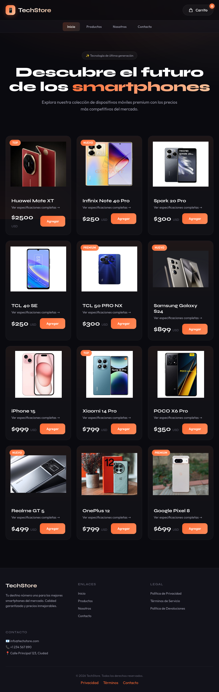
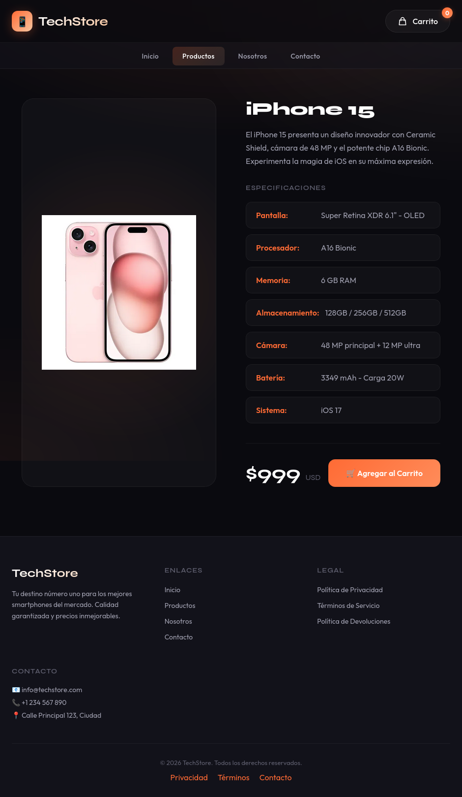
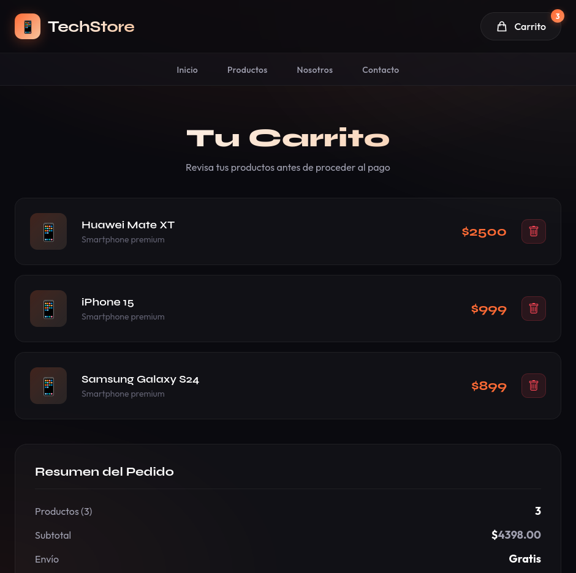

# TechStore - Tienda de Smartphones

## Capturas de Pantalla

### Pagina Principal



### Detalle de Producto



### Carrito de Compras



## Descripcion

TechStore es una tienda online de smartphones premium. El proyecto esta construido con HTML, CSS y JavaScript vanilla, utilizando Vite como bundler para el desarrollo.

## Estructura del Proyecto

```
ProyectoFinal-TalentoTech/
├── index.html                    # Pagina principal con catalogo de productos
├── src/
│   ├── assets/
│   │   └── images/              # Imagenes de productos
│   ├── pages/
│   │   ├── about.html           # Pagina Nosotros
│   │   ├── contacto.html        # Pagina Contacto
│   │   ├── carrito.html         # Carrito de compras
│   │   └── productos/           # Paginas de detalle de producto (12 productos)
│   ├── scripts/
│   │   ├── app.js               # Logica principal del carrito
│   │   ├── carrito.js           # Funciones del carrito de compras
│   │   └── layout.js            # Layout compartido (header/footer)
│   └── styles/
│       ├── main.css             # Estilos globales
│       ├── about.css            # Estilos pagina Nosotros
│       ├── contacto.css         # Estilos pagina Contacto
│       ├── carrito.css          # Estilos pagina Carrito
│       └── productos.css        # Estilos paginas de productos
├── package.json
└── vite.config.js
```

## Funcionalidades

### Pagina Principal (index.html)

- Catalogo de 12 smartphones con imagen, precio y boton de agregar
- Hero section con mensaje destacado
- Navegacion principal

### Paginas de Producto

- Detalle completo de cada smartphone
- Especificaciones tecnicas (pantalla, procesador, memoria, camara, bateria)
- Boton para agregar al carrito

### Carrito de Compras

- Lista de productos agregados
- Eliminar productos individuales
- Resumen con total
- Persistencia en localStorage (el carrito se mantiene al navegar)

### Layout Compartido

- Header con logo y boton de carrito (contador dinamico)
- Navegacion con enlaces a todas las secciones
- Footer completo con 4 columnas: Brand, Enlaces, Legal, Contacto
- Implementado via layout.js para consistencia en todas las paginas

### Pagina Nosotros

- Historia de la empresa
- Valores y beneficios
- Equipo de trabajo

### Pagina Contacto

- Formulario de contacto
- Informacion de contacto

## Tecnologias Utilizadas

- HTML5
- CSS3
- JavaScript (ES6+)
- Vite (bundler y servidor de desarrollo)
- LocalStorage (persistencia del carrito)

## Como Ejecutar el Proyecto

1. Clonar el repositorio:

```bash
git clone https://github.com/SASOPELANA/ProyectoFinal-TalentoTech
```

1. Instalar dependencias:

```bash
npm install
```

1. Iniciar servidor de desarrollo:

```bash
npm run dev
```

1. Abrir en el navegador: <http://localhost:5173>

## Scripts Disponibles

- `npm run dev` - Inicia el servidor de desarrollo
- `npm run build` - Genera la build de produccion
- `npm run preview` - Previsualiza la build de produccion

## Despliegue

El proyecto esta desplegado en Vercel:

- URL: <https://proyecto-final-talento-tech-rose.vercel.app/>

## Repositorio

- GitHub: <https://github.com/SASOPELANA/ProyectoFinal-TalentoTech>

## Herramientas de Desarrollo

- Neovim / LazyVim (Editor)
- Visual Studio Code (Editor)
- WezTerm (Terminal)
- Zellij (Multiplexor de terminal)
- Git (Control de versiones)
- GitHub (Repositorio)
- Vercel (Hosting)
- Firefox / Brave (Navegadores)
- Linux Debian 13

## Licencia

Este proyecto esta bajo la Licencia MIT.
