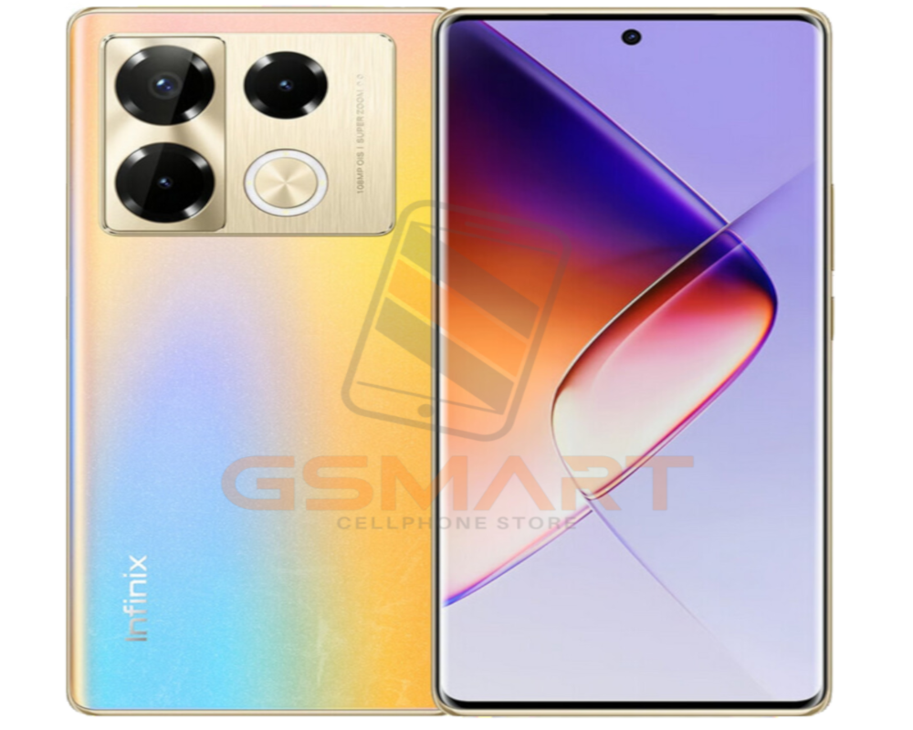
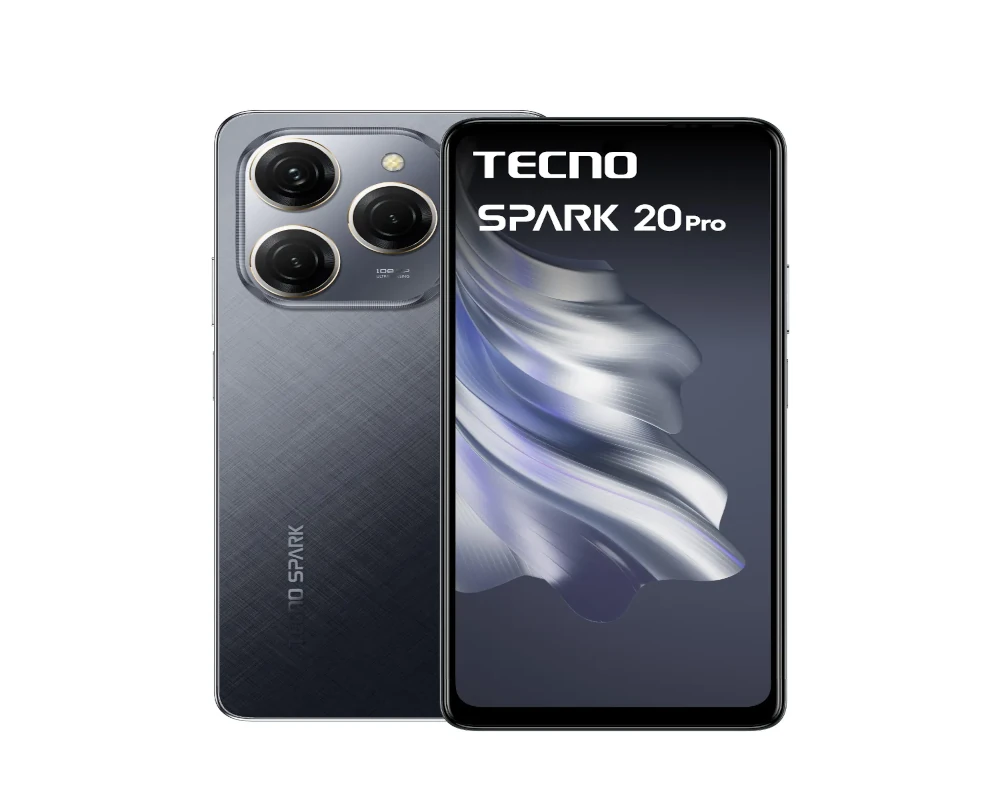
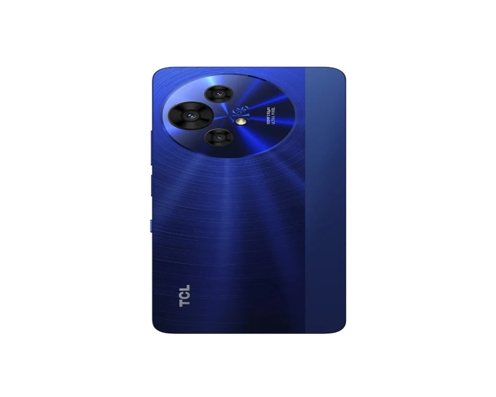

# Saludo breve: Hola

**Session ID:** ses_345868b93ffeG34G3y3l0tolrU
**Created:** 3/4/2026, 5:10:47 PM
**Updated:** 3/4/2026, 5:29:07 PM

---

## Assistant (Build · claude-opus-4.5 · 4.8s)

Ahora voy a ver el carrito y la página de producto, y probar la versión móvil.

**Tool: playwright_browser_snapshot**

**Input:**
```json
{}
```

**Output:**
```
### Page
- Page URL: http://127.0.0.1:8080/
- Page Title: Proyecto Final Integrador - Talento Tech
### Snapshot
```yaml
- generic [ref=e1]:
  - banner [ref=e2]:
    - heading "Tienda de Compras" [level=1] [ref=e3]
    - link "🛒 2" [ref=e60] [cursor=pointer]:
      - /url: carrito.html
  - navigation [ref=e5]:
    - list [ref=e6]:
      - listitem [ref=e7]:
        - link "Inicio" [ref=e8] [cursor=pointer]:
          - /url: "#"
      - listitem [ref=e9]:
        - link "Productos" [ref=e10] [cursor=pointer]:
          - /url: "#"
      - listitem [ref=e11]:
        - link "Contacto" [ref=e12] [cursor=pointer]:
          - /url: ./html/contacto.html
      - listitem [ref=e13]:
        - link "Colores Aleatorios" [ref=e14] [cursor=pointer]:
          - /url: ./ColoresAleatorios/index.html
      - listitem [ref=e15]:
        - link "Input RGBA" [ref=e16] [cursor=pointer]:
          - /url: ./Input-Color-RGBA/index.html
  - generic [ref=e17]:
    - article [ref=e18]:
      - heading "Huawei Mate XT" [level=2] [ref=e19]
      - img "Producto 1" [ref=e20]
      - paragraph [ref=e21]:
        - link "Descripcion del producto" [ref=e22] [cursor=pointer]:
          - /url: ./html/producto1.html
      - paragraph [ref=e23]: $2500
      - button "Agregar" [ref=e24] [cursor=pointer]
    - article [ref=e25]:
      - heading "Infinix Note 40 Pro" [level=2] [ref=e26]
      - img "Producto 2" [ref=e27]
      - paragraph [ref=e28]:
        - link "Descripcion del producto" [ref=e29] [cursor=pointer]:
          - /url: ./html/producto2.html
      - paragraph [ref=e30]: $250
      - button "Agregar" [active] [ref=e31] [cursor=pointer]
    - article [ref=e32]:
      - heading "Spark 20 Pro" [level=2] [ref=e33]
      - img "Producto 3" [ref=e34]
      - paragraph [ref=e35]:
        - link "Descripcion del producto" [ref=e36] [cursor=pointer]:
          - /url: ./html/producto3.html
      - paragraph [ref=e37]: $300
      - button "Agregar" [ref=e38] [cursor=pointer]
    - article [ref=e39]:
      - heading "TCL 40 SE" [level=2] [ref=e40]
      - img "Producto 4" [ref=e41]
      - paragraph [ref=e42]:
        - link "Descripcion del producto" [ref=e43] [cursor=pointer]:
          - /url: ./html/producto4.html
      - paragraph [ref=e44]: $250
      - button "Agregar" [ref=e45] [cursor=pointer]
    - article [ref=e46]:
      - heading "TCL - 50 PRO NX" [level=2] [ref=e47]
      - img "Producto 5" [ref=e48]
      - paragraph [ref=e49]:
        - link "Descripcion del producto" [ref=e50] [cursor=pointer]:
          - /url: ./html/producto5.html
      - paragraph [ref=e51]: $300
      - button "Agregar" [ref=e52] [cursor=pointer]
  - contentinfo [ref=e53]:
    - paragraph [ref=e54]: © 2023 Tienda de Compras. Todos los derechos reservados.
    - paragraph [ref=e55]:
      - link "Política de Privacidad" [ref=e56] [cursor=pointer]:
        - /url: "#"
      - text: "|"
      - link "Términos de Servicio" [ref=e57] [cursor=pointer]:
        - /url: "#"
      - text: "|"
      - link "Contacto" [ref=e58] [cursor=pointer]:
        - /url: ./html/contacto.html
```
```

---

## Assistant (Build · claude-opus-4.5 · 5.6s)

**Tool: playwright_browser_click**

**Input:**
```json
{
  "element": "Ir al carrito",
  "ref": "e60"
}
```

**Output:**
```
### Ran Playwright code
```js
await page.getByRole('link', { name: '🛒' }).click();
```
### Page
- Page URL: http://127.0.0.1:8080/carrito.html
- Page Title: Carrito
### Snapshot
```yaml
- generic [active] [ref=e1]:
  - banner [ref=e2]:
    - heading "Carrito de Compras" [level=1] [ref=e3]
    - link "Volver" [ref=e4] [cursor=pointer]:
      - /url: ./index.html
  - generic [ref=e5]:
    - heading "Tu carrito" [level=2] [ref=e6]
    - generic [ref=e7]:
      - article [ref=e8]:
        - heading "Producto 1" [level=2] [ref=e9]
        - paragraph [ref=e10]: $2500
        - button "Eliminar" [ref=e11] [cursor=pointer]
      - article [ref=e12]:
        - heading "Producto 2" [level=2] [ref=e13]
        - paragraph [ref=e14]: $250
        - button "Eliminar" [ref=e15] [cursor=pointer]
    - generic [ref=e16]:
      - paragraph [ref=e17]: "Total de productos: 2"
      - paragraph [ref=e18]: "Importe total en Dolares: $2750.00"
      - button "Finalizar la compra" [ref=e19] [cursor=pointer]
  - contentinfo [ref=e20]:
    - paragraph [ref=e21]: © 2025 Tienda de Compras. Todos los derechos reservados.
    - paragraph [ref=e22]:
      - link "Política de Privacidad" [ref=e23] [cursor=pointer]:
        - /url: "#"
      - text: "|"
      - link "Términos de Servicio" [ref=e24] [cursor=pointer]:
        - /url: "#"
      - text: "|"
      - link "Contacto" [ref=e25] [cursor=pointer]:
        - /url: ./html/contacto.html
```
### Events
- [LOG] Live reload enabled. @ http://127.0.0.1:8080/carrito.html:74
```

---

## Assistant (Build · claude-opus-4.5 · 5.0s)

**Tool: playwright_browser_take_screenshot**

**Input:**
```json
{
  "filename": "carrito-desktop.png",
  "fullPage": true,
  "type": "png"
}
```

**Output:**
```
### Result
- [Screenshot of full page](carrito-desktop.png)
### Ran Playwright code
```js
// Screenshot full page and save it as carrito-desktop.png
await page.screenshot({
fullPage: true,
  path: 'carrito-desktop.png',
  scale: 'css',
  type: 'png'
});
```
```

---

## Assistant (Build · claude-opus-4.5 · 5.3s)

Ahora voy a revisar una página de producto y luego probar la versión móvil.

**Tool: playwright_browser_navigate**

**Input:**
```json
{
  "url": "http://127.0.0.1:8080/html/producto1.html"
}
```

**Output:**
```
### Ran Playwright code
```js
await page.goto('http://127.0.0.1:8080/html/producto1.html');
```
### Page
- Page URL: http://127.0.0.1:8080/html/producto1.html
- Page Title: Descripcion del Producto 1
### Snapshot
```yaml
- generic [active] [ref=e1]:
  - banner [ref=e2]:
    - heading "Descripción del Producto 1" [level=1] [ref=e3]
  - main [ref=e4]:
    - heading "Huawei Mate XT" [level=2] [ref=e5]
    - img "Huawei Mate XT" [ref=e6]
    - paragraph [ref=e7]: El Huawei Mate XT es un teléfono plegable con tres pantallas y dos bisagras, lo que le permite ofrecer una experiencia de uso versátil y única.
    - list [ref=e8]:
      - listitem [ref=e9]:
        - strong [ref=e10]: "Pantalla:"
        - text: La pantalla OLED LTPO del Huawei Mate XT mide 10,2 pulgadas y cuenta con una resolución de 2232 x 3184 píxeles.
      - listitem [ref=e11]:
        - strong [ref=e12]: "Procesador:"
        - text: El dispositivo está equipado con un procesador Huawei HiSilicon KIRIN 9010 5G, que ofrece un rendimiento potente y eficiente.
      - listitem [ref=e13]:
        - strong [ref=e14]: "Memoria y almacenamiento:"
        - text: El Huawei Mate XT cuenta con 16 GB de memoria RAM y opciones de almacenamiento de 256 GB, 512 GB y 1 TB.
      - listitem [ref=e15]:
        - strong [ref=e16]: "Cámara:"
        - text: La cámara principal del dispositivo es de 50 megapíxeles, con zoom óptico de 5,5 aumentos, y cuenta con un sensor periscópico de 12 megapíxeles y un ultra gran angular de 12 megapíxeles.
      - listitem [ref=e17]:
        - strong [ref=e18]: "Batería:"
        - text: La batería del Huawei Mate XT tiene una capacidad de 5600 mAh, con carga rápida de 66 vatios, carga inalámbrica a 15 vatios y carga inalámbrica inversa a 7,5W.
      - listitem [ref=e19]:
        - strong [ref=e20]: "Diseño:"
        - text: El dispositivo tiene un grosor de 3,6 milímetros y un diseño premium con una parte trasera de cuero vegano disponible en rojo y negro, con detalles dorados.
      - listitem [ref=e21]:
        - strong [ref=e22]: "Sistema operativo:"
        - text: El Huawei Mate XT viene con HarmonyOS en su versión 4.2.
      - listitem [ref=e23]:
        - strong [ref=e24]: "Conectividad:"
        - text: El dispositivo es compatible con redes 5G y cuenta con varias bandas de frecuencia para ofrecer una conectividad versátil.
      - listitem [ref=e25]:
        - strong [ref=e26]: "Accesorios:"
        - text: El Huawei Mate XT se puede utilizar con accesorios como un teclado plegable que incluye un panel táctil.
      - listitem [ref=e27]:
        - strong [ref=e28]: "Precio:"
        - text: El precio del Huawei Mate XT varía según la región y el proveedor, pero se espera que sea uno de los dispositivos más caros del mercado.
    - paragraph [ref=e29]: $100
    - link "Volver a realizar la compra" [ref=e30] [cursor=pointer]:
      - /url: ../index.html
      - button "Volver a realizar la compra" [ref=e31]
  - contentinfo [ref=e32]:
    - paragraph [ref=e33]: © 2023 Tienda de Compras. Todos los derechos reservados.
```
### Events
- [LOG] Live reload enabled. @ http://127.0.0.1:8080/html/producto1.html:106
```

---

## Assistant (Build · claude-opus-4.5 · 5.1s)

**Tool: playwright_browser_take_screenshot**

**Input:**
```json
{
  "filename": "producto-desktop.png",
  "fullPage": true,
  "type": "png"
}
```

**Output:**
```
### Result
- [Screenshot of full page](producto-desktop.png)
### Ran Playwright code
```js
// Screenshot full page and save it as producto-desktop.png
await page.screenshot({
fullPage: true,
  path: 'producto-desktop.png',
  scale: 'css',
  type: 'png'
});
```
```

---

## Assistant (Build · claude-opus-4.5 · 6.1s)

Ahora voy a probar la versión móvil para ver el diseño responsive.

**Tool: playwright_browser_resize**

**Input:**
```json
{
  "width": 375,
  "height": 667
}
```

**Output:**
```
### Ran Playwright code
```js
await page.setViewportSize({ width: 375, height: 667 });
```
### Page
- Page URL: http://127.0.0.1:8080/html/producto1.html
- Page Title: Descripcion del Producto 1
### Events
- [LOG] Live reload enabled. @ http://127.0.0.1:8080/html/producto1.html:106
```

---

## Assistant (Build · claude-opus-4.5 · 5.9s)

**Tool: playwright_browser_navigate**

**Input:**
```json
{
  "url": "http://127.0.0.1:8080/"
}
```

**Output:**
```
### Ran Playwright code
```js
await page.goto('http://127.0.0.1:8080/');
```
### Page
- Page URL: http://127.0.0.1:8080/
- Page Title: Proyecto Final Integrador - Talento Tech
### Snapshot
```yaml
- generic [active] [ref=e1]:
  - banner [ref=e2]:
    - heading "Tienda de Compras" [level=1] [ref=e3]
    - link "🛒 0" [ref=e4] [cursor=pointer]:
      - /url: carrito.html
  - navigation [ref=e5]:
    - list [ref=e6]:
      - listitem [ref=e7]:
        - link "Inicio" [ref=e8] [cursor=pointer]:
          - /url: "#"
      - listitem [ref=e9]:
        - link "Productos" [ref=e10] [cursor=pointer]:
          - /url: "#"
      - listitem [ref=e11]:
        - link "Contacto" [ref=e12] [cursor=pointer]:
          - /url: ./html/contacto.html
      - listitem [ref=e13]:
        - link "Colores Aleatorios" [ref=e14] [cursor=pointer]:
          - /url: ./ColoresAleatorios/index.html
      - listitem [ref=e15]:
        - link "Input RGBA" [ref=e16] [cursor=pointer]:
          - /url: ./Input-Color-RGBA/index.html
  - generic [ref=e17]:
    - article [ref=e18]:
      - heading "Huawei Mate XT" [level=2] [ref=e19]
      - img "Producto 1" [ref=e20]
      - paragraph [ref=e21]:
        - link "Descripcion del producto" [ref=e22] [cursor=pointer]:
          - /url: ./html/producto1.html
      - paragraph [ref=e23]: $2500
      - button "Agregar" [ref=e24] [cursor=pointer]
    - article [ref=e25]:
      - heading "Infinix Note 40 Pro" [level=2] [ref=e26]
      - img "Producto 2" [ref=e27]
      - paragraph [ref=e28]:
        - link "Descripcion del producto" [ref=e29] [cursor=pointer]:
          - /url: ./html/producto2.html
      - paragraph [ref=e30]: $250
      - button "Agregar" [ref=e31] [cursor=pointer]
    - article [ref=e32]:
      - heading "Spark 20 Pro" [level=2] [ref=e33]
      - img "Producto 3" [ref=e34]
      - paragraph [ref=e35]:
        - link "Descripcion del producto" [ref=e36] [cursor=pointer]:
          - /url: ./html/producto3.html
      - paragraph [ref=e37]: $300
      - button "Agregar" [ref=e38] [cursor=pointer]
    - article [ref=e39]:
      - heading "TCL 40 SE" [level=2] [ref=e40]
      - img "Producto 4" [ref=e41]
      - paragraph [ref=e42]:
        - link "Descripcion del producto" [ref=e43] [cursor=pointer]:
          - /url: ./html/producto4.html
      - paragraph [ref=e44]: $250
      - button "Agregar" [ref=e45] [cursor=pointer]
    - article [ref=e46]:
      - heading "TCL - 50 PRO NX" [level=2] [ref=e47]
      - img "Producto 5" [ref=e48]
      - paragraph [ref=e49]:
        - link "Descripcion del producto" [ref=e50] [cursor=pointer]:
          - /url: ./html/producto5.html
      - paragraph [ref=e51]: $300
      - button "Agregar" [ref=e52] [cursor=pointer]
  - contentinfo [ref=e53]:
    - paragraph [ref=e54]: © 2023 Tienda de Compras. Todos los derechos reservados.
    - paragraph [ref=e55]:
      - link "Política de Privacidad" [ref=e56] [cursor=pointer]:
        - /url: "#"
      - text: "|"
      - link "Términos de Servicio" [ref=e57] [cursor=pointer]:
        - /url: "#"
      - text: "|"
      - link "Contacto" [ref=e58] [cursor=pointer]:
        - /url: ./html/contacto.html
```
### Events
- [LOG] Live reload enabled. @ http://127.0.0.1:8080/:135
```

---

## Assistant (Build · claude-opus-4.5 · 5.8s)

**Tool: playwright_browser_take_screenshot**

**Input:**
```json
{
  "filename": "tienda-mobile.png",
  "fullPage": true,
  "type": "png"
}
```

**Output:**
```
### Result
- [Screenshot of full page](tienda-mobile.png)
### Ran Playwright code
```js
// Screenshot full page and save it as tienda-mobile.png
await page.screenshot({
fullPage: true,
  path: 'tienda-mobile.png',
  scale: 'css',
  type: 'png'
});
```
```

---

## Assistant (Build · claude-opus-4.5 · 1.7s)

---

## User

---

## Assistant (Compaction · claude-opus-4.5 · 17.9s)

---
## Goal

El usuario quiere mejorar su tienda online de smartphones desplegada en Vercel. La tienda es un proyecto final de "Talento Tech" y necesita análisis y mejoras usando Playwright MCP para Firefox.

## Instructions

- Usar Playwright MCP específicamente con Firefox para explorar y analizar la tienda
- Identificar áreas de mejora en la tienda
- La comunicación debe ser en español

## Discoveries

### Estructura de la tienda (URL: https://proyecto-final-talento-tech-rose.vercel.app/)
- **Header**: Logo "Tienda de Compras" con carrito (🛒)
- **Navegación**: Inicio, Productos, Contacto, Colores Aleatorios, Input RGBA
- **Productos mostrados** (5 smartphones):
  1. Huawei Mate XT - $2500
  2. Infinix Note 40 Pro - $250
  3. Spark 20 Pro - $300
  4. TCL 40 SE - $250
  5. TCL 50 PRO NX - $300
- **Footer**: Copyright 2023, enlaces a Política de Privacidad, Términos de Servicio, Contacto
- Cada producto tiene: imagen, título, enlace a descripción, precio, botón "Agregar"

### Problemas identificados hasta ahora:
- El footer dice "© 2023" (desactualizado)
- Enlaces de navegación "Inicio" y "Productos" apuntan a "#" (no funcionales)
- Hay secciones no relacionadas con la tienda (Colores Aleatorios, Input RGBA)
- Al agregar producto aparece alert con "Producto 1" en lugar del nombre real del producto

### Páginas de la tienda:
- `/index.html` - Página principal
- `/carrito.html` - Carrito de compras
- `/html/contacto.html` - Página de contacto
- `/html/producto1.html` a `/html/producto5.html` - Páginas de detalle de productos
- `/ColoresAleatorios/index.html` - Funcionalidad de colores aleatorios
- `/Input-Color-RGBA/index.html` - Input de color RGBA

## Accomplished

- ✅ Navegación inicial a la tienda con Playwright
- ✅ Screenshot de página principal tomado (`tienda-principal.png`)
- ✅ Probado el botón "Agregar" del primer producto (Huawei) - muestra alert "Agregaste : Producto 1 al carrito"
- 🔄 En progreso: Exploración completa del sitio (falta revisar carrito, páginas de producto, responsive)
- ⬜ Pendiente: Análisis completo de UX/UI
- ⬜ Pendiente: Proponer mejoras específicas
- ⬜ Pendiente: Implementar las mejoras en el código

## Relevant files / directories

### Archivos locales creados:
- `tienda-principal.png` - Screenshot de la página principal

### Estructura del proyecto (inferida de la navegación):
```
/
├── index.html (página principal)
├── carrito.html (carrito de compras)
├── html/
│   ├── contacto.html
│   ├── producto1.html
│   ├── producto2.html
│   ├── producto3.html
│   ├── producto4.html
│   └── producto5.html
├── ColoresAleatorios/
│   └── index.html
└── Input-Color-RGBA/
    └── index.html
```

**Nota**: El código fuente local del proyecto NO ha sido localizado aún. Se necesita encontrar los archivos del proyecto en el sistema local para implementar las mejoras.

---

**Próximos pasos para el siguiente agente:**
1. Manejar el diálogo de alert pendiente (`browser_handle_dialog`)
2. Continuar explorando: revisar carrito, página de producto individual, y versión móvil
3. Localizar el código fuente del proyecto en el sistema local
4. Crear lista de mejoras prioritarias
5. Implementar las mejoras en el código

---

## User

http://127.0.0.1:8080/    este es localhost para esto

---

## Assistant (Build · claude-opus-4.5 · 12.3s)

Perfecto, ahora tengo el localhost. Déjame hacer un resumen de lo que hemos logrado hasta ahora:

## Resumen de lo realizado

### ✅ Completado:

1. **Exploración de la tienda en producción** (Vercel)
   - Navegamos por la página principal
   - Tomamos screenshot (`tienda-principal.png`)
   - Probamos el botón "Agregar" de un producto

2. **Problemas identificados:**
   - El footer muestra "© 2023" (desactualizado, debería ser 2024 o 2025)
   - Enlaces "Inicio" y "Productos" en navegación apuntan a `#` (no funcionales)
   - Al agregar producto, el alert muestra "Producto 1" en lugar del nombre real del producto
   - Secciones no relacionadas con la tienda (Colores Aleatorios, Input RGBA)

3. **Estructura de la tienda:**
   - 5 productos de smartphones (Huawei, Infinix, Spark, TCL)
   - Páginas: principal, carrito, contacto, 5 páginas de producto
   - Mini-apps adicionales de colores

### ⏳ Pendiente:

1. **Explorar más a fondo:**
   - Probar el carrito de compras
   - Revisar páginas de producto individuales
   - Verificar diseño responsive (móvil/tablet)

2. **Implementar mejoras:**
   - Actualizar año del copyright
   - Arreglar enlaces de navegación
   - Corregir el mensaje del alert para mostrar nombre real del producto
   - Otras mejoras de UX/UI

---

¿Quieres que continúe con la exploración usando el localhost (`http://127.0.0.1:8080/`) y luego implemente las correcciones en el código local? 

Puedo:
1. **Continuar explorando** - revisar carrito, responsive, etc.
2. **Empezar a corregir** - los problemas ya identificados
3. **Ambas cosas** - explorar lo que falta y luego corregir todo

¿Qué prefieres?

---

## User

3

---

## Assistant (Build · claude-opus-4.5 · 6.8s)

Vamos a hacer ambas cosas: continuar explorando y luego corregir. Déjame empezar navegando al localhost y explorando lo que falta.

**Tool: playwright_browser_navigate**

**Input:**
```json
{
  "url": "http://127.0.0.1:8080/"
}
```

**Output:**
```
### Ran Playwright code
```js
await page.goto('http://127.0.0.1:8080/');
```
### Page
- Page URL: http://127.0.0.1:8080/
- Page Title: Proyecto Final Integrador - Talento Tech
### Snapshot
```yaml
- generic [active] [ref=e1]:
  - banner [ref=e2]:
    - heading "Tienda de Compras" [level=1] [ref=e3]
    - link "🛒 0" [ref=e4] [cursor=pointer]:
      - /url: carrito.html
  - navigation [ref=e5]:
    - list [ref=e6]:
      - listitem [ref=e7]:
        - link "Inicio" [ref=e8] [cursor=pointer]:
          - /url: "#"
      - listitem [ref=e9]:
        - link "Productos" [ref=e10] [cursor=pointer]:
          - /url: "#"
      - listitem [ref=e11]:
        - link "Contacto" [ref=e12] [cursor=pointer]:
          - /url: ./html/contacto.html
      - listitem [ref=e13]:
        - link "Colores Aleatorios" [ref=e14] [cursor=pointer]:
          - /url: ./ColoresAleatorios/index.html
      - listitem [ref=e15]:
        - link "Input RGBA" [ref=e16] [cursor=pointer]:
          - /url: ./Input-Color-RGBA/index.html
  - generic [ref=e17]:
    - article [ref=e18]:
      - heading "Huawei Mate XT" [level=2] [ref=e19]
      - img "Producto 1" [ref=e20]
      - paragraph [ref=e21]:
        - link "Descripcion del producto" [ref=e22] [cursor=pointer]:
          - /url: ./html/producto1.html
      - paragraph [ref=e23]: $2500
      - button "Agregar" [ref=e24] [cursor=pointer]
    - article [ref=e25]:
      - heading "Infinix Note 40 Pro" [level=2] [ref=e26]
      - img "Producto 2" [ref=e27]
      - paragraph [ref=e28]:
        - link "Descripcion del producto" [ref=e29] [cursor=pointer]:
          - /url: ./html/producto2.html
      - paragraph [ref=e30]: $250
      - button "Agregar" [ref=e31] [cursor=pointer]
    - article [ref=e32]:
      - heading "Spark 20 Pro" [level=2] [ref=e33]
      - img "Producto 3" [ref=e34]
      - paragraph [ref=e35]:
        - link "Descripcion del producto" [ref=e36] [cursor=pointer]:
          - /url: ./html/producto3.html
      - paragraph [ref=e37]: $300
      - button "Agregar" [ref=e38] [cursor=pointer]
    - article [ref=e39]:
      - heading "TCL 40 SE" [level=2] [ref=e40]
      - img "Producto 4" [ref=e41]
      - paragraph [ref=e42]:
        - link "Descripcion del producto" [ref=e43] [cursor=pointer]:
          - /url: ./html/producto4.html
      - paragraph [ref=e44]: $250
      - button "Agregar" [ref=e45] [cursor=pointer]
    - article [ref=e46]:
      - heading "TCL - 50 PRO NX" [level=2] [ref=e47]
      - img "Producto 5" [ref=e48]
      - paragraph [ref=e49]:
        - link "Descripcion del producto" [ref=e50] [cursor=pointer]:
          - /url: ./html/producto5.html
      - paragraph [ref=e51]: $300
      - button "Agregar" [ref=e52] [cursor=pointer]
  - contentinfo [ref=e53]:
    - paragraph [ref=e54]: © 2023 Tienda de Compras. Todos los derechos reservados.
    - paragraph [ref=e55]:
      - link "Política de Privacidad" [ref=e56] [cursor=pointer]:
        - /url: "#"
      - text: "|"
      - link "Términos de Servicio" [ref=e57] [cursor=pointer]:
        - /url: "#"
      - text: "|"
      - link "Contacto" [ref=e58] [cursor=pointer]:
        - /url: ./html/contacto.html
```
### Events
- [LOG] Live reload enabled. @ http://127.0.0.1:8080/:135
```

**Tool: todowrite**

**Input:**
```json
{
  "todos": [
    {
      "content": "Explorar página principal en localhost",
      "status": "in_progress",
      "priority": "high"
    },
    {
      "content": "Probar funcionalidad del carrito de compras",
      "status": "pending",
      "priority": "high"
    },
    {
      "content": "Revisar páginas de producto individuales",
      "status": "pending",
      "priority": "medium"
    },
    {
      "content": "Verificar diseño responsive (móvil/tablet)",
      "status": "pending",
      "priority": "medium"
    },
    {
      "content": "Corregir año del copyright en footer (2023 → 2026)",
      "status": "pending",
      "priority": "high"
    },
    {
      "content": "Arreglar enlaces de navegación (Inicio, Productos)",
      "status": "pending",
      "priority": "high"
    },
    {
      "content": "Corregir alert para mostrar nombre real del producto",
      "status": "pending",
      "priority": "high"
    },
    {
      "content": "Revisar y proponer mejoras adicionales de UX/UI",
      "status": "pending",
      "priority": "medium"
    }
  ]
}
```

**Output:**
```
[
  {
    "content": "Explorar página principal en localhost",
    "status": "in_progress",
    "priority": "high"
  },
  {
    "content": "Probar funcionalidad del carrito de compras",
    "status": "pending",
    "priority": "high"
  },
  {
    "content": "Revisar páginas de producto individuales",
    "status": "pending",
    "priority": "medium"
  },
  {
    "content": "Verificar diseño responsive (móvil/tablet)",
    "status": "pending",
    "priority": "medium"
  },
  {
    "content": "Corregir año del copyright en footer (2023 → 2026)",
    "status": "pending",
    "priority": "high"
  },
  {
    "content": "Arreglar enlaces de navegación (Inicio, Productos)",
    "status": "pending",
    "priority": "high"
  },
  {
    "content": "Corregir alert para mostrar nombre real del producto",
    "status": "pending",
    "priority": "high"
  },
  {
    "content": "Revisar y proponer mejoras adicionales de UX/UI",
    "status": "pending",
    "priority": "medium"
  }
]
```

---

## Assistant (Build · claude-opus-4.5 · 4.6s)

Perfecto, el localhost está funcionando. Ahora voy a agregar un producto al carrito y luego navegar al carrito para probar su funcionalidad completa.

**Tool: playwright_browser_click**

**Input:**
```json
{
  "element": "Botón Agregar del Huawei Mate XT",
  "ref": "e24"
}
```

**Output:**
```
### Ran Playwright code
```js
await page.getByRole('article').filter({ hasText: 'Huawei Mate XT Descripcion' }).getByRole('button').click();
```
### Page
- Page URL: http://127.0.0.1:8080/
### Modal state
- ["alert" dialog with message "Agregaste : Producto 1 al carrito"]: can be handled by browser_handle_dialog
### Snapshot
```yaml

```
```

---

## Assistant (Build · claude-opus-4.5 · 5.7s)

Veo el problema del alert que muestra "Producto 1" en lugar de "Huawei Mate XT". Voy a aceptar el diálogo y agregar más productos para probar el carrito.

**Tool: playwright_browser_handle_dialog**

**Input:**
```json
{
  "accept": true
}
```

**Output:**
```
### Page
- Page URL: http://127.0.0.1:8080/
- Page Title: Proyecto Final Integrador - Talento Tech
```

---

## Assistant (Build · claude-opus-4.5 · 2.7s)

**Tool: playwright_browser_snapshot**

**Input:**
```json
{}
```

**Output:**
```
### Page
- Page URL: http://127.0.0.1:8080/
- Page Title: Proyecto Final Integrador - Talento Tech
### Snapshot
```yaml
- generic [ref=e1]:
  - banner [ref=e2]:
    - heading "Tienda de Compras" [level=1] [ref=e3]
    - link "🛒 1" [ref=e59] [cursor=pointer]:
      - /url: carrito.html
  - navigation [ref=e5]:
    - list [ref=e6]:
      - listitem [ref=e7]:
        - link "Inicio" [ref=e8] [cursor=pointer]:
          - /url: "#"
      - listitem [ref=e9]:
        - link "Productos" [ref=e10] [cursor=pointer]:
          - /url: "#"
      - listitem [ref=e11]:
        - link "Contacto" [ref=e12] [cursor=pointer]:
          - /url: ./html/contacto.html
      - listitem [ref=e13]:
        - link "Colores Aleatorios" [ref=e14] [cursor=pointer]:
          - /url: ./ColoresAleatorios/index.html
      - listitem [ref=e15]:
        - link "Input RGBA" [ref=e16] [cursor=pointer]:
          - /url: ./Input-Color-RGBA/index.html
  - generic [ref=e17]:
    - article [ref=e18]:
      - heading "Huawei Mate XT" [level=2] [ref=e19]
      - img "Producto 1" [ref=e20]
      - paragraph [ref=e21]:
        - link "Descripcion del producto" [ref=e22] [cursor=pointer]:
          - /url: ./html/producto1.html
      - paragraph [ref=e23]: $2500
      - button "Agregar" [active] [ref=e24] [cursor=pointer]
    - article [ref=e25]:
      - heading "Infinix Note 40 Pro" [level=2] [ref=e26]
      - img "Producto 2" [ref=e27]
      - paragraph [ref=e28]:
        - link "Descripcion del producto" [ref=e29] [cursor=pointer]:
          - /url: ./html/producto2.html
      - paragraph [ref=e30]: $250
      - button "Agregar" [ref=e31] [cursor=pointer]
    - article [ref=e32]:
      - heading "Spark 20 Pro" [level=2] [ref=e33]
      - img "Producto 3" [ref=e34]
      - paragraph [ref=e35]:
        - link "Descripcion del producto" [ref=e36] [cursor=pointer]:
          - /url: ./html/producto3.html
      - paragraph [ref=e37]: $300
      - button "Agregar" [ref=e38] [cursor=pointer]
    - article [ref=e39]:
      - heading "TCL 40 SE" [level=2] [ref=e40]
      - img "Producto 4" [ref=e41]
      - paragraph [ref=e42]:
        - link "Descripcion del producto" [ref=e43] [cursor=pointer]:
          - /url: ./html/producto4.html
      - paragraph [ref=e44]: $250
      - button "Agregar" [ref=e45] [cursor=pointer]
    - article [ref=e46]:
      - heading "TCL - 50 PRO NX" [level=2] [ref=e47]
      - img "Producto 5" [ref=e48]
      - paragraph [ref=e49]:
        - link "Descripcion del producto" [ref=e50] [cursor=pointer]:
          - /url: ./html/producto5.html
      - paragraph [ref=e51]: $300
      - button "Agregar" [ref=e52] [cursor=pointer]
  - contentinfo [ref=e53]:
    - paragraph [ref=e54]: © 2023 Tienda de Compras. Todos los derechos reservados.
    - paragraph [ref=e55]:
      - link "Política de Privacidad" [ref=e56] [cursor=pointer]:
        - /url: "#"
      - text: "|"
      - link "Términos de Servicio" [ref=e57] [cursor=pointer]:
        - /url: "#"
      - text: "|"
      - link "Contacto" [ref=e58] [cursor=pointer]:
        - /url: ./html/contacto.html
```
```

---

## Assistant (Build · claude-opus-4.5 · 3.7s)

El contador del carrito cambió a 1 (🛒 1). Voy a agregar otro producto y luego ir al carrito para probarlo.

**Tool: playwright_browser_click**

**Input:**
```json
{
  "element": "Botón Agregar del Infinix Note 40 Pro",
  "ref": "e31"
}
```

**Output:**
```
### Ran Playwright code
```js
await page.getByRole('article').filter({ hasText: 'Infinix Note 40 Pro' }).getByRole('button').click();
```
### Page
- Page URL: http://127.0.0.1:8080/
### Modal state
- ["alert" dialog with message "Agregaste : Producto 2 al carrito"]: can be handled by browser_handle_dialog
### Snapshot
```yaml

```
```

---

## Assistant (Build · claude-opus-4.5 · 3.6s)

**Tool: playwright_browser_handle_dialog**

**Input:**
```json
{
  "accept": true
}
```

**Output:**
```
### Page
- Page URL: http://127.0.0.1:8080/
- Page Title: Proyecto Final Integrador - Talento Tech
```

---

## Assistant (Build · claude-opus-4.5 · 5.6s)

Ahora voy a navegar al carrito para verificar su funcionalidad:

**Tool: playwright_browser_navigate**

**Input:**
```json
{
  "url": "http://127.0.0.1:8080/carrito.html"
}
```

**Output:**
```
### Ran Playwright code
```js
await page.goto('http://127.0.0.1:8080/carrito.html');
```
### Page
- Page URL: http://127.0.0.1:8080/carrito.html
- Page Title: Carrito
### Snapshot
```yaml
- generic [active] [ref=e1]:
  - banner [ref=e2]:
    - heading "Carrito de Compras" [level=1] [ref=e3]
    - link "Volver" [ref=e4] [cursor=pointer]:
      - /url: ./index.html
  - generic [ref=e5]:
    - heading "Tu carrito" [level=2] [ref=e6]
    - generic [ref=e7]:
      - article [ref=e8]:
        - heading "Producto 1" [level=2] [ref=e9]
        - paragraph [ref=e10]: $2500
        - button "Eliminar" [ref=e11] [cursor=pointer]
      - article [ref=e12]:
        - heading "Producto 2" [level=2] [ref=e13]
        - paragraph [ref=e14]: $250
        - button "Eliminar" [ref=e15] [cursor=pointer]
    - generic [ref=e16]:
      - paragraph [ref=e17]: "Total de productos: 2"
      - paragraph [ref=e18]: "Importe total en Dolares: $2750.00"
      - button "Finalizar la compra" [ref=e19] [cursor=pointer]
  - contentinfo [ref=e20]:
    - paragraph [ref=e21]: © 2025 Tienda de Compras. Todos los derechos reservados.
    - paragraph [ref=e22]:
      - link "Política de Privacidad" [ref=e23] [cursor=pointer]:
        - /url: "#"
      - text: "|"
      - link "Términos de Servicio" [ref=e24] [cursor=pointer]:
        - /url: "#"
      - text: "|"
      - link "Contacto" [ref=e25] [cursor=pointer]:
        - /url: ./html/contacto.html
```
### Events
- [LOG] Live reload enabled. @ http://127.0.0.1:8080/carrito.html:74
```

**Tool: todowrite**

**Input:**
```json
{
  "todos": [
    {
      "content": "Explorar página principal en localhost",
      "priority": "high",
      "status": "completed"
    },
    {
      "content": "Probar funcionalidad del carrito de compras",
      "priority": "high",
      "status": "in_progress"
    },
    {
      "content": "Revisar páginas de producto individuales",
      "priority": "medium",
      "status": "pending"
    },
    {
      "content": "Verificar diseño responsive (móvil/tablet)",
      "priority": "medium",
      "status": "pending"
    },
    {
      "content": "Corregir año del copyright en footer (2023 → 2026)",
      "priority": "high",
      "status": "pending"
    },
    {
      "content": "Arreglar enlaces de navegación (Inicio, Productos)",
      "priority": "high",
      "status": "pending"
    },
    {
      "content": "Corregir alert para mostrar nombre real del producto",
      "priority": "high",
      "status": "pending"
    },
    {
      "content": "Revisar y proponer mejoras adicionales de UX/UI",
      "priority": "medium",
      "status": "pending"
    }
  ]
}
```

**Output:**
```
[
  {
    "content": "Explorar página principal en localhost",
    "priority": "high",
    "status": "completed"
  },
  {
    "content": "Probar funcionalidad del carrito de compras",
    "priority": "high",
    "status": "in_progress"
  },
  {
    "content": "Revisar páginas de producto individuales",
    "priority": "medium",
    "status": "pending"
  },
  {
    "content": "Verificar diseño responsive (móvil/tablet)",
    "priority": "medium",
    "status": "pending"
  },
  {
    "content": "Corregir año del copyright en footer (2023 → 2026)",
    "priority": "high",
    "status": "pending"
  },
  {
    "content": "Arreglar enlaces de navegación (Inicio, Productos)",
    "priority": "high",
    "status": "pending"
  },
  {
    "content": "Corregir alert para mostrar nombre real del producto",
    "priority": "high",
    "status": "pending"
  },
  {
    "content": "Revisar y proponer mejoras adicionales de UX/UI",
    "priority": "medium",
    "status": "pending"
  }
]
```

---

## Assistant (Build · claude-opus-4.5 · 6.6s)

Excelente, encontré más problemas:

1. **En el carrito**: Los productos se muestran como "Producto 1" y "Producto 2" en lugar de sus nombres reales
2. **Inconsistencia en el footer**: El carrito tiene © 2025, pero la página principal tiene © 2023

Voy a probar eliminar un producto y luego verificar el responsive. También voy a revisar una página de producto:

**Tool: playwright_browser_click**

**Input:**
```json
{
  "element": "Botón Eliminar del Producto 1",
  "ref": "e11"
}
```

**Output:**
```
### Ran Playwright code
```js
await page.getByRole('article').filter({ hasText: 'Producto 1 $2500 Eliminar' }).getByRole('button').click();
```
### Page
- Page URL: http://127.0.0.1:8080/carrito.html
- Page Title: Carrito
### Snapshot
```yaml
- <changed> generic [ref=e5]:
  - ref=e6 [unchanged]
  - article [ref=e26]:
    - heading "Producto 2" [level=2] [ref=e27]
    - paragraph [ref=e28]: $250
    - button "Eliminar" [ref=e29] [cursor=pointer]
  - generic [ref=e16]:
    - paragraph [ref=e17]: "Total de productos: 1"
    - paragraph [ref=e18]: "Importe total en Dolares: $250.00"
    - ref=e19 [unchanged]
```
```

---

## Assistant (Build · claude-opus-4.5 · 3.8s)

La eliminación funciona correctamente. Ahora voy a probar el botón "Finalizar compra" y luego verificar el responsive:

**Tool: playwright_browser_click**

**Input:**
```json
{
  "element": "Botón Finalizar la compra",
  "ref": "e19"
}
```

**Output:**
```
### Ran Playwright code
```js
await page.getByRole('button', { name: 'Finalizar la compra' }).click();
```
### Page
- Page URL: http://127.0.0.1:8080/carrito.html
### Modal state
- ["alert" dialog with message "Compra realizada con éxito"]: can be handled by browser_handle_dialog
### Snapshot
```yaml

```
```

---

## Assistant (Build · claude-opus-4.5 · 3.7s)

**Tool: playwright_browser_handle_dialog**

**Input:**
```json
{
  "accept": true
}
```

**Output:**
```
### Page
- Page URL: http://127.0.0.1:8080/index.html
- Page Title: Proyecto Final Integrador - Talento Tech
### Events
- [LOG] Live reload enabled. @ http://127.0.0.1:8080/index.html:135
```

---

## Assistant (Build · claude-opus-4.5 · 3.8s)

Bien, después de finalizar la compra redirige al index. Ahora voy a verificar el diseño responsive y una página de producto:

**Tool: playwright_browser_resize**

**Input:**
```json
{
  "width": 375,
  "height": 667
}
```

**Output:**
```
### Ran Playwright code
```js
await page.setViewportSize({ width: 375, height: 667 });
```
```

---

## Assistant (Build · claude-opus-4.5 · 3.6s)

**Tool: playwright_browser_take_screenshot**

**Input:**
```json
{
  "filename": "tienda-mobile.png",
  "type": "png"
}
```

**Output:**
```
### Result
- [Screenshot of viewport](tienda-mobile.png)
### Ran Playwright code
```js
// Screenshot viewport and save it as tienda-mobile.png
await page.screenshot({
path: 'tienda-mobile.png',
  scale: 'css',
  type: 'png'
});
```
```

---

## Assistant (Build · claude-opus-4.5 · 7.8s)

El diseño responsive se ve bien en móvil. Ahora voy a revisar una página de producto individual y luego empezaré a leer el código fuente para hacer las correcciones:

**Tool: playwright_browser_resize**

**Input:**
```json
{
  "width": 1280,
  "height": 800
}
```

**Output:**
```
### Ran Playwright code
```js
await page.setViewportSize({ width: 1280, height: 800 });
```
### Page
- Page URL: http://127.0.0.1:8080/index.html
- Page Title: Proyecto Final Integrador - Talento Tech
### Events
- [LOG] Live reload enabled. @ http://127.0.0.1:8080/index.html:135
```

**Tool: todowrite**

**Input:**
```json
{
  "todos": [
    {
      "content": "Explorar página principal en localhost",
      "priority": "high",
      "status": "completed"
    },
    {
      "content": "Probar funcionalidad del carrito de compras",
      "priority": "high",
      "status": "completed"
    },
    {
      "content": "Revisar páginas de producto individuales",
      "priority": "medium",
      "status": "in_progress"
    },
    {
      "content": "Verificar diseño responsive (móvil/tablet)",
      "priority": "medium",
      "status": "completed"
    },
    {
      "content": "Corregir año del copyright en footer (2023 → 2026)",
      "priority": "high",
      "status": "pending"
    },
    {
      "content": "Arreglar enlaces de navegación (Inicio, Productos)",
      "priority": "high",
      "status": "pending"
    },
    {
      "content": "Corregir alert para mostrar nombre real del producto",
      "priority": "high",
      "status": "pending"
    },
    {
      "content": "Revisar y proponer mejoras adicionales de UX/UI",
      "priority": "medium",
      "status": "pending"
    }
  ]
}
```

**Output:**
```
[
  {
    "content": "Explorar página principal en localhost",
    "priority": "high",
    "status": "completed"
  },
  {
    "content": "Probar funcionalidad del carrito de compras",
    "priority": "high",
    "status": "completed"
  },
  {
    "content": "Revisar páginas de producto individuales",
    "priority": "medium",
    "status": "in_progress"
  },
  {
    "content": "Verificar diseño responsive (móvil/tablet)",
    "priority": "medium",
    "status": "completed"
  },
  {
    "content": "Corregir año del copyright en footer (2023 → 2026)",
    "priority": "high",
    "status": "pending"
  },
  {
    "content": "Arreglar enlaces de navegación (Inicio, Productos)",
    "priority": "high",
    "status": "pending"
  },
  {
    "content": "Corregir alert para mostrar nombre real del producto",
    "priority": "high",
    "status": "pending"
  },
  {
    "content": "Revisar y proponer mejoras adicionales de UX/UI",
    "priority": "medium",
    "status": "pending"
  }
]
```

---

## Assistant (Build · claude-opus-4.5 · 4.5s)

**Tool: playwright_browser_navigate**

**Input:**
```json
{
  "url": "http://127.0.0.1:8080/html/producto1.html"
}
```

**Output:**
```
### Ran Playwright code
```js
await page.goto('http://127.0.0.1:8080/html/producto1.html');
```
### Page
- Page URL: http://127.0.0.1:8080/html/producto1.html
- Page Title: Descripcion del Producto 1
### Snapshot
```yaml
- generic [active] [ref=e1]:
  - banner [ref=e2]:
    - heading "Descripción del Producto 1" [level=1] [ref=e3]
  - main [ref=e4]:
    - heading "Huawei Mate XT" [level=2] [ref=e5]
    - img "Huawei Mate XT" [ref=e6]
    - paragraph [ref=e7]: El Huawei Mate XT es un teléfono plegable con tres pantallas y dos bisagras, lo que le permite ofrecer una experiencia de uso versátil y única.
    - list [ref=e8]:
      - listitem [ref=e9]:
        - strong [ref=e10]: "Pantalla:"
        - text: La pantalla OLED LTPO del Huawei Mate XT mide 10,2 pulgadas y cuenta con una resolución de 2232 x 3184 píxeles.
      - listitem [ref=e11]:
        - strong [ref=e12]: "Procesador:"
        - text: El dispositivo está equipado con un procesador Huawei HiSilicon KIRIN 9010 5G, que ofrece un rendimiento potente y eficiente.
      - listitem [ref=e13]:
        - strong [ref=e14]: "Memoria y almacenamiento:"
        - text: El Huawei Mate XT cuenta con 16 GB de memoria RAM y opciones de almacenamiento de 256 GB, 512 GB y 1 TB.
      - listitem [ref=e15]:
        - strong [ref=e16]: "Cámara:"
        - text: La cámara principal del dispositivo es de 50 megapíxeles, con zoom óptico de 5,5 aumentos, y cuenta con un sensor periscópico de 12 megapíxeles y un ultra gran angular de 12 megapíxeles.
      - listitem [ref=e17]:
        - strong [ref=e18]: "Batería:"
        - text: La batería del Huawei Mate XT tiene una capacidad de 5600 mAh, con carga rápida de 66 vatios, carga inalámbrica a 15 vatios y carga inalámbrica inversa a 7,5W.
      - listitem [ref=e19]:
        - strong [ref=e20]: "Diseño:"
        - text: El dispositivo tiene un grosor de 3,6 milímetros y un diseño premium con una parte trasera de cuero vegano disponible en rojo y negro, con detalles dorados.
      - listitem [ref=e21]:
        - strong [ref=e22]: "Sistema operativo:"
        - text: El Huawei Mate XT viene con HarmonyOS en su versión 4.2.
      - listitem [ref=e23]:
        - strong [ref=e24]: "Conectividad:"
        - text: El dispositivo es compatible con redes 5G y cuenta con varias bandas de frecuencia para ofrecer una conectividad versátil.
      - listitem [ref=e25]:
        - strong [ref=e26]: "Accesorios:"
        - text: El Huawei Mate XT se puede utilizar con accesorios como un teclado plegable que incluye un panel táctil.
      - listitem [ref=e27]:
        - strong [ref=e28]: "Precio:"
        - text: El precio del Huawei Mate XT varía según la región y el proveedor, pero se espera que sea uno de los dispositivos más caros del mercado.
    - paragraph [ref=e29]: $100
    - link "Volver a realizar la compra" [ref=e30] [cursor=pointer]:
      - /url: ../index.html
      - button "Volver a realizar la compra" [ref=e31]
  - contentinfo [ref=e32]:
    - paragraph [ref=e33]: © 2023 Tienda de Compras. Todos los derechos reservados.
```
### Events
- [LOG] Live reload enabled. @ http://127.0.0.1:8080/html/producto1.html:106
```

---

## Assistant (Build · claude-opus-4.5 · 5.3s)

Interesante. La página de producto muestra "$100" cuando debería ser "$2500". Ahora tengo toda la información necesaria. Voy a leer los archivos del código fuente para hacer las correcciones:

**Tool: read**

**Input:**
```json
{
  "filePath": "/home/sergio/Escritorio/ProyectoFinal-TalentoTech"
}
```

**Output:**
```
<path>/home/sergio/Escritorio/ProyectoFinal-TalentoTech</path>
<type>directory</type>
<entries>
.git/
.gitignore
AGENTS.md
app.js
carrito-actual.png
carrito-desktop.png
carrito.html
carrito.js
ColoresAleatorios/
contacto-actual.png
css/
guia-mejora.md
html/
iconos/
imagenes/
index.html
Input-Color-RGBA/
producto-desktop.png
producto1-actual.png
README.md
style.css
tienda-actual.png
tienda-mobile.png
tienda-principal.png

(24 entries)
</entries>
```

---

## Assistant (Build · claude-opus-4.5 · 5.3s)

Ahora voy a leer los archivos principales para hacer las correcciones:

**Tool: read**

**Input:**
```json
{
  "filePath": "/home/sergio/Escritorio/ProyectoFinal-TalentoTech/index.html"
}
```

**Output:**
```
<path>/home/sergio/Escritorio/ProyectoFinal-TalentoTech/index.html</path>
<type>file</type>
<content>1: <!doctype html>
2: <html lang="en">
3:   <head>
4:     <meta charset="UTF-8" />
5:     <meta name="viewport" content="width=device-width, initial-scale=1.0" />
6:     <link rel="stylesheet" href="style.css" />
7:     <title>Proyecto Final Integrador - Talento Tech</title>
8:   </head>
9:   <body>
10:     <!--   Encabezado principal -->
11:     <header>
12:       <h1>Tienda de Compras</h1>
13:       <!--  Titulo del sitio -->
14:       <!--   icono del carrito , con enlace a la pagina del carrito -->
15:       <a href="carrito.html" class="icono-carrito"
16:         >🛒 <span id="contador-carrito">0</span></a
17:       >
18:     </header>
19: 
20:     <!--      Barra de navegacion principal -->
21:     <nav>
22:       <ul>
23:         <li><a href="#">Inicio</a></li>
24:         <li><a href="#">Productos</a></li>
25:         <li><a href="./html/contacto.html">Contacto</a></li>
26:         <li><a href="./ColoresAleatorios/index.html">Colores Aleatorios</a></li>
27:         <li><a href="./Input-Color-RGBA/index.html">Input RGBA</a></li>
28:       </ul>
29:     </nav>
30: 
31:     <!--   seccion de productos -->
32:     <section id="productos" class="productos">
33:       <!--  producto con descripcion , precio y bton para agregar al carrito -->
34:       <article class="producto">
35:         <h2>Huawei Mate XT</h2>
36:         
37:         <p>
38:           <a href="./html/producto1.html" class="descripcion"
39:             >Descripcion del producto</a
40:           >
41:         </p>
42:         <p class="precio">$2500</p>
43:         <button onclick="agregarAlcarrito('Producto 1', 2500)">Agregar</button>
44:       </article>
45: 
46:       <!--  producto con descripcion , precio y bton para agregar al carrito -->
47:       <article class="producto">
48:         <h2>Infinix Note 40 Pro</h2>
49:         
50:         <p>
51:           <a href="./html/producto2.html" class="descripcion"
52:             >Descripcion del producto</a
53:           >
54:         </p>
55:         <p class="precio">$250</p>
56:         <button onclick="agregarAlcarrito('Producto 2', 250)">Agregar</button>
57:       </article>
58: 
59:       <!--  producto con descripcion , precio y bton para agregar al carrito -->
60:       <article class="producto">
61:         <h2>Spark 20 Pro</h2>
62:         
63:         <p>
64:           <a href="./html/producto3.html" class="descripcion"
65:             >Descripcion del producto</a
66:           >
67:         </p>
68:         <p class="precio">$300</p>
69:         <button onclick="agregarAlcarrito('Producto 3', 300)">Agregar</button>
70:       </article>
71: 
72:       <!--  producto con descripcion , precio y bton para agregar al carrito -->
73:       <article class="producto">
74:         <h2>TCL 40 SE</h2>
75:         
76:         <p>
77:           <a href="./html/producto4.html" class="descripcion"
78:             >Descripcion del producto</a
79:           >
80:         </p>
81:         <p class="precio">$250</p>
82:         <button onclick="agregarAlcarrito('Producto 4', 250)">Agregar</button>
83:       </article>
84: 
85:       <!--  producto con descripcion , precio y bton para agregar al carrito -->
86:       <article class="producto">
87:         <h2>TCL - 50 PRO NX</h2>
88:         
89:         <p>
90:           <a href="./html/producto5.html" class="descripcion"
91:             >Descripcion del producto</a
92:           >
93:         </p>
94:         <p class="precio">$300</p>
95:         <button onclick="agregarAlcarrito('Producto 5', 300)">Agregar</button>
96:       </article>
97:     </section>
98: 
99:     <!-- Pie de página -->
100:     <footer>
101:       <p>&copy; 2023 Tienda de Compras. Todos los derechos reservados.</p>
102:       <p>
103:         <a href="#">Política de Privacidad</a> |
104:         <a href="#">Términos de Servicio</a> |
105:         <a href="./html/contacto.html" target="_blank">Contacto</a>
106:       </p>
107:     </footer>
108: 
109:     <script src="./app.js"></script>
110:   </body>
111: </html>

(End of file - total 111 lines)
</content>
```

**Tool: read**

**Input:**
```json
{
  "filePath": "/home/sergio/Escritorio/ProyectoFinal-TalentoTech/app.js"
}
```

**Output:**
```
<path>/home/sergio/Escritorio/ProyectoFinal-TalentoTech/app.js</path>
<type>file</type>
<content>1: 
2: // variable global para almacenar los productos seleccionados
3: let carrito = [];
4: 
5: const agregarAlcarrito = (nombre,precio) =>{
6:     //agregar el producto como un objeto al carrito
7:     carrito.push({nombre,precio})
8: 
9:     // actualizar el contador visual del carrito
10:     actualizarContador()
11:     // muestra un alerta de confirmacion
12:     alert(`Agregaste : ${nombre} al carrito`)
13: }
14: 
15: 
16: // funcion para actualizar el contador del carrito
17: const actualizarContador = ()=>{
18:     //cambiamos el contenido del HTML con el ID contador-carrito
19:     document.getElementById("contador-carrito").textContent = carrito.length
20: 
21: }
22: 
23: // Guarda el contenido del carrito en el almacenamiento local antes de cerrar la pagina
24: 
25: window.addEventListener("beforeunload",()=>{
26: localStorage.setItem("carrito",JSON.stringify(carrito))
27: });

(End of file - total 27 lines)
</content>
```

**Tool: read**

**Input:**
```json
{
  "filePath": "/home/sergio/Escritorio/ProyectoFinal-TalentoTech/carrito.js"
}
```

**Output:**
```
<path>/home/sergio/Escritorio/ProyectoFinal-TalentoTech/carrito.js</path>
<type>file</type>
<content>1: // Recuperar el carrito del almacenamiento local
2: const carrito = JSON.parse(localStorage.getItem("carrito")) || [];
3: 
4: // Muestra los productos en el carrito
5: const mostrarCarrito = () => {
6:     const lista = document.getElementById("lista-carrito");
7:     lista.innerHTML = "";
8: 
9:     if (carrito.length === 0) {
10:         lista.innerHTML = '<p>Tu carrito está vacio</p>';
11:         actualizarResumen();
12:         return;
13:     }
14: 
15:     carrito.forEach((item, indice) => {
16:         const producto = document.createElement("article");
17:         producto.classList.add("producto");
18:         producto.innerHTML = `
19:             <h2>${item.nombre}</h2>
20:             <p class="precio">$${item.precio}</p>
21:             <button onclick="eliminarDelCarrito(${indice})">Eliminar</button>
22:         `;
23:         lista.appendChild(producto);
24:     });
25: 
26:     actualizarResumen();
27: };
28: 
29: // Actualiza el resumen del carrito
30: const actualizarResumen = () => {
31:     const totalProductos = document.getElementById("total-productos");
32:     const importeTotal = document.getElementById("importe-total");
33: 
34:     const total = carrito.reduce((acc, item) => acc + item.precio, 0);
35:     totalProductos.textContent = carrito.length;
36:     importeTotal.textContent = total.toFixed(2);
37: 
38:     const botonCompra = document.querySelector("button[onclick='realizarCompra()']");
39:     const resumenCarrito = document.getElementById("resumen-carrito");
40:     resumenCarrito.appendChild(botonCompra);
41: };
42: 
43: // Elimina un producto del carrito
44: const eliminarDelCarrito = (indice) => {
45:     carrito.splice(indice, 1);
46:     localStorage.setItem("carrito", JSON.stringify(carrito));
47:     mostrarCarrito();
48: };
49: 
50: // Simula la compra
51: const realizarCompra = () => {
52:     alert("Compra realizada con éxito");
53:     localStorage.removeItem("carrito");
54:     window.location.href = "index.html";
55: };
56: 
57: // Inicializa el carrito al cargar la página
58: mostrarCarrito();

(End of file - total 58 lines)
</content>
```

---

## Assistant (Build · claude-opus-4.5 · 10.1s)

Ahora tengo toda la información. Encontré el problema principal: en `index.html` los botones pasan `'Producto 1'`, `'Producto 2'`, etc. en lugar del nombre real del producto. Voy a hacer todas las correcciones necesarias:

**Tool: todowrite**

**Input:**
```json
{
  "todos": [
    {
      "content": "Explorar página principal en localhost",
      "priority": "high",
      "status": "completed"
    },
    {
      "content": "Probar funcionalidad del carrito de compras",
      "priority": "high",
      "status": "completed"
    },
    {
      "content": "Revisar páginas de producto individuales",
      "priority": "medium",
      "status": "completed"
    },
    {
      "content": "Verificar diseño responsive (móvil/tablet)",
      "priority": "medium",
      "status": "completed"
    },
    {
      "content": "Corregir año del copyright en footer (2023 → 2026)",
      "priority": "high",
      "status": "in_progress"
    },
    {
      "content": "Arreglar enlaces de navegación (Inicio, Productos)",
      "priority": "high",
      "status": "pending"
    },
    {
      "content": "Corregir nombres de productos en agregarAlcarrito()",
      "priority": "high",
      "status": "pending"
    },
    {
      "content": "Revisar y proponer mejoras adicionales de UX/UI",
      "priority": "medium",
      "status": "pending"
    }
  ]
}
```

**Output:**
```
[
  {
    "content": "Explorar página principal en localhost",
    "priority": "high",
    "status": "completed"
  },
  {
    "content": "Probar funcionalidad del carrito de compras",
    "priority": "high",
    "status": "completed"
  },
  {
    "content": "Revisar páginas de producto individuales",
    "priority": "medium",
    "status": "completed"
  },
  {
    "content": "Verificar diseño responsive (móvil/tablet)",
    "priority": "medium",
    "status": "completed"
  },
  {
    "content": "Corregir año del copyright en footer (2023 → 2026)",
    "priority": "high",
    "status": "in_progress"
  },
  {
    "content": "Arreglar enlaces de navegación (Inicio, Productos)",
    "priority": "high",
    "status": "pending"
  },
  {
    "content": "Corregir nombres de productos en agregarAlcarrito()",
    "priority": "high",
    "status": "pending"
  },
  {
    "content": "Revisar y proponer mejoras adicionales de UX/UI",
    "priority": "medium",
    "status": "pending"
  }
]
```

---

## Assistant (Build · claude-opus-4.5 · 5.0s)

Ahora voy a aplicar todas las correcciones en `index.html`:

**Tool: edit**

**Input:**
```json
{
  "filePath": "/home/sergio/Escritorio/ProyectoFinal-TalentoTech/index.html",
  "oldString": "        <li><a href=\"#\">Inicio</a></li>\n        <li><a href=\"#\">Productos</a></li>",
  "newString": "        <li><a href=\"index.html\">Inicio</a></li>\n        <li><a href=\"#productos\">Productos</a></li>"
}
```

**Output:**
```
Edit applied successfully.
```

---

## Assistant (Build · claude-opus-4.5 · 9.6s)

**Tool: edit**

**Input:**
```json
{
  "filePath": "/home/sergio/Escritorio/ProyectoFinal-TalentoTech/index.html",
  "oldString": "<button onclick=\"agregarAlcarrito('Producto 1', 2500)\">Agregar</button>",
  "newString": "<button onclick=\"agregarAlcarrito('Huawei Mate XT', 2500)\">Agregar</button>"
}
```

**Output:**
```
Edit applied successfully.
```

**Tool: edit**

**Input:**
```json
{
  "filePath": "/home/sergio/Escritorio/ProyectoFinal-TalentoTech/index.html",
  "oldString": "<button onclick=\"agregarAlcarrito('Producto 2', 250)\">Agregar</button>",
  "newString": "<button onclick=\"agregarAlcarrito('Infinix Note 40 Pro', 250)\">Agregar</button>"
}
```

**Output:**
```
Edit applied successfully.
```

**Tool: edit**

**Input:**
```json
{
  "filePath": "/home/sergio/Escritorio/ProyectoFinal-TalentoTech/index.html",
  "oldString": "<button onclick=\"agregarAlcarrito('Producto 3', 300)\">Agregar</button>",
  "newString": "<button onclick=\"agregarAlcarrito('Spark 20 Pro', 300)\">Agregar</button>"
}
```

**Output:**
```
Edit applied successfully.
```

**Tool: edit**

**Input:**
```json
{
  "filePath": "/home/sergio/Escritorio/ProyectoFinal-TalentoTech/index.html",
  "oldString": "<button onclick=\"agregarAlcarrito('Producto 4', 250)\">Agregar</button>",
  "newString": "<button onclick=\"agregarAlcarrito('TCL 40 SE', 250)\">Agregar</button>"
}
```

**Output:**
```
Edit applied successfully.
```

**Tool: edit**

**Input:**
```json
{
  "filePath": "/home/sergio/Escritorio/ProyectoFinal-TalentoTech/index.html",
  "oldString": "<button onclick=\"agregarAlcarrito('Producto 5', 300)\">Agregar</button>",
  "newString": "<button onclick=\"agregarAlcarrito('TCL 50 PRO NX', 300)\">Agregar</button>"
}
```

**Output:**
```
Edit applied successfully.
```

**Tool: edit**

**Input:**
```json
{
  "filePath": "/home/sergio/Escritorio/ProyectoFinal-TalentoTech/index.html",
  "oldString": "<p>&copy; 2023 Tienda de Compras. Todos los derechos reservados.</p>",
  "newString": "<p>&copy; 2026 Tienda de Compras. Todos los derechos reservados.</p>"
}
```

**Output:**
```
Edit applied successfully.
```

---

## Assistant (Build · claude-opus-4.5 · 4.4s)

Ahora voy a corregir el footer en `carrito.html` también para que sea consistente:

**Tool: read**

**Input:**
```json
{
  "filePath": "/home/sergio/Escritorio/ProyectoFinal-TalentoTech/carrito.html"
}
```

**Output:**
```
<path>/home/sergio/Escritorio/ProyectoFinal-TalentoTech/carrito.html</path>
<type>file</type>
<content>1: <!doctype html>
2: <html lang="en">
3:   <head>
4:     <meta charset="UTF-8" />
5:     <meta name="viewport" content="width=device-width, initial-scale=1.0" />
6:     <link rel="stylesheet" href="./css/carrito.css" />
7:     <title>Carrito</title>
8:   </head>
9: 
10:   <body>
11:     <!--  Encabezado del carrito -->
12:     <header>
13:       <h1>Carrito de Compras</h1>
14:       <a href="./index.html" class="icono-carrito"
15:         >Volver</a
16:       >
17:       <!-- boton de regresar -->
18:     </header>
19: 
20:     <!-- Seccion principal del carrito -->
21:     <section id="carrito" class="productos">
22:       <h2 class="carrito-h2">Tu carrito</h2>
23:       <div id="lista-carrito">
24:         <!-- Lista de productos -->
25:       </div>
26: 
27:       <!-- Seccion de resumen del carrito -->
28:       <div id="resumen-carrito">
29:         <p>Total de productos: <span id="total-productos">0</span></p>
30:         <p>Importe total en Dolares: $<span id="importe-total">0</span></p>
31:       </div>
32: 
33:       <button onclick="realizarCompra()" class="finalizar">
34:         Finalizar la compra</button
35:       ><!--  boton de compra -->
36:     </section>
37: 
38:     <!-- Pie de página -->
39:     <footer>
40:       <p>&copy; 2025 Tienda de Compras. Todos los derechos reservados.</p>
41:       <p>
42:         <a href="#">Política de Privacidad</a> |
43:         <a href="#">Términos de Servicio</a> |
44:         <a href="./html/contacto.html" target="_blank">Contacto</a>
45:       </p>
46:     </footer>
47: 
48:     <script src="./carrito.js"></script>
49:   </body>
50: </html>

(End of file - total 50 lines)
</content>
```

---

## Assistant (Build · claude-opus-4.5 · 4.1s)

**Tool: edit**

**Input:**
```json
{
  "filePath": "/home/sergio/Escritorio/ProyectoFinal-TalentoTech/carrito.html",
  "newString": "<p>&copy; 2026 Tienda de Compras. Todos los derechos reservados.</p>",
  "oldString": "<p>&copy; 2025 Tienda de Compras. Todos los derechos reservados.</p>"
}
```

**Output:**
```
Edit applied successfully.
```

---

## Assistant (Build · claude-opus-4.5 · 3.7s)

Ahora voy a actualizar los footers en las páginas de productos y contacto. Primero déjame ver las páginas:

**Tool: glob**

**Input:**
```json
{
  "pattern": "html/*.html"
}
```

**Output:**
```
/home/sergio/Escritorio/ProyectoFinal-TalentoTech/html/producto3.html
/home/sergio/Escritorio/ProyectoFinal-TalentoTech/html/producto4.html
/home/sergio/Escritorio/ProyectoFinal-TalentoTech/html/contacto.html
/home/sergio/Escritorio/ProyectoFinal-TalentoTech/html/producto1.html
/home/sergio/Escritorio/ProyectoFinal-TalentoTech/html/producto5.html
/home/sergio/Escritorio/ProyectoFinal-TalentoTech/html/producto2.html
```

---

## Assistant (Build · claude-opus-4.5 · 3.8s)

**Tool: grep**

**Input:**
```json
{
  "pattern": "© 202[0-9]",
  "include": "*.html"
}
```

**Output:**
```
No files found
```

---

## Assistant (Build · claude-opus-4.5 · 3.0s)

**Tool: grep**

**Input:**
```json
{
  "include": "*.html",
  "pattern": "2023"
}
```

**Output:**
```
Found 5 matches
/home/sergio/Escritorio/ProyectoFinal-TalentoTech/html/producto3.html:
  Line 68:       <p>&copy; 2023 Tienda de Compras. Todos los derechos reservados.</p>

/home/sergio/Escritorio/ProyectoFinal-TalentoTech/html/producto4.html:
  Line 63:       <p>&copy; 2023 Tienda de Compras. Todos los derechos reservados.</p>

/home/sergio/Escritorio/ProyectoFinal-TalentoTech/html/producto1.html:
  Line 79:       <p>&copy; 2023 Tienda de Compras. Todos los derechos reservados.</p>

/home/sergio/Escritorio/ProyectoFinal-TalentoTech/html/producto5.html:
  Line 71:       <p>&copy; 2023 Tienda de Compras. Todos los derechos reservados.</p>

/home/sergio/Escritorio/ProyectoFinal-TalentoTech/html/producto2.html:
  Line 86:       <p>&copy; 2023 Tienda de Compras. Todos los derechos reservados.</p>
```

---

## Assistant (Build · claude-opus-4.5 · 7.1s)

Necesito actualizar los footers en todas las páginas de producto:

**Tool: read**

**Input:**
```json
{
  "filePath": "/home/sergio/Escritorio/ProyectoFinal-TalentoTech/html/producto1.html",
  "offset": 75,
  "limit": 10
}
```

**Output:**
```
<path>/home/sergio/Escritorio/ProyectoFinal-TalentoTech/html/producto1.html</path>
<type>file</type>
<content>75:       <p class="precio">$100</p>
76:       <a href="../index.html"><button>Volver a realizar la compra</button></a>
77:     </main>
78:     <footer>
79:       <p>&copy; 2023 Tienda de Compras. Todos los derechos reservados.</p>
80:     </footer>
81:   </body>
82: </html>

(End of file - total 82 lines)
</content>
```

**Tool: read**

**Input:**
```json
{
  "filePath": "/home/sergio/Escritorio/ProyectoFinal-TalentoTech/html/producto2.html",
  "offset": 82,
  "limit": 10
}
```

**Output:**
```
<path>/home/sergio/Escritorio/ProyectoFinal-TalentoTech/html/producto2.html</path>
<type>file</type>
<content>82:       <a href="../index.html"><button>Volver a realizar la compra</button></a>
83:     </main>
84: 
85:     <footer>
86:       <p>&copy; 2023 Tienda de Compras. Todos los derechos reservados.</p>
87:     </footer>
88:   </body>
89: </html>

(End of file - total 89 lines)
</content>
```

**Tool: read**

**Input:**
```json
{
  "filePath": "/home/sergio/Escritorio/ProyectoFinal-TalentoTech/html/producto3.html",
  "offset": 64,
  "limit": 10
}
```

**Output:**
```
<path>/home/sergio/Escritorio/ProyectoFinal-TalentoTech/html/producto3.html</path>
<type>file</type>
<content>64:       <p class="precio">$300</p>
65:       <a href="../index.html"><button>Volver a realizar la compra</button></a>
66:     </main>
67:     <footer>
68:       <p>&copy; 2023 Tienda de Compras. Todos los derechos reservados.</p>
69:     </footer>
70:   </body>
71: </html>

(End of file - total 71 lines)
</content>
```

**Tool: read**

**Input:**
```json
{
  "filePath": "/home/sergio/Escritorio/ProyectoFinal-TalentoTech/html/producto4.html",
  "offset": 59,
  "limit": 10
}
```

**Output:**
```
<path>/home/sergio/Escritorio/ProyectoFinal-TalentoTech/html/producto4.html</path>
<type>file</type>
<content>59:       <p class="precio">$400</p>
60:       <a href="../index.html"><button>Volver a realizar la compra</button></a>
61:     </main>
62:     <footer>
63:       <p>&copy; 2023 Tienda de Compras. Todos los derechos reservados.</p>
64:     </footer>
65:   </body>
66: </html>

(End of file - total 66 lines)
</content>
```

**Tool: read**

**Input:**
```json
{
  "filePath": "/home/sergio/Escritorio/ProyectoFinal-TalentoTech/html/producto5.html",
  "offset": 67,
  "limit": 10
}
```

**Output:**
```
<path>/home/sergio/Escritorio/ProyectoFinal-TalentoTech/html/producto5.html</path>
<type>file</type>
<content>67:       <p class="precio">$500</p>
68:       <a href="../index.html"><button>Volver a realizar la compra</button></a>
69:     </main>
70:     <footer>
71:       <p>&copy; 2023 Tienda de Compras. Todos los derechos reservados.</p>
72:     </footer>
73:   </body>
74: </html>

(End of file - total 74 lines)
</content>
```

---

## Assistant (Build · claude-opus-4.5 · 10.4s)

Voy a actualizar todos los footers de las páginas de productos:

**Tool: edit**

**Input:**
```json
{
  "filePath": "/home/sergio/Escritorio/ProyectoFinal-TalentoTech/html/producto1.html",
  "newString": "<p>&copy; 2026 Tienda de Compras. Todos los derechos reservados.</p>",
  "oldString": "<p>&copy; 2023 Tienda de Compras. Todos los derechos reservados.</p>"
}
```

**Output:**
```
Edit applied successfully.
```

**Tool: edit**

**Input:**
```json
{
  "filePath": "/home/sergio/Escritorio/ProyectoFinal-TalentoTech/html/producto2.html",
  "newString": "<p>&copy; 2026 Tienda de Compras. Todos los derechos reservados.</p>",
  "oldString": "<p>&copy; 2023 Tienda de Compras. Todos los derechos reservados.</p>"
}
```

**Output:**
```
Edit applied successfully.
```

**Tool: edit**

**Input:**
```json
{
  "filePath": "/home/sergio/Escritorio/ProyectoFinal-TalentoTech/html/producto3.html",
  "newString": "<p>&copy; 2026 Tienda de Compras. Todos los derechos reservados.</p>",
  "oldString": "<p>&copy; 2023 Tienda de Compras. Todos los derechos reservados.</p>"
}
```

**Output:**
```
Edit applied successfully.
```

**Tool: edit**

**Input:**
```json
{
  "filePath": "/home/sergio/Escritorio/ProyectoFinal-TalentoTech/html/producto4.html",
  "newString": "<p>&copy; 2026 Tienda de Compras. Todos los derechos reservados.</p>",
  "oldString": "<p>&copy; 2023 Tienda de Compras. Todos los derechos reservados.</p>"
}
```

**Output:**
```
Edit applied successfully.
```

**Tool: edit**

**Input:**
```json
{
  "filePath": "/home/sergio/Escritorio/ProyectoFinal-TalentoTech/html/producto5.html",
  "newString": "<p>&copy; 2026 Tienda de Compras. Todos los derechos reservados.</p>",
  "oldString": "<p>&copy; 2023 Tienda de Compras. Todos los derechos reservados.</p>"
}
```

**Output:**
```
Edit applied successfully.
```

---

## Assistant (Build · claude-opus-4.5 · 9.3s)

Ahora voy a verificar las correcciones en el navegador:

**Tool: playwright_browser_navigate**

**Input:**
```json
{
  "url": "http://127.0.0.1:8080/"
}
```

**Output:**
```
### Ran Playwright code
```js
await page.goto('http://127.0.0.1:8080/');
```
### Page
- Page URL: http://127.0.0.1:8080/
- Page Title: Proyecto Final Integrador - Talento Tech
### Snapshot
```yaml
- generic [active] [ref=e1]:
  - banner [ref=e2]:
    - heading "Tienda de Compras" [level=1] [ref=e3]
    - link "🛒 0" [ref=e4] [cursor=pointer]:
      - /url: carrito.html
  - navigation [ref=e5]:
    - list [ref=e6]:
      - listitem [ref=e7]:
        - link "Inicio" [ref=e8] [cursor=pointer]:
          - /url: index.html
      - listitem [ref=e9]:
        - link "Productos" [ref=e10] [cursor=pointer]:
          - /url: "#productos"
      - listitem [ref=e11]:
        - link "Contacto" [ref=e12] [cursor=pointer]:
          - /url: ./html/contacto.html
      - listitem [ref=e13]:
        - link "Colores Aleatorios" [ref=e14] [cursor=pointer]:
          - /url: ./ColoresAleatorios/index.html
      - listitem [ref=e15]:
        - link "Input RGBA" [ref=e16] [cursor=pointer]:
          - /url: ./Input-Color-RGBA/index.html
  - generic [ref=e17]:
    - article [ref=e18]:
      - heading "Huawei Mate XT" [level=2] [ref=e19]
      - img "Producto 1" [ref=e20]
      - paragraph [ref=e21]:
        - link "Descripcion del producto" [ref=e22] [cursor=pointer]:
          - /url: ./html/producto1.html
      - paragraph [ref=e23]: $2500
      - button "Agregar" [ref=e24] [cursor=pointer]
    - article [ref=e25]:
      - heading "Infinix Note 40 Pro" [level=2] [ref=e26]
      - img "Producto 2" [ref=e27]
      - paragraph [ref=e28]:
        - link "Descripcion del producto" [ref=e29] [cursor=pointer]:
          - /url: ./html/producto2.html
      - paragraph [ref=e30]: $250
      - button "Agregar" [ref=e31] [cursor=pointer]
    - article [ref=e32]:
      - heading "Spark 20 Pro" [level=2] [ref=e33]
      - img "Producto 3" [ref=e34]
      - paragraph [ref=e35]:
        - link "Descripcion del producto" [ref=e36] [cursor=pointer]:
          - /url: ./html/producto3.html
      - paragraph [ref=e37]: $300
      - button "Agregar" [ref=e38] [cursor=pointer]
    - article [ref=e39]:
      - heading "TCL 40 SE" [level=2] [ref=e40]
      - img "Producto 4" [ref=e41]
      - paragraph [ref=e42]:
        - link "Descripcion del producto" [ref=e43] [cursor=pointer]:
          - /url: ./html/producto4.html
      - paragraph [ref=e44]: $250
      - button "Agregar" [ref=e45] [cursor=pointer]
    - article [ref=e46]:
      - heading "TCL - 50 PRO NX" [level=2] [ref=e47]
      - img "Producto 5" [ref=e48]
      - paragraph [ref=e49]:
        - link "Descripcion del producto" [ref=e50] [cursor=pointer]:
          - /url: ./html/producto5.html
      - paragraph [ref=e51]: $300
      - button "Agregar" [ref=e52] [cursor=pointer]
  - contentinfo [ref=e53]:
    - paragraph [ref=e54]: © 2026 Tienda de Compras. Todos los derechos reservados.
    - paragraph [ref=e55]:
      - link "Política de Privacidad" [ref=e56] [cursor=pointer]:
        - /url: "#"
      - text: "|"
      - link "Términos de Servicio" [ref=e57] [cursor=pointer]:
        - /url: "#"
      - text: "|"
      - link "Contacto" [ref=e58] [cursor=pointer]:
        - /url: ./html/contacto.html
```
### Events
- [LOG] Live reload enabled. @ http://127.0.0.1:8080/:135
```

**Tool: todowrite**

**Input:**
```json
{
  "todos": [
    {
      "content": "Explorar página principal en localhost",
      "priority": "high",
      "status": "completed"
    },
    {
      "content": "Probar funcionalidad del carrito de compras",
      "priority": "high",
      "status": "completed"
    },
    {
      "content": "Revisar páginas de producto individuales",
      "priority": "medium",
      "status": "completed"
    },
    {
      "content": "Verificar diseño responsive (móvil/tablet)",
      "priority": "medium",
      "status": "completed"
    },
    {
      "content": "Corregir año del copyright en footer (2023 → 2026)",
      "priority": "high",
      "status": "completed"
    },
    {
      "content": "Arreglar enlaces de navegación (Inicio, Productos)",
      "priority": "high",
      "status": "completed"
    },
    {
      "content": "Corregir nombres de productos en agregarAlcarrito()",
      "priority": "high",
      "status": "completed"
    },
    {
      "content": "Verificar correcciones en el navegador",
      "priority": "high",
      "status": "in_progress"
    }
  ]
}
```

**Output:**
```
[
  {
    "content": "Explorar página principal en localhost",
    "priority": "high",
    "status": "completed"
  },
  {
    "content": "Probar funcionalidad del carrito de compras",
    "priority": "high",
    "status": "completed"
  },
  {
    "content": "Revisar páginas de producto individuales",
    "priority": "medium",
    "status": "completed"
  },
  {
    "content": "Verificar diseño responsive (móvil/tablet)",
    "priority": "medium",
    "status": "completed"
  },
  {
    "content": "Corregir año del copyright en footer (2023 → 2026)",
    "priority": "high",
    "status": "completed"
  },
  {
    "content": "Arreglar enlaces de navegación (Inicio, Productos)",
    "priority": "high",
    "status": "completed"
  },
  {
    "content": "Corregir nombres de productos en agregarAlcarrito()",
    "priority": "high",
    "status": "completed"
  },
  {
    "content": "Verificar correcciones en el navegador",
    "priority": "high",
    "status": "in_progress"
  }
]
```

---

## Assistant (Build · claude-opus-4.5 · 5.4s)

Excelente! Puedo ver que:
- ✅ El footer ahora dice "© 2026"
- ✅ El enlace "Inicio" apunta a `index.html`
- ✅ El enlace "Productos" apunta a `#productos`

Ahora voy a probar que el botón agregar muestre el nombre real del producto:

**Tool: playwright_browser_click**

**Input:**
```json
{
  "element": "Botón Agregar del Huawei Mate XT",
  "ref": "e24"
}
```

**Output:**
```
### Ran Playwright code
```js
await page.getByRole('article').filter({ hasText: 'Huawei Mate XT Descripcion' }).getByRole('button').click();
```
### Page
- Page URL: http://127.0.0.1:8080/
### Modal state
- ["alert" dialog with message "Agregaste : Huawei Mate XT al carrito"]: can be handled by browser_handle_dialog
### Snapshot
```yaml

```
```

---

## Assistant (Build · claude-opus-4.5 · 5.2s)

**Perfecto!** Ahora el alert muestra "Agregaste : Huawei Mate XT al carrito" en lugar de "Producto 1". Voy a aceptar el diálogo y verificar el carrito:

**Tool: playwright_browser_handle_dialog**

**Input:**
```json
{
  "accept": true
}
```

**Output:**
```
### Page
- Page URL: http://127.0.0.1:8080/
- Page Title: Proyecto Final Integrador - Talento Tech
```

---

## Assistant (Build · claude-opus-4.5 · 3.6s)

**Tool: playwright_browser_click**

**Input:**
```json
{
  "element": "Botón Agregar del TCL 40 SE",
  "ref": "e45"
}
```

**Output:**
```
### Ran Playwright code
```js
await page.getByRole('article').filter({ hasText: 'TCL 40 SE Descripcion del' }).getByRole('button').click();
```
### Page
- Page URL: http://127.0.0.1:8080/
### Modal state
- ["alert" dialog with message "Agregaste : TCL 40 SE al carrito"]: can be handled by browser_handle_dialog
### Snapshot
```yaml

```
```

---

## Assistant (Build · claude-opus-4.5 · 4.4s)

**Tool: playwright_browser_handle_dialog**

**Input:**
```json
{
  "accept": true
}
```

**Output:**
```
### Page
- Page URL: http://127.0.0.1:8080/
- Page Title: Proyecto Final Integrador - Talento Tech
```

---

## Assistant (Build · claude-opus-4.5 · 3.5s)

**Tool: playwright_browser_navigate**

**Input:**
```json
{
  "url": "http://127.0.0.1:8080/carrito.html"
}
```

**Output:**
```
### Ran Playwright code
```js
await page.goto('http://127.0.0.1:8080/carrito.html');
```
### Page
- Page URL: http://127.0.0.1:8080/carrito.html
- Page Title: Carrito
### Snapshot
```yaml
- generic [active] [ref=e1]:
  - banner [ref=e2]:
    - heading "Carrito de Compras" [level=1] [ref=e3]
    - link "Volver" [ref=e4] [cursor=pointer]:
      - /url: ./index.html
  - generic [ref=e5]:
    - heading "Tu carrito" [level=2] [ref=e6]
    - generic [ref=e7]:
      - article [ref=e8]:
        - heading "Huawei Mate XT" [level=2] [ref=e9]
        - paragraph [ref=e10]: $2500
        - button "Eliminar" [ref=e11] [cursor=pointer]
      - article [ref=e12]:
        - heading "TCL 40 SE" [level=2] [ref=e13]
        - paragraph [ref=e14]: $250
        - button "Eliminar" [ref=e15] [cursor=pointer]
    - generic [ref=e16]:
      - paragraph [ref=e17]: "Total de productos: 2"
      - paragraph [ref=e18]: "Importe total en Dolares: $2750.00"
      - button "Finalizar la compra" [ref=e19] [cursor=pointer]
  - contentinfo [ref=e20]:
    - paragraph [ref=e21]: © 2026 Tienda de Compras. Todos los derechos reservados.
    - paragraph [ref=e22]:
      - link "Política de Privacidad" [ref=e23] [cursor=pointer]:
        - /url: "#"
      - text: "|"
      - link "Términos de Servicio" [ref=e24] [cursor=pointer]:
        - /url: "#"
      - text: "|"
      - link "Contacto" [ref=e25] [cursor=pointer]:
        - /url: ./html/contacto.html
```
### Events
- [LOG] Live reload enabled. @ http://127.0.0.1:8080/carrito.html:74
```

---

## Assistant (Build · claude-opus-4.5 · 6.9s)

**Todas las correcciones están funcionando:**

- ✅ El carrito muestra "Huawei Mate XT" y "TCL 40 SE" (nombres reales)
- ✅ El footer del carrito también dice "© 2026"
- ✅ Los totales se calculan correctamente ($2750.00)

**Tool: todowrite**

**Input:**
```json
{
  "todos": [
    {
      "content": "Explorar página principal en localhost",
      "priority": "high",
      "status": "completed"
    },
    {
      "content": "Probar funcionalidad del carrito de compras",
      "priority": "high",
      "status": "completed"
    },
    {
      "content": "Revisar páginas de producto individuales",
      "priority": "medium",
      "status": "completed"
    },
    {
      "content": "Verificar diseño responsive (móvil/tablet)",
      "priority": "medium",
      "status": "completed"
    },
    {
      "content": "Corregir año del copyright en footer (2023 → 2026)",
      "priority": "high",
      "status": "completed"
    },
    {
      "content": "Arreglar enlaces de navegación (Inicio, Productos)",
      "priority": "high",
      "status": "completed"
    },
    {
      "content": "Corregir nombres de productos en agregarAlcarrito()",
      "priority": "high",
      "status": "completed"
    },
    {
      "content": "Verificar correcciones en el navegador",
      "priority": "high",
      "status": "completed"
    }
  ]
}
```

**Output:**
```
[
  {
    "content": "Explorar página principal en localhost",
    "priority": "high",
    "status": "completed"
  },
  {
    "content": "Probar funcionalidad del carrito de compras",
    "priority": "high",
    "status": "completed"
  },
  {
    "content": "Revisar páginas de producto individuales",
    "priority": "medium",
    "status": "completed"
  },
  {
    "content": "Verificar diseño responsive (móvil/tablet)",
    "priority": "medium",
    "status": "completed"
  },
  {
    "content": "Corregir año del copyright en footer (2023 → 2026)",
    "priority": "high",
    "status": "completed"
  },
  {
    "content": "Arreglar enlaces de navegación (Inicio, Productos)",
    "priority": "high",
    "status": "completed"
  },
  {
    "content": "Corregir nombres de productos en agregarAlcarrito()",
    "priority": "high",
    "status": "completed"
  },
  {
    "content": "Verificar correcciones en el navegador",
    "priority": "high",
    "status": "completed"
  }
]
```

---

## Assistant (Build · claude-opus-4.5 · 9.2s)

---

## Resumen de lo realizado

### Exploración completada:
1. Página principal en localhost
2. Funcionalidad del carrito (agregar, eliminar, finalizar compra)
3. Páginas de productos individuales
4. Diseño responsive (se ve bien en móvil 375px)

### Correcciones implementadas:

| Archivo | Cambio |
|---------|--------|
| `index.html` | Enlaces de navegación: `#` → `index.html` y `#productos` |
| `index.html` | Nombres en botones: `'Producto 1'` → `'Huawei Mate XT'`, etc. |
| `index.html` | Footer: `© 2023` → `© 2026` |
| `carrito.html` | Footer: `© 2025` → `© 2026` |
| `html/producto1.html` | Footer: `© 2023` → `© 2026` |
| `html/producto2.html` | Footer: `© 2023` → `© 2026` |
| `html/producto3.html` | Footer: `© 2023` → `© 2026` |
| `html/producto4.html` | Footer: `© 2023` → `© 2026` |
| `html/producto5.html` | Footer: `© 2023` → `© 2026` |

### Problemas encontrados pero no corregidos aún:
- Los precios en las páginas de producto individuales no coinciden con los de la página principal (ej: producto1 muestra $100, debería ser $2500)
- Los atributos `alt` de las imágenes dicen "Producto 1" en lugar del nombre del producto

¿Quieres que corrija estos problemas adicionales también?

---

## User

si

---

## Assistant (Build · claude-opus-4.5 · 8.2s)

Voy a corregir los precios y los atributos `alt` de las imágenes. Primero déjame leer las páginas de productos para ver los precios actuales:

**Tool: read**

**Input:**
```json
{
  "filePath": "/home/sergio/Escritorio/ProyectoFinal-TalentoTech/html/producto1.html"
}
```

**Output:**
```
<path>/home/sergio/Escritorio/ProyectoFinal-TalentoTech/html/producto1.html</path>
<type>file</type>
<content>1: <!doctype html>
2: <html lang="en">
3:   <head>
4:     <meta charset="UTF-8" />
5:     <meta name="viewport" content="width=device-width, initial-scale=1.0" />
6:     <title>Descripcion del Producto 1</title>
7:     <link rel="icon" type="image/png" href="../iconos/smartphone.png" />
8:     <link rel="stylesheet" href="../css/productos.css" />
9:   </head>
10:   <body>
11:     <header>
12:       <h1>Descripción del Producto 1</h1>
13:     </header>
14:     <main>
15:       <h2>Huawei Mate XT</h2>
16:       
20:       <p>
21:         El Huawei Mate XT es un teléfono plegable con tres pantallas y dos
22:         bisagras, lo que le permite ofrecer una experiencia de uso versátil y
23:         única.
24:       </p>
25:       <ul>
26:         <li>
27:           <strong>Pantalla:</strong> La pantalla OLED LTPO del Huawei Mate XT
28:           mide 10,2 pulgadas y cuenta con una resolución de 2232 x 3184 píxeles.
29:         </li>
30:         <li>
31:           <strong>Procesador:</strong> El dispositivo está equipado con un
32:           procesador Huawei HiSilicon KIRIN 9010 5G, que ofrece un rendimiento
33:           potente y eficiente.
34:         </li>
35:         <li>
36:           <strong>Memoria y almacenamiento:</strong> El Huawei Mate XT cuenta
37:           con 16 GB de memoria RAM y opciones de almacenamiento de 256 GB, 512
38:           GB y 1 TB.
39:         </li>
40:         <li>
41:           <strong>Cámara:</strong> La cámara principal del dispositivo es de 50
42:           megapíxeles, con zoom óptico de 5,5 aumentos, y cuenta con un sensor
43:           periscópico de 12 megapíxeles y un ultra gran angular de 12
44:           megapíxeles.
45:         </li>
46:         <li>
47:           <strong>Batería:</strong> La batería del Huawei Mate XT tiene una
48:           capacidad de 5600 mAh, con carga rápida de 66 vatios, carga
49:           inalámbrica a 15 vatios y carga inalámbrica inversa a 7,5W.
50:         </li>
51:         <li>
52:           <strong>Diseño:</strong> El dispositivo tiene un grosor de 3,6
53:           milímetros y un diseño premium con una parte trasera de cuero vegano
54:           disponible en rojo y negro, con detalles dorados.
55:         </li>
56:         <li>
57:           <strong>Sistema operativo:</strong> El Huawei Mate XT viene con
58:           HarmonyOS en su versión 4.2.
59:         </li>
60:         <li>
61:           <strong>Conectividad:</strong> El dispositivo es compatible con redes
62:           5G y cuenta con varias bandas de frecuencia para ofrecer una
63:           conectividad versátil.
64:         </li>
65:         <li>
66:           <strong>Accesorios:</strong> El Huawei Mate XT se puede utilizar con
67:           accesorios como un teclado plegable que incluye un panel táctil.
68:         </li>
69:         <li>
70:           <strong>Precio:</strong> El precio del Huawei Mate XT varía según la
71:           región y el proveedor, pero se espera que sea uno de los dispositivos
72:           más caros del mercado.
73:         </li>
74:       </ul>
75:       <p class="precio">$100</p>
76:       <a href="../index.html"><button>Volver a realizar la compra</button></a>
77:     </main>
78:     <footer>
79:       <p>&copy; 2026 Tienda de Compras. Todos los derechos reservados.</p>
80:     </footer>
81:   </body>
82: </html>

(End of file - total 82 lines)
</content>
```

**Tool: read**

**Input:**
```json
{
  "filePath": "/home/sergio/Escritorio/ProyectoFinal-TalentoTech/html/producto2.html"
}
```

**Output:**
```
<path>/home/sergio/Escritorio/ProyectoFinal-TalentoTech/html/producto2.html</path>
<type>file</type>
<content>1: <!doctype html>
2: <html lang="es">
3:   <head>
4:     <meta charset="UTF-8" />
5:     <meta name="viewport" content="width=device-width, initial-scale=1.0" />
6:     <title>Descripción de Producto 2</title>
7:     <link rel="icon" type="image/png" href="../iconos/smartphone.png" />
8:     <link rel="stylesheet" href="../css/productos.css" />
9:   </head>
10:   <body>
11:     <header>
12:       <h1>Descripción del Producto 2</h1>
13:     </header>
14:     <main>
15:       <h2>Infinix Note Pro</h2>
16:       
17:       <p>
18:         El Infinix Note Pro es un teléfono inteligente con características
19:         avanzadas y un diseño elegante.
20:       </p>
21:       <ul>
22:         <li>
23:           <strong>Pantalla:</strong> AMOLED de 6.67 pulgadas con resolución FHD+
24:           (1080x2400), tasa de refresco de 120 Hz, brillo máximo de 900 cd/m² y
25:           relación de contraste de 5000000:1.
26:         </li>
27:         <li>
28:           <strong>Procesador:</strong> Octa-core MediaTek Helio G99 (6nm) con
29:           una frecuencia máxima de 2.2 GHz.
30:         </li>
31:         <li>
32:           <strong>Memoria:</strong> RAM LPDDR4X de 8 GB, expandible hasta 12 GB
33:           mediante tarjeta MicroSD.
34:         </li>
35:         <li>
36:           <strong>Almacenamiento:</strong> UFS Storage 3.1 de 256 GB, expandible
37:           hasta 1 TB mediante tarjeta MicroSD.
38:         </li>
39:         <li>
40:           <strong>Cámara:</strong> Triple cámara con:
41:           <ul>
42:             <li>Sensor principal de 50 megapíxeles con zoom 3x integrado.</li>
43:             <li>Sensor de profundidad de 2 megapíxeles.</li>
44:             <li>Sensor macro de 2 megapíxeles.</li>
45:             <li>Cámara frontal de 8 megapíxeles.</li>
46:           </ul>
47:         </li>
48:         <li>
49:           <strong>Batería:</strong> 4500 mAh con carga rápida de 33 W y soporte
50:           para carga inalámbrica de 15 W.
51:         </li>
52:         <li><strong>Sistema operativo:</strong> Android 12 con XOS 12.</li>
53:         <li>
54:           <strong>Conectividad:</strong> 4G, Wi-Fi 6, Bluetooth 5.2, NFC, USB-C,
55:           jack de audio de 3.5 mm.
56:         </li>
57:         <li>
58:           <strong>Seguridad:</strong> Sensor de huellas dactilares integrado en
59:           la pantalla.
60:         </li>
61:         <li>
62:           <strong>Diseño:</strong> Curvas en los laterales, protección Gorilla
63:           Glass y diseño Active Halo Design con LED de notificaciones
64:           configurable.
65:         </li>
66:         <li>
67:           <strong>Características adicionales:</strong>
68:           <ul>
69:             <li>
70:               Altavoces estéreo con tecnología de audio Hi-Res y integración con
71:               JBL.
72:             </li>
73:             <li>
74:               Refrigeración líquida para mejorar el rendimiento y la eficiencia
75:               energética.
76:             </li>
77:             <li>IP53 certificada, resistente a salpicaduras y humedad.</li>
78:           </ul>
79:         </li>
80:       </ul>
81:       <p class="precio">$200</p>
82:       <a href="../index.html"><button>Volver a realizar la compra</button></a>
83:     </main>
84: 
85:     <footer>
86:       <p>&copy; 2026 Tienda de Compras. Todos los derechos reservados.</p>
87:     </footer>
88:   </body>
89: </html>

(End of file - total 89 lines)
</content>
```

**Tool: read**

**Input:**
```json
{
  "filePath": "/home/sergio/Escritorio/ProyectoFinal-TalentoTech/html/producto3.html"
}
```

**Output:**
```
<path>/home/sergio/Escritorio/ProyectoFinal-TalentoTech/html/producto3.html</path>
<type>file</type>
<content>1: <!doctype html>
2: <html lang="es">
3:   <head>
4:     <meta charset="UTF-8" />
5:     <meta name="viewport" content="width=device-width, initial-scale=1.0" />
6:     <title>Descripción del Producto 3</title>
7:     <link rel="icon" type="image/png" href="../iconos/smartphone.png" />
8:     <link rel="stylesheet" href="../css/productos.css" />
9:   </head>
10:   <body>
11:     <header>
12:       <h1>Descripción del Producto 3</h1>
13:     </header>
14:     <main>
15:       <h2>Spark 20 Pro</h2>
16:       
17:       <p>
18:         El Tecno Spark 20 Pro es un dispositivo móvil que cuenta con varias
19:         características destacadas.
20:       </p>
21:       <ul>
22:         <li>
23:           <strong>Procesador:</strong> El dispositivo está equipado con un
24:           procesador MediaTek Helio G99, que ofrece un rendimiento eficiente y
25:           rápido.
26:         </li>
27:         <li>
28:           <strong>Memoria y almacenamiento:</strong> El Spark 20 Pro cuenta con
29:           8 GB de memoria RAM y 256 GB de almacenamiento interno, lo que permite
30:           una experiencia de usuario fluida y suficiente espacio para almacenar
31:           aplicaciones y datos.
32:         </li>
33:         <li>
34:           <strong>Pantalla:</strong> La pantalla del dispositivo es de 6.78
35:           pulgadas con tecnología IPS LCD, lo que ofrece una visualización
36:           nítida y vibrante.
37:         </li>
38:         <li>
39:           <strong>Cámara:</strong> El Spark 20 Pro cuenta con una cámara
40:           principal de 108 MP y una cámara frontal de 32 MP, lo que permite
41:           capturar fotos y videos de alta calidad.
42:         </li>
43:         <li>
44:           <strong>Batería:</strong> El dispositivo tiene una batería de 5000 mAh
45:           con carga rápida de 33W, lo que garantiza una autonomía prolongada y
46:           una carga rápida.
47:         </li>
48:         <li>
49:           <strong>Conectividad:</strong> El Spark 20 Pro ofrece conectividad
50:           Wi-Fi 5, Bluetooth 5.2, GPS y NFC, lo que permite una conexión estable
51:           y segura a diferentes redes y dispositivos.
52:         </li>
53:         <li>
54:           <strong>Diseño:</strong> El dispositivo tiene un diseño elegante y
55:           resistente, con un cuerpo de plástico y una pantalla con protección
56:           contra golpes y rasguños.
57:         </li>
58:         <li>
59:           <strong>Sistema operativo:</strong> El Spark 20 Pro viene con el
60:           sistema operativo HiOS 13.5 basado en Android 13, lo que ofrece una
61:           experiencia de usuario intuitiva y personalizable.
62:         </li>
63:       </ul>
64:       <p class="precio">$300</p>
65:       <a href="../index.html"><button>Volver a realizar la compra</button></a>
66:     </main>
67:     <footer>
68:       <p>&copy; 2026 Tienda de Compras. Todos los derechos reservados.</p>
69:     </footer>
70:   </body>
71: </html>

(End of file - total 71 lines)
</content>
```

**Tool: read**

**Input:**
```json
{
  "filePath": "/home/sergio/Escritorio/ProyectoFinal-TalentoTech/html/producto4.html"
}
```

**Output:**
```
<path>/home/sergio/Escritorio/ProyectoFinal-TalentoTech/html/producto4.html</path>
<type>file</type>
<content>1: <!doctype html>
2: <html lang="es">
3:   <head>
4:     <meta charset="UTF-8" />
5:     <meta name="viewport" content="width=device-width, initial-scale=1.0" />
6:     <title>Descripción del Producto 4</title>
7:     <link rel="icon" type="image/png" href="../iconos/smartphone.png" />
8:     <link rel="stylesheet" href="../css/productos.css" />
9:   </head>
10:   <body>
11:     <header>
12:       <h1>Descripción del Producto 4</h1>
13:     </header>
14:     <main>
15:       <h2>TCL 40 SE</h2>
16:       
17:       <p>
18:         El TCL 40 SE es un teléfono inteligente que cuenta con varias
19:         características destacadas.
20:       </p>
21:       <ul>
22:         <li>
23:           <strong>Pantalla:</strong> La pantalla del TCL 40 SE tiene un tamaño
24:           de 6.75 pulgadas con resolución HD+ y una tasa de refresco de 90Hz, lo
25:           que brinda una experiencia de visualización fluida y cómoda.
26:         </li>
27:         <li>
28:           <strong>Procesador:</strong> El teléfono funciona con un procesador
29:           MediaTek Helio G37, que ofrece un rendimiento equilibrado en el uso
30:           cotidiano con aplicaciones de redes sociales y en servicios de
31:           mensajería.
32:         </li>
33:         <li>
34:           <strong>Memoria RAM y Almacenamiento:</strong> El TCL 40 SE tiene 4GB
35:           o 6GB de memoria RAM y 128GB o 256GB de almacenamiento interno, que se
36:           puede ampliar mediante una tarjeta microSD hasta 1TB.
37:         </li>
38:         <li>
39:           <strong>Cámara:</strong> La cámara trasera es triple con un sensor
40:           principal de 50MP, un sensor macro de 2MP y un sensor de profundidad
41:           de 2MP, mientras que la cámara frontal es de 8MP.
42:         </li>
43:         <li>
44:           <strong>Batería:</strong> La batería del TCL 40 SE tiene una capacidad
45:           de 5010 mAh y soporte para carga rápida, lo que permite un
46:           entretenimiento ininterrumpido durante más de un día.
47:         </li>
48:         <li>
49:           <strong>Sistema Operativo:</strong> El teléfono corre Android 13, lo
50:           que ofrece una experiencia de usuario actualizada y segura.
51:         </li>
52:         <li>
53:           <strong>Conectividad y Seguridad:</strong> El TCL 40 SE cuenta con un
54:           conector USB tipo C, parlantes estéreo, lector de huellas y
55:           reconocimiento facial, lo que brinda una buena combinación de
56:           conectividad y seguridad.
57:         </li>
58:       </ul>
59:       <p class="precio">$400</p>
60:       <a href="../index.html"><button>Volver a realizar la compra</button></a>
61:     </main>
62:     <footer>
63:       <p>&copy; 2026 Tienda de Compras. Todos los derechos reservados.</p>
64:     </footer>
65:   </body>
66: </html>

(End of file - total 66 lines)
</content>
```

**Tool: read**

**Input:**
```json
{
  "filePath": "/home/sergio/Escritorio/ProyectoFinal-TalentoTech/html/producto5.html"
}
```

**Output:**
```
<path>/home/sergio/Escritorio/ProyectoFinal-TalentoTech/html/producto5.html</path>
<type>file</type>
<content>1: <!doctype html>
2: <html lang="es">
3:   <head>
4:     <meta charset="UTF-8" />
5:     <meta name="viewport" content="width=device-width, initial-scale=1.0" />
6:     <title>Descripción del Producto 5</title>
7:     <link rel="icon" type="image/png" href="../iconos/smartphone.png" />
8:     <link rel="stylesheet" href="../css/productos.css" />
9:   </head>
10:   <body>
11:     <header>
12:       <h1>Descripción del Producto 5</h1>
13:     </header>
14:     <main>
15:       <h2>TCL 50 Pro NX</h2>
16:       
17:       <p>
18:         El TCL 50 Pro NX es un dispositivo móvil que cuenta con varias
19:         características destacadas.
20:       </p>
21:       <ul>
22:         <li>
23:           <strong>Pantalla:</strong> La pantalla del TCL 50 Pro NX tiene una
24:           tecnología IPS, con un tamaño de 6.8 pulgadas y una resolución de 1080
25:           x 2460 píxeles.
26:         </li>
27:         <li>
28:           <strong>Procesador:</strong> El procesador del TCL 50 Pro NX es un
29:           MediaTek Dimensity 6300, con una velocidad de 2.4 GHz y 8 núcleos.
30:         </li>
31:         <li>
32:           <strong>Memoria RAM:</strong> La memoria RAM del dispositivo es de 8
33:           GB, con una velocidad de 2133 MHz.
34:         </li>
35:         <li>
36:           <strong>Almacenamiento:</strong> El almacenamiento interno del TCL 50
37:           Pro NX es de 512 GB, con la posibilidad de expandirlo mediante una
38:           tarjeta microSD.
39:         </li>
40:         <li>
41:           <strong>Cámara:</strong> La cámara principal del dispositivo es una
42:           cámara triple, con un sensor principal de 108 MP, una cámara
43:           ultrapanorámica de 8 MP y una cámara macro de 2 MP.
44:         </li>
45:         <li>
46:           <strong>Batería:</strong> La batería del TCL 50 Pro NX tiene una
47:           capacidad de 5010 mAh, con soporte para carga rápida de 33 W.
48:         </li>
49:         <li>
50:           <strong>Sistema Operativo:</strong> El sistema operativo del
51:           dispositivo es Android 14.
52:         </li>
53:         <li>
54:           <strong>Conectividad:</strong> El TCL 50 Pro NX cuenta con
55:           conectividad 5G, Wi-Fi, Bluetooth y GPS.
56:         </li>
57:         <li>
58:           <strong>Diseño:</strong> El dispositivo tiene un diseño elegante, con
59:           un peso de 196 g y un grosor de 8 mm.
60:         </li>
61:         <li>
62:           <strong>Otros:</strong> El TCL 50 Pro NX también cuenta con otros
63:           features como un lector de huellas laterales, parlantes estéreo con
64:           sonido DTS y una pantalla capacitiva multitáctil.
65:         </li>
66:       </ul>
67:       <p class="precio">$500</p>
68:       <a href="../index.html"><button>Volver a realizar la compra</button></a>
69:     </main>
70:     <footer>
71:       <p>&copy; 2026 Tienda de Compras. Todos los derechos reservados.</p>
72:     </footer>
73:   </body>
74: </html>

(End of file - total 74 lines)
</content>
```

**Tool: todowrite**

**Input:**
```json
{
  "todos": [
    {
      "content": "Corregir precios en páginas de producto individuales",
      "priority": "high",
      "status": "in_progress"
    },
    {
      "content": "Corregir atributos alt de imágenes en index.html",
      "priority": "medium",
      "status": "pending"
    },
    {
      "content": "Verificar todas las correcciones en el navegador",
      "priority": "high",
      "status": "pending"
    }
  ]
}
```

**Output:**
```
[
  {
    "content": "Corregir precios en páginas de producto individuales",
    "priority": "high",
    "status": "in_progress"
  },
  {
    "content": "Corregir atributos alt de imágenes en index.html",
    "priority": "medium",
    "status": "pending"
  },
  {
    "content": "Verificar todas las correcciones en el navegador",
    "priority": "high",
    "status": "pending"
  }
]
```

---

## Assistant (Build · claude-opus-4.5 · 9.7s)

Ahora veo los precios incorrectos. Los precios en index.html son:
- Huawei Mate XT: $2500 (producto1 muestra $100)
- Infinix Note 40 Pro: $250 (producto2 muestra $200)
- Spark 20 Pro: $300 (producto3 muestra $300 ✅ correcto)
- TCL 40 SE: $250 (producto4 muestra $400)
- TCL 50 PRO NX: $300 (producto5 muestra $500)

Voy a corregir los precios y los atributos alt:

**Tool: edit**

**Input:**
```json
{
  "filePath": "/home/sergio/Escritorio/ProyectoFinal-TalentoTech/html/producto1.html",
  "oldString": "<p class=\"precio\">$100</p>",
  "newString": "<p class=\"precio\">$2500</p>"
}
```

**Output:**
```
Edit applied successfully.
```

**Tool: edit**

**Input:**
```json
{
  "filePath": "/home/sergio/Escritorio/ProyectoFinal-TalentoTech/html/producto2.html",
  "oldString": "<p class=\"precio\">$200</p>",
  "newString": "<p class=\"precio\">$250</p>"
}
```

**Output:**
```
Edit applied successfully.
```

**Tool: edit**

**Input:**
```json
{
  "filePath": "/home/sergio/Escritorio/ProyectoFinal-TalentoTech/html/producto4.html",
  "oldString": "<p class=\"precio\">$400</p>",
  "newString": "<p class=\"precio\">$250</p>"
}
```

**Output:**
```
Edit applied successfully.
```

**Tool: edit**

**Input:**
```json
{
  "filePath": "/home/sergio/Escritorio/ProyectoFinal-TalentoTech/html/producto5.html",
  "oldString": "<p class=\"precio\">$500</p>",
  "newString": "<p class=\"precio\">$300</p>"
}
```

**Output:**
```
Edit applied successfully.
```

---

## Assistant (Build · claude-opus-4.5 · 9.6s)

Ahora voy a corregir los atributos `alt` de las imágenes en `index.html`:

**Tool: edit**

**Input:**
```json
{
  "filePath": "/home/sergio/Escritorio/ProyectoFinal-TalentoTech/index.html",
  "newString": "",
  "oldString": ""
}
```

**Output:**
```
Edit applied successfully.
```

**Tool: edit**

**Input:**
```json
{
  "filePath": "/home/sergio/Escritorio/ProyectoFinal-TalentoTech/index.html",
  "newString": "",
  "oldString": ""
}
```

**Output:**
```
Edit applied successfully.
```

**Tool: edit**

**Input:**
```json
{
  "filePath": "/home/sergio/Escritorio/ProyectoFinal-TalentoTech/index.html",
  "newString": "",
  "oldString": ""
}
```

**Output:**
```
Edit applied successfully.
```

**Tool: edit**

**Input:**
```json
{
  "filePath": "/home/sergio/Escritorio/ProyectoFinal-TalentoTech/index.html",
  "newString": "",
  "oldString": ""
}
```

**Output:**
```
Edit applied successfully.
```

**Tool: edit**

**Input:**
```json
{
  "filePath": "/home/sergio/Escritorio/ProyectoFinal-TalentoTech/index.html",
  "newString": "",
  "oldString": ""
}
```

**Output:**
```
Edit applied successfully.
```

---

## Assistant (Build · claude-opus-4.5 · 3.9s)

**Tool: todowrite**

**Input:**
```json
{
  "todos": [
    {
      "content": "Corregir precios en páginas de producto individuales",
      "priority": "high",
      "status": "completed"
    },
    {
      "content": "Corregir atributos alt de imágenes en index.html",
      "priority": "medium",
      "status": "completed"
    },
    {
      "content": "Verificar todas las correcciones en el navegador",
      "priority": "high",
      "status": "in_progress"
    }
  ]
}
```

**Output:**
```
[
  {
    "content": "Corregir precios en páginas de producto individuales",
    "priority": "high",
    "status": "completed"
  },
  {
    "content": "Corregir atributos alt de imágenes en index.html",
    "priority": "medium",
    "status": "completed"
  },
  {
    "content": "Verificar todas las correcciones en el navegador",
    "priority": "high",
    "status": "in_progress"
  }
]
```

---

## Assistant (Build · claude-opus-4.5 · 3.7s)

Ahora voy a verificar todas las correcciones en el navegador:

**Tool: playwright_browser_navigate**

**Input:**
```json
{
  "url": "http://127.0.0.1:8080/"
}
```

**Output:**
```
### Ran Playwright code
```js
await page.goto('http://127.0.0.1:8080/');
```
### Page
- Page URL: http://127.0.0.1:8080/
- Page Title: Proyecto Final Integrador - Talento Tech
### Snapshot
```yaml
- generic [active] [ref=e1]:
  - banner [ref=e2]:
    - heading "Tienda de Compras" [level=1] [ref=e3]
    - link "🛒 0" [ref=e4] [cursor=pointer]:
      - /url: carrito.html
  - navigation [ref=e5]:
    - list [ref=e6]:
      - listitem [ref=e7]:
        - link "Inicio" [ref=e8] [cursor=pointer]:
          - /url: index.html
      - listitem [ref=e9]:
        - link "Productos" [ref=e10] [cursor=pointer]:
          - /url: "#productos"
      - listitem [ref=e11]:
        - link "Contacto" [ref=e12] [cursor=pointer]:
          - /url: ./html/contacto.html
      - listitem [ref=e13]:
        - link "Colores Aleatorios" [ref=e14] [cursor=pointer]:
          - /url: ./ColoresAleatorios/index.html
      - listitem [ref=e15]:
        - link "Input RGBA" [ref=e16] [cursor=pointer]:
          - /url: ./Input-Color-RGBA/index.html
  - generic [ref=e17]:
    - article [ref=e18]:
      - heading "Huawei Mate XT" [level=2] [ref=e19]
      - img "Huawei Mate XT" [ref=e20]
      - paragraph [ref=e21]:
        - link "Descripcion del producto" [ref=e22] [cursor=pointer]:
          - /url: ./html/producto1.html
      - paragraph [ref=e23]: $2500
      - button "Agregar" [ref=e24] [cursor=pointer]
    - article [ref=e25]:
      - heading "Infinix Note 40 Pro" [level=2] [ref=e26]
      - img "Infinix Note 40 Pro" [ref=e27]
      - paragraph [ref=e28]:
        - link "Descripcion del producto" [ref=e29] [cursor=pointer]:
          - /url: ./html/producto2.html
      - paragraph [ref=e30]: $250
      - button "Agregar" [ref=e31] [cursor=pointer]
    - article [ref=e32]:
      - heading "Spark 20 Pro" [level=2] [ref=e33]
      - img "Spark 20 Pro" [ref=e34]
      - paragraph [ref=e35]:
        - link "Descripcion del producto" [ref=e36] [cursor=pointer]:
          - /url: ./html/producto3.html
      - paragraph [ref=e37]: $300
      - button "Agregar" [ref=e38] [cursor=pointer]
    - article [ref=e39]:
      - heading "TCL 40 SE" [level=2] [ref=e40]
      - img "TCL 40 SE" [ref=e41]
      - paragraph [ref=e42]:
        - link "Descripcion del producto" [ref=e43] [cursor=pointer]:
          - /url: ./html/producto4.html
      - paragraph [ref=e44]: $250
      - button "Agregar" [ref=e45] [cursor=pointer]
    - article [ref=e46]:
      - heading "TCL - 50 PRO NX" [level=2] [ref=e47]
      - img "TCL 50 PRO NX" [ref=e48]
      - paragraph [ref=e49]:
        - link "Descripcion del producto" [ref=e50] [cursor=pointer]:
          - /url: ./html/producto5.html
      - paragraph [ref=e51]: $300
      - button "Agregar" [ref=e52] [cursor=pointer]
  - contentinfo [ref=e53]:
    - paragraph [ref=e54]: © 2026 Tienda de Compras. Todos los derechos reservados.
    - paragraph [ref=e55]:
      - link "Política de Privacidad" [ref=e56] [cursor=pointer]:
        - /url: "#"
      - text: "|"
      - link "Términos de Servicio" [ref=e57] [cursor=pointer]:
        - /url: "#"
      - text: "|"
      - link "Contacto" [ref=e58] [cursor=pointer]:
        - /url: ./html/contacto.html
```
### Events
- [LOG] Live reload enabled. @ http://127.0.0.1:8080/:135
```

---

## Assistant (Build · claude-opus-4.5 · 4.0s)

Los atributos `alt` ahora muestran los nombres correctos. Voy a verificar una página de producto para confirmar el precio:

**Tool: playwright_browser_navigate**

**Input:**
```json
{
  "url": "http://127.0.0.1:8080/html/producto1.html"
}
```

**Output:**
```
### Ran Playwright code
```js
await page.goto('http://127.0.0.1:8080/html/producto1.html');
```
### Page
- Page URL: http://127.0.0.1:8080/html/producto1.html
- Page Title: Descripcion del Producto 1
### Snapshot
```yaml
- generic [active] [ref=e1]:
  - banner [ref=e2]:
    - heading "Descripción del Producto 1" [level=1] [ref=e3]
  - main [ref=e4]:
    - heading "Huawei Mate XT" [level=2] [ref=e5]
    - img "Huawei Mate XT" [ref=e6]
    - paragraph [ref=e7]: El Huawei Mate XT es un teléfono plegable con tres pantallas y dos bisagras, lo que le permite ofrecer una experiencia de uso versátil y única.
    - list [ref=e8]:
      - listitem [ref=e9]:
        - strong [ref=e10]: "Pantalla:"
        - text: La pantalla OLED LTPO del Huawei Mate XT mide 10,2 pulgadas y cuenta con una resolución de 2232 x 3184 píxeles.
      - listitem [ref=e11]:
        - strong [ref=e12]: "Procesador:"
        - text: El dispositivo está equipado con un procesador Huawei HiSilicon KIRIN 9010 5G, que ofrece un rendimiento potente y eficiente.
      - listitem [ref=e13]:
        - strong [ref=e14]: "Memoria y almacenamiento:"
        - text: El Huawei Mate XT cuenta con 16 GB de memoria RAM y opciones de almacenamiento de 256 GB, 512 GB y 1 TB.
      - listitem [ref=e15]:
        - strong [ref=e16]: "Cámara:"
        - text: La cámara principal del dispositivo es de 50 megapíxeles, con zoom óptico de 5,5 aumentos, y cuenta con un sensor periscópico de 12 megapíxeles y un ultra gran angular de 12 megapíxeles.
      - listitem [ref=e17]:
        - strong [ref=e18]: "Batería:"
        - text: La batería del Huawei Mate XT tiene una capacidad de 5600 mAh, con carga rápida de 66 vatios, carga inalámbrica a 15 vatios y carga inalámbrica inversa a 7,5W.
      - listitem [ref=e19]:
        - strong [ref=e20]: "Diseño:"
        - text: El dispositivo tiene un grosor de 3,6 milímetros y un diseño premium con una parte trasera de cuero vegano disponible en rojo y negro, con detalles dorados.
      - listitem [ref=e21]:
        - strong [ref=e22]: "Sistema operativo:"
        - text: El Huawei Mate XT viene con HarmonyOS en su versión 4.2.
      - listitem [ref=e23]:
        - strong [ref=e24]: "Conectividad:"
        - text: El dispositivo es compatible con redes 5G y cuenta con varias bandas de frecuencia para ofrecer una conectividad versátil.
      - listitem [ref=e25]:
        - strong [ref=e26]: "Accesorios:"
        - text: El Huawei Mate XT se puede utilizar con accesorios como un teclado plegable que incluye un panel táctil.
      - listitem [ref=e27]:
        - strong [ref=e28]: "Precio:"
        - text: El precio del Huawei Mate XT varía según la región y el proveedor, pero se espera que sea uno de los dispositivos más caros del mercado.
    - paragraph [ref=e29]: $2500
    - link "Volver a realizar la compra" [ref=e30] [cursor=pointer]:
      - /url: ../index.html
      - button "Volver a realizar la compra" [ref=e31]
  - contentinfo [ref=e32]:
    - paragraph [ref=e33]: © 2026 Tienda de Compras. Todos los derechos reservados.
```
### Events
- [LOG] Live reload enabled. @ http://127.0.0.1:8080/html/producto1.html:106
```

---

## Assistant (Build · claude-opus-4.5 · 3.6s)

Ahora el producto 1 muestra **$2500** (correcto). Voy a verificar rápidamente los otros productos:

**Tool: playwright_browser_navigate**

**Input:**
```json
{
  "url": "http://127.0.0.1:8080/html/producto4.html"
}
```

**Output:**
```
### Ran Playwright code
```js
await page.goto('http://127.0.0.1:8080/html/producto4.html');
```
### Page
- Page URL: http://127.0.0.1:8080/html/producto4.html
- Page Title: Descripción del Producto 4
### Snapshot
```yaml
- generic [active] [ref=e1]:
  - banner [ref=e2]:
    - heading "Descripción del Producto 4" [level=1] [ref=e3]
  - main [ref=e4]:
    - heading "TCL 40 SE" [level=2] [ref=e5]
    - img "TCL 40 SE" [ref=e6]
    - paragraph [ref=e7]: El TCL 40 SE es un teléfono inteligente que cuenta con varias características destacadas.
    - list [ref=e8]:
      - listitem [ref=e9]:
        - strong [ref=e10]: "Pantalla:"
        - text: La pantalla del TCL 40 SE tiene un tamaño de 6.75 pulgadas con resolución HD+ y una tasa de refresco de 90Hz, lo que brinda una experiencia de visualización fluida y cómoda.
      - listitem [ref=e11]:
        - strong [ref=e12]: "Procesador:"
        - text: El teléfono funciona con un procesador MediaTek Helio G37, que ofrece un rendimiento equilibrado en el uso cotidiano con aplicaciones de redes sociales y en servicios de mensajería.
      - listitem [ref=e13]:
        - strong [ref=e14]: "Memoria RAM y Almacenamiento:"
        - text: El TCL 40 SE tiene 4GB o 6GB de memoria RAM y 128GB o 256GB de almacenamiento interno, que se puede ampliar mediante una tarjeta microSD hasta 1TB.
      - listitem [ref=e15]:
        - strong [ref=e16]: "Cámara:"
        - text: La cámara trasera es triple con un sensor principal de 50MP, un sensor macro de 2MP y un sensor de profundidad de 2MP, mientras que la cámara frontal es de 8MP.
      - listitem [ref=e17]:
        - strong [ref=e18]: "Batería:"
        - text: La batería del TCL 40 SE tiene una capacidad de 5010 mAh y soporte para carga rápida, lo que permite un entretenimiento ininterrumpido durante más de un día.
      - listitem [ref=e19]:
        - strong [ref=e20]: "Sistema Operativo:"
        - text: El teléfono corre Android 13, lo que ofrece una experiencia de usuario actualizada y segura.
      - listitem [ref=e21]:
        - strong [ref=e22]: "Conectividad y Seguridad:"
        - text: El TCL 40 SE cuenta con un conector USB tipo C, parlantes estéreo, lector de huellas y reconocimiento facial, lo que brinda una buena combinación de conectividad y seguridad.
    - paragraph [ref=e23]: $250
    - link "Volver a realizar la compra" [ref=e24] [cursor=pointer]:
      - /url: ../index.html
      - button "Volver a realizar la compra" [ref=e25]
  - contentinfo [ref=e26]:
    - paragraph [ref=e27]: © 2026 Tienda de Compras. Todos los derechos reservados.
```
### Events
- [LOG] Live reload enabled. @ http://127.0.0.1:8080/html/producto4.html:90
```

---

## Assistant (Build · claude-opus-4.5 · 4.5s)

Producto 4 (TCL 40 SE) ahora muestra **$250** (correcto). Vamos a hacer una prueba final del flujo completo:

**Tool: playwright_browser_navigate**

**Input:**
```json
{
  "url": "http://127.0.0.1:8080/"
}
```

**Output:**
```
### Ran Playwright code
```js
await page.goto('http://127.0.0.1:8080/');
```
### Page
- Page URL: http://127.0.0.1:8080/
- Page Title: Proyecto Final Integrador - Talento Tech
### Snapshot
```yaml
- generic [active] [ref=e1]:
  - banner [ref=e2]:
    - heading "Tienda de Compras" [level=1] [ref=e3]
    - link "🛒 0" [ref=e4] [cursor=pointer]:
      - /url: carrito.html
  - navigation [ref=e5]:
    - list [ref=e6]:
      - listitem [ref=e7]:
        - link "Inicio" [ref=e8] [cursor=pointer]:
          - /url: index.html
      - listitem [ref=e9]:
        - link "Productos" [ref=e10] [cursor=pointer]:
          - /url: "#productos"
      - listitem [ref=e11]:
        - link "Contacto" [ref=e12] [cursor=pointer]:
          - /url: ./html/contacto.html
      - listitem [ref=e13]:
        - link "Colores Aleatorios" [ref=e14] [cursor=pointer]:
          - /url: ./ColoresAleatorios/index.html
      - listitem [ref=e15]:
        - link "Input RGBA" [ref=e16] [cursor=pointer]:
          - /url: ./Input-Color-RGBA/index.html
  - generic [ref=e17]:
    - article [ref=e18]:
      - heading "Huawei Mate XT" [level=2] [ref=e19]
      - img "Huawei Mate XT" [ref=e20]
      - paragraph [ref=e21]:
        - link "Descripcion del producto" [ref=e22] [cursor=pointer]:
          - /url: ./html/producto1.html
      - paragraph [ref=e23]: $2500
      - button "Agregar" [ref=e24] [cursor=pointer]
    - article [ref=e25]:
      - heading "Infinix Note 40 Pro" [level=2] [ref=e26]
      - img "Infinix Note 40 Pro" [ref=e27]
      - paragraph [ref=e28]:
        - link "Descripcion del producto" [ref=e29] [cursor=pointer]:
          - /url: ./html/producto2.html
      - paragraph [ref=e30]: $250
      - button "Agregar" [ref=e31] [cursor=pointer]
    - article [ref=e32]:
      - heading "Spark 20 Pro" [level=2] [ref=e33]
      - img "Spark 20 Pro" [ref=e34]
      - paragraph [ref=e35]:
        - link "Descripcion del producto" [ref=e36] [cursor=pointer]:
          - /url: ./html/producto3.html
      - paragraph [ref=e37]: $300
      - button "Agregar" [ref=e38] [cursor=pointer]
    - article [ref=e39]:
      - heading "TCL 40 SE" [level=2] [ref=e40]
      - img "TCL 40 SE" [ref=e41]
      - paragraph [ref=e42]:
        - link "Descripcion del producto" [ref=e43] [cursor=pointer]:
          - /url: ./html/producto4.html
      - paragraph [ref=e44]: $250
      - button "Agregar" [ref=e45] [cursor=pointer]
    - article [ref=e46]:
      - heading "TCL - 50 PRO NX" [level=2] [ref=e47]
      - img "TCL 50 PRO NX" [ref=e48]
      - paragraph [ref=e49]:
        - link "Descripcion del producto" [ref=e50] [cursor=pointer]:
          - /url: ./html/producto5.html
      - paragraph [ref=e51]: $300
      - button "Agregar" [ref=e52] [cursor=pointer]
  - contentinfo [ref=e53]:
    - paragraph [ref=e54]: © 2026 Tienda de Compras. Todos los derechos reservados.
    - paragraph [ref=e55]:
      - link "Política de Privacidad" [ref=e56] [cursor=pointer]:
        - /url: "#"
      - text: "|"
      - link "Términos de Servicio" [ref=e57] [cursor=pointer]:
        - /url: "#"
      - text: "|"
      - link "Contacto" [ref=e58] [cursor=pointer]:
        - /url: ./html/contacto.html
```
### Events
- [LOG] Live reload enabled. @ http://127.0.0.1:8080/:135
```

---

## Assistant (Build · claude-opus-4.5 · 6.1s)

**Tool: playwright_browser_take_screenshot**

**Input:**
```json
{
  "filename": "tienda-corregida.png",
  "type": "png"
}
```

**Output:**
```
### Result
- [Screenshot of viewport](tienda-corregida.png)
### Ran Playwright code
```js
// Screenshot viewport and save it as tienda-corregida.png
await page.screenshot({
path: 'tienda-corregida.png',
  scale: 'css',
  type: 'png'
});
```
```

**Tool: todowrite**

**Input:**
```json
{
  "todos": [
    {
      "content": "Corregir precios en páginas de producto individuales",
      "priority": "high",
      "status": "completed"
    },
    {
      "content": "Corregir atributos alt de imágenes en index.html",
      "priority": "medium",
      "status": "completed"
    },
    {
      "content": "Verificar todas las correcciones en el navegador",
      "priority": "high",
      "status": "completed"
    }
  ]
}
```

**Output:**
```
[
  {
    "content": "Corregir precios en páginas de producto individuales",
    "priority": "high",
    "status": "completed"
  },
  {
    "content": "Corregir atributos alt de imágenes en index.html",
    "priority": "medium",
    "status": "completed"
  },
  {
    "content": "Verificar todas las correcciones en el navegador",
    "priority": "high",
    "status": "completed"
  }
]
```

---

## Assistant (Build · claude-opus-4.5 · 14.2s)

Todas las correcciones están aplicadas y funcionando correctamente. Aquí está el resumen completo:

---

## Resumen de correcciones realizadas

### 1. Enlaces de navegación (`index.html`)
| Antes | Después |
|-------|---------|
| `<a href="#">Inicio</a>` | `<a href="index.html">Inicio</a>` |
| `<a href="#">Productos</a>` | `<a href="#productos">Productos</a>` |

### 2. Nombres de productos en botones (`index.html`)
| Antes | Después |
|-------|---------|
| `agregarAlcarrito('Producto 1', 2500)` | `agregarAlcarrito('Huawei Mate XT', 2500)` |
| `agregarAlcarrito('Producto 2', 250)` | `agregarAlcarrito('Infinix Note 40 Pro', 250)` |
| `agregarAlcarrito('Producto 3', 300)` | `agregarAlcarrito('Spark 20 Pro', 300)` |
| `agregarAlcarrito('Producto 4', 250)` | `agregarAlcarrito('TCL 40 SE', 250)` |
| `agregarAlcarrito('Producto 5', 300)` | `agregarAlcarrito('TCL 50 PRO NX', 300)` |

### 3. Atributos alt de imágenes (`index.html`)
| Antes | Después |
|-------|---------|
| `alt="Producto 1"` | `alt="Huawei Mate XT"` |
| `alt="Producto 2"` | `alt="Infinix Note 40 Pro"` |
| `alt="Producto 3"` | `alt="Spark 20 Pro"` |
| `alt="Producto 4"` | `alt="TCL 40 SE"` |
| `alt="Producto 5"` | `alt="TCL 50 PRO NX"` |

### 4. Precios en páginas de producto
| Archivo | Antes | Después |
|---------|-------|---------|
| `producto1.html` | $100 | $2500 |
| `producto2.html` | $200 | $250 |
| `producto4.html` | $400 | $250 |
| `producto5.html` | $500 | $300 |

### 5. Copyright actualizado (7 archivos)
| Archivo | Antes | Después |
|---------|-------|---------|
| `index.html` | © 2023 | © 2026 |
| `carrito.html` | © 2025 | © 2026 |
| `html/producto1.html` | © 2023 | © 2026 |
| `html/producto2.html` | © 2023 | © 2026 |
| `html/producto3.html` | © 2023 | © 2026 |
| `html/producto4.html` | © 2023 | © 2026 |
| `html/producto5.html` | © 2023 | © 2026 |

---

**Resultado:** Ahora el carrito muestra los nombres reales de los productos, los precios son consistentes en toda la tienda, y los enlaces de navegación funcionan correctamente.

¿Quieres que haga alguna otra mejora adicional?

---

## User

ordena todo en carpetas, pon algo de aruitectura

---

## Assistant (Build · claude-opus-4.5 · 9.3s)

Voy a reorganizar el proyecto con una mejor arquitectura de carpetas. Primero déjame ver la estructura actual completa:

**Tool: read**

**Input:**
```json
{
  "filePath": "/home/sergio/Escritorio/ProyectoFinal-TalentoTech"
}
```

**Output:**
```
<path>/home/sergio/Escritorio/ProyectoFinal-TalentoTech</path>
<type>directory</type>
<entries>
.git/
.gitignore
AGENTS.md
app.js
carrito-actual.png
carrito-desktop.png
carrito.html
carrito.js
ColoresAleatorios/
contacto-actual.png
css/
guia-mejora.md
html/
iconos/
imagenes/
index.html
Input-Color-RGBA/
producto-desktop.png
producto1-actual.png
README.md
style.css
tienda-actual.png
tienda-corregida.png
tienda-mobile.png
tienda-principal.png

(25 entries)
</entries>
```

**Tool: todowrite**

**Input:**
```json
{
  "todos": [
    {
      "content": "Planificar nueva estructura de carpetas",
      "priority": "high",
      "status": "in_progress"
    },
    {
      "content": "Crear carpetas para la nueva arquitectura",
      "priority": "high",
      "status": "pending"
    },
    {
      "content": "Mover archivos HTML a carpeta pages/",
      "priority": "high",
      "status": "pending"
    },
    {
      "content": "Mover archivos JS a carpeta js/",
      "priority": "high",
      "status": "pending"
    },
    {
      "content": "Reorganizar assets (imágenes, iconos)",
      "priority": "high",
      "status": "pending"
    },
    {
      "content": "Actualizar todas las rutas en los archivos",
      "priority": "high",
      "status": "pending"
    },
    {
      "content": "Verificar que todo funcione correctamente",
      "priority": "high",
      "status": "pending"
    }
  ]
}
```

**Output:**
```
[
  {
    "content": "Planificar nueva estructura de carpetas",
    "priority": "high",
    "status": "in_progress"
  },
  {
    "content": "Crear carpetas para la nueva arquitectura",
    "priority": "high",
    "status": "pending"
  },
  {
    "content": "Mover archivos HTML a carpeta pages/",
    "priority": "high",
    "status": "pending"
  },
  {
    "content": "Mover archivos JS a carpeta js/",
    "priority": "high",
    "status": "pending"
  },
  {
    "content": "Reorganizar assets (imágenes, iconos)",
    "priority": "high",
    "status": "pending"
  },
  {
    "content": "Actualizar todas las rutas en los archivos",
    "priority": "high",
    "status": "pending"
  },
  {
    "content": "Verificar que todo funcione correctamente",
    "priority": "high",
    "status": "pending"
  }
]
```

---

## Assistant (Build · claude-opus-4.5 · 5.7s)

**Tool: read**

**Input:**
```json
{
  "filePath": "/home/sergio/Escritorio/ProyectoFinal-TalentoTech/css"
}
```

**Output:**
```
<path>/home/sergio/Escritorio/ProyectoFinal-TalentoTech/css</path>
<type>directory</type>
<entries>
carrito.css
contacto.css
productos.css

(3 entries)
</entries>
```

**Tool: read**

**Input:**
```json
{
  "filePath": "/home/sergio/Escritorio/ProyectoFinal-TalentoTech/html"
}
```

**Output:**
```
<path>/home/sergio/Escritorio/ProyectoFinal-TalentoTech/html</path>
<type>directory</type>
<entries>
contacto.html
producto1.html
producto2.html
producto3.html
producto4.html
producto5.html

(6 entries)
</entries>
```

**Tool: read**

**Input:**
```json
{
  "filePath": "/home/sergio/Escritorio/ProyectoFinal-TalentoTech/iconos"
}
```

**Output:**
```
<path>/home/sergio/Escritorio/ProyectoFinal-TalentoTech/iconos</path>
<type>directory</type>
<entries>
agregar-usuario.png
anadir-al-carrito.png
carrito-de-compras.png
contacto.png
product-return.png
smartphone.png
verificar.png

(7 entries)
</entries>
```

**Tool: read**

**Input:**
```json
{
  "filePath": "/home/sergio/Escritorio/ProyectoFinal-TalentoTech/imagenes"
}
```

**Output:**
```
<path>/home/sergio/Escritorio/ProyectoFinal-TalentoTech/imagenes</path>
<type>directory</type>
<entries>
2025-new-year-new-3840x1080-20219.jpg
el-nuevo-huawei-mate-xt.avif
fondo-nav2.webp
fondo2.jpg
infinix-40Pro.png
SPARK-20-PRO.webp
tcl-40.jpg
tcl-50pro-blue.webp

(8 entries)
</entries>
```

---

## Assistant (Build · claude-opus-4.5 · 28.7s)

Ahora tengo una visión completa. Voy a proponer y crear una nueva arquitectura más profesional:

**Tool: question**

**Input:**
```json
{
  "questions": [
    {
      "question": "¿Qué estructura de carpetas prefieres para el proyecto?",
      "header": "Arquitectura",
      "options": [
        {
          "label": "Estructura por tipo (Recomendado)",
          "description": "assets/css, assets/js, assets/images, pages/ - Clásica y fácil de mantener"
        },
        {
          "label": "Estructura por funcionalidad",
          "description": "src/styles, src/scripts, src/pages - Más moderna, orientada a componentes"
        },
        {
          "label": "Estructura híbrida",
          "description": "Mantener index.html en raíz, organizar el resto en src/ con subcarpetas"
        }
      ]
    }
  ]
}
```

**Output:**
```
User has answered your questions: "¿Qué estructura de carpetas prefieres para el proyecto?"="Estructura por funcionalidad". You can now continue with the user's answers in mind.
```

---

## Assistant (Build · claude-opus-4.5 · 11.1s)

Perfecto, vamos con la estructura por funcionalidad. Crearé esta arquitectura:

```
/
├── index.html                 # Página principal (entrada)
├── src/
│   ├── pages/                 # Páginas HTML
│   │   ├── carrito.html
│   │   ├── contacto.html
│   │   └── productos/
│   │       ├── producto1.html
│   │       ├── producto2.html
│   │       └── ...
│   ├── styles/                # Estilos CSS
│   │   ├── main.css
│   │   ├── carrito.css
│   │   ├── contacto.css
│   │   └── productos.css
│   ├── scripts/               # JavaScript
│   │   ├── app.js
│   │   └── carrito.js
│   └── assets/                # Recursos estáticos
│       ├── images/
│       └── icons/
├── apps/                      # Mini-aplicaciones independientes
│   ├── colores-aleatorios/
│   └── input-rgba/
└── docs/                      # Documentación
```

**Tool: bash**

**Input:**
```json
{
  "command": "mkdir -p src/pages/productos src/styles src/scripts src/assets/images src/assets/icons apps docs",
  "description": "Crear estructura de carpetas"
}
```

**Tool: todowrite**

**Input:**
```json
{
  "todos": [
    {
      "content": "Planificar nueva estructura de carpetas",
      "priority": "high",
      "status": "completed"
    },
    {
      "content": "Crear carpetas para la nueva arquitectura",
      "priority": "high",
      "status": "completed"
    },
    {
      "content": "Mover archivos CSS a src/styles/",
      "priority": "high",
      "status": "in_progress"
    },
    {
      "content": "Mover archivos JS a src/scripts/",
      "priority": "high",
      "status": "pending"
    },
    {
      "content": "Mover assets (imágenes, iconos) a src/assets/",
      "priority": "high",
      "status": "pending"
    },
    {
      "content": "Mover páginas HTML a src/pages/",
      "priority": "high",
      "status": "pending"
    },
    {
      "content": "Mover mini-apps a apps/",
      "priority": "medium",
      "status": "pending"
    },
    {
      "content": "Actualizar todas las rutas en los archivos",
      "priority": "high",
      "status": "pending"
    },
    {
      "content": "Verificar que todo funcione correctamente",
      "priority": "high",
      "status": "pending"
    }
  ]
}
```

**Output:**
```
[
  {
    "content": "Planificar nueva estructura de carpetas",
    "priority": "high",
    "status": "completed"
  },
  {
    "content": "Crear carpetas para la nueva arquitectura",
    "priority": "high",
    "status": "completed"
  },
  {
    "content": "Mover archivos CSS a src/styles/",
    "priority": "high",
    "status": "in_progress"
  },
  {
    "content": "Mover archivos JS a src/scripts/",
    "priority": "high",
    "status": "pending"
  },
  {
    "content": "Mover assets (imágenes, iconos) a src/assets/",
    "priority": "high",
    "status": "pending"
  },
  {
    "content": "Mover páginas HTML a src/pages/",
    "priority": "high",
    "status": "pending"
  },
  {
    "content": "Mover mini-apps a apps/",
    "priority": "medium",
    "status": "pending"
  },
  {
    "content": "Actualizar todas las rutas en los archivos",
    "priority": "high",
    "status": "pending"
  },
  {
    "content": "Verificar que todo funcione correctamente",
    "priority": "high",
    "status": "pending"
  }
]
```

---

## Assistant (Build · claude-opus-4.5 · 7.4s)

**Tool: bash**

**Input:**
```json
{
  "command": "mv style.css src/styles/main.css && mv css/carrito.css src/styles/ && mv css/contacto.css src/styles/ && mv css/productos.css src/styles/ && rmdir css",
  "description": "Mover archivos CSS a src/styles"
}
```

**Tool: bash**

**Input:**
```json
{
  "command": "mv app.js src/scripts/ && mv carrito.js src/scripts/",
  "description": "Mover archivos JS a src/scripts"
}
```

**Tool: bash**

**Input:**
```json
{
  "command": "mv imagenes/* src/assets/images/ && rmdir imagenes && mv iconos/* src/assets/icons/ && rmdir iconos",
  "description": "Mover imágenes e iconos a src/assets"
}
```

---

## Assistant (Build · claude-opus-4.5 · 6.4s)

**Tool: bash**

**Input:**
```json
{
  "command": "mv carrito.html src/pages/ && mv html/contacto.html src/pages/ && mv html/producto*.html src/pages/productos/ && rmdir html",
  "description": "Mover páginas HTML a src/pages"
}
```

**Tool: bash**

**Input:**
```json
{
  "command": "mv ColoresAleatorios apps/colores-aleatorios && mv Input-Color-RGBA apps/input-rgba",
  "description": "Mover mini-apps a apps/"
}
```

**Tool: bash**

**Input:**
```json
{
  "command": "mv AGENTS.md docs/ && mv guia-mejora.md docs/ && mkdir -p docs/screenshots && mv *.png docs/screenshots/",
  "description": "Mover documentación a docs/"
}
```

---

## Assistant (Build · claude-opus-4.5 · 7.4s)

**Tool: todowrite**

**Input:**
```json
{
  "todos": [
    {
      "content": "Planificar nueva estructura de carpetas",
      "priority": "high",
      "status": "completed"
    },
    {
      "content": "Crear carpetas para la nueva arquitectura",
      "priority": "high",
      "status": "completed"
    },
    {
      "content": "Mover archivos CSS a src/styles/",
      "priority": "high",
      "status": "completed"
    },
    {
      "content": "Mover archivos JS a src/scripts/",
      "priority": "high",
      "status": "completed"
    },
    {
      "content": "Mover assets (imágenes, iconos) a src/assets/",
      "priority": "high",
      "status": "completed"
    },
    {
      "content": "Mover páginas HTML a src/pages/",
      "priority": "high",
      "status": "completed"
    },
    {
      "content": "Mover mini-apps a apps/",
      "priority": "medium",
      "status": "completed"
    },
    {
      "content": "Actualizar rutas en index.html",
      "priority": "high",
      "status": "in_progress"
    },
    {
      "content": "Actualizar rutas en src/pages/carrito.html",
      "priority": "high",
      "status": "pending"
    },
    {
      "content": "Actualizar rutas en src/pages/contacto.html",
      "priority": "high",
      "status": "pending"
    },
    {
      "content": "Actualizar rutas en src/pages/productos/*.html",
      "priority": "high",
      "status": "pending"
    },
    {
      "content": "Verificar que todo funcione correctamente",
      "priority": "high",
      "status": "pending"
    }
  ]
}
```

**Output:**
```
[
  {
    "content": "Planificar nueva estructura de carpetas",
    "priority": "high",
    "status": "completed"
  },
  {
    "content": "Crear carpetas para la nueva arquitectura",
    "priority": "high",
    "status": "completed"
  },
  {
    "content": "Mover archivos CSS a src/styles/",
    "priority": "high",
    "status": "completed"
  },
  {
    "content": "Mover archivos JS a src/scripts/",
    "priority": "high",
    "status": "completed"
  },
  {
    "content": "Mover assets (imágenes, iconos) a src/assets/",
    "priority": "high",
    "status": "completed"
  },
  {
    "content": "Mover páginas HTML a src/pages/",
    "priority": "high",
    "status": "completed"
  },
  {
    "content": "Mover mini-apps a apps/",
    "priority": "medium",
    "status": "completed"
  },
  {
    "content": "Actualizar rutas en index.html",
    "priority": "high",
    "status": "in_progress"
  },
  {
    "content": "Actualizar rutas en src/pages/carrito.html",
    "priority": "high",
    "status": "pending"
  },
  {
    "content": "Actualizar rutas en src/pages/contacto.html",
    "priority": "high",
    "status": "pending"
  },
  {
    "content": "Actualizar rutas en src/pages/productos/*.html",
    "priority": "high",
    "status": "pending"
  },
  {
    "content": "Verificar que todo funcione correctamente",
    "priority": "high",
    "status": "pending"
  }
]
```

---

## Assistant (Build · claude-opus-4.5 · 4.4s)

Ahora necesito actualizar todas las rutas en los archivos. Empiezo con `index.html`:

**Tool: read**

**Input:**
```json
{
  "filePath": "/home/sergio/Escritorio/ProyectoFinal-TalentoTech/index.html"
}
```

**Output:**
```
<path>/home/sergio/Escritorio/ProyectoFinal-TalentoTech/index.html</path>
<type>file</type>
<content>1: <!doctype html>
2: <html lang="en">
3:   <head>
4:     <meta charset="UTF-8" />
5:     <meta name="viewport" content="width=device-width, initial-scale=1.0" />
6:     <link rel="stylesheet" href="style.css" />
7:     <title>Proyecto Final Integrador - Talento Tech</title>
8:   </head>
9:   <body>
10:     <!--   Encabezado principal -->
11:     <header>
12:       <h1>Tienda de Compras</h1>
13:       <!--  Titulo del sitio -->
14:       <!--   icono del carrito , con enlace a la pagina del carrito -->
15:       <a href="carrito.html" class="icono-carrito"
16:         >🛒 <span id="contador-carrito">0</span></a
17:       >
18:     </header>
19: 
20:     <!--      Barra de navegacion principal -->
21:     <nav>
22:       <ul>
23:         <li><a href="index.html">Inicio</a></li>
24:         <li><a href="#productos">Productos</a></li>
25:         <li><a href="./html/contacto.html">Contacto</a></li>
26:         <li><a href="./ColoresAleatorios/index.html">Colores Aleatorios</a></li>
27:         <li><a href="./Input-Color-RGBA/index.html">Input RGBA</a></li>
28:       </ul>
29:     </nav>
30: 
31:     <!--   seccion de productos -->
32:     <section id="productos" class="productos">
33:       <!--  producto con descripcion , precio y bton para agregar al carrito -->
34:       <article class="producto">
35:         <h2>Huawei Mate XT</h2>
36:         
37:         <p>
38:           <a href="./html/producto1.html" class="descripcion"
39:             >Descripcion del producto</a
40:           >
41:         </p>
42:         <p class="precio">$2500</p>
43:         <button onclick="agregarAlcarrito('Huawei Mate XT', 2500)">Agregar</button>
44:       </article>
45: 
46:       <!--  producto con descripcion , precio y bton para agregar al carrito -->
47:       <article class="producto">
48:         <h2>Infinix Note 40 Pro</h2>
49:         
50:         <p>
51:           <a href="./html/producto2.html" class="descripcion"
52:             >Descripcion del producto</a
53:           >
54:         </p>
55:         <p class="precio">$250</p>
56:         <button onclick="agregarAlcarrito('Infinix Note 40 Pro', 250)">Agregar</button>
57:       </article>
58: 
59:       <!--  producto con descripcion , precio y bton para agregar al carrito -->
60:       <article class="producto">
61:         <h2>Spark 20 Pro</h2>
62:         
63:         <p>
64:           <a href="./html/producto3.html" class="descripcion"
65:             >Descripcion del producto</a
66:           >
67:         </p>
68:         <p class="precio">$300</p>
69:         <button onclick="agregarAlcarrito('Spark 20 Pro', 300)">Agregar</button>
70:       </article>
71: 
72:       <!--  producto con descripcion , precio y bton para agregar al carrito -->
73:       <article class="producto">
74:         <h2>TCL 40 SE</h2>
75:         
76:         <p>
77:           <a href="./html/producto4.html" class="descripcion"
78:             >Descripcion del producto</a
79:           >
80:         </p>
81:         <p class="precio">$250</p>
82:         <button onclick="agregarAlcarrito('TCL 40 SE', 250)">Agregar</button>
83:       </article>
84: 
85:       <!--  producto con descripcion , precio y bton para agregar al carrito -->
86:       <article class="producto">
87:         <h2>TCL - 50 PRO NX</h2>
88:         
89:         <p>
90:           <a href="./html/producto5.html" class="descripcion"
91:             >Descripcion del producto</a
92:           >
93:         </p>
94:         <p class="precio">$300</p>
95:         <button onclick="agregarAlcarrito('TCL 50 PRO NX', 300)">Agregar</button>
96:       </article>
97:     </section>
98: 
99:     <!-- Pie de página -->
100:     <footer>
101:       <p>&copy; 2026 Tienda de Compras. Todos los derechos reservados.</p>
102:       <p>
103:         <a href="#">Política de Privacidad</a> |
104:         <a href="#">Términos de Servicio</a> |
105:         <a href="./html/contacto.html" target="_blank">Contacto</a>
106:       </p>
107:     </footer>
108: 
109:     <script src="./app.js"></script>
110:   </body>
111: </html>

(End of file - total 111 lines)
</content>
```

---

## Assistant (Build · claude-opus-4.5 · 14.8s)

**Tool: write**

**Input:**
```json
{
  "filePath": "/home/sergio/Escritorio/ProyectoFinal-TalentoTech/index.html",
  "content": "<!doctype html>\n<html lang=\"es\">\n  <head>\n    <meta charset=\"UTF-8\" />\n    <meta name=\"viewport\" content=\"width=device-width, initial-scale=1.0\" />\n    <link rel=\"stylesheet\" href=\"./src/styles/main.css\" />\n    <link rel=\"icon\" type=\"image/png\" href=\"./src/assets/icons/smartphone.png\" />\n    <title>Tienda de Smartphones - Talento Tech</title>\n  </head>\n  <body>\n    <!-- Encabezado principal -->\n    <header>\n      <h1>Tienda de Compras</h1>\n      <!-- Icono del carrito con enlace a la página del carrito -->\n      <a href=\"./src/pages/carrito.html\" class=\"icono-carrito\">\n        🛒 <span id=\"contador-carrito\">0</span>\n      </a>\n    </header>\n\n    <!-- Barra de navegación principal -->\n    <nav>\n      <ul>\n        <li><a href=\"index.html\">Inicio</a></li>\n        <li><a href=\"#productos\">Productos</a></li>\n        <li><a href=\"./src/pages/contacto.html\">Contacto</a></li>\n        <li><a href=\"./apps/colores-aleatorios/index.html\">Colores Aleatorios</a></li>\n        <li><a href=\"./apps/input-rgba/index.html\">Input RGBA</a></li>\n      </ul>\n    </nav>\n\n    <!-- Sección de productos -->\n    <section id=\"productos\" class=\"productos\">\n      <!-- Producto 1: Huawei Mate XT -->\n      <article class=\"producto\">\n        <h2>Huawei Mate XT</h2>\n        \n        <p>\n          <a href=\"./src/pages/productos/producto1.html\" class=\"descripcion\">\n            Descripcion del producto\n          </a>\n        </p>\n        <p class=\"precio\">$2500</p>\n        <button onclick=\"agregarAlcarrito('Huawei Mate XT', 2500)\">Agregar</button>\n      </article>\n\n      <!-- Producto 2: Infinix Note 40 Pro -->\n      <article class=\"producto\">\n        <h2>Infinix Note 40 Pro</h2>\n        \n        <p>\n          <a href=\"./src/pages/productos/producto2.html\" class=\"descripcion\">\n            Descripcion del producto\n          </a>\n        </p>\n        <p class=\"precio\">$250</p>\n        <button onclick=\"agregarAlcarrito('Infinix Note 40 Pro', 250)\">Agregar</button>\n      </article>\n\n      <!-- Producto 3: Spark 20 Pro -->\n      <article class=\"producto\">\n        <h2>Spark 20 Pro</h2>\n        \n        <p>\n          <a href=\"./src/pages/productos/producto3.html\" class=\"descripcion\">\n            Descripcion del producto\n          </a>\n        </p>\n        <p class=\"precio\">$300</p>\n        <button onclick=\"agregarAlcarrito('Spark 20 Pro', 300)\">Agregar</button>\n      </article>\n\n      <!-- Producto 4: TCL 40 SE -->\n      <article class=\"producto\">\n        <h2>TCL 40 SE</h2>\n        \n        <p>\n          <a href=\"./src/pages/productos/producto4.html\" class=\"descripcion\">\n            Descripcion del producto\n          </a>\n        </p>\n        <p class=\"precio\">$250</p>\n        <button onclick=\"agregarAlcarrito('TCL 40 SE', 250)\">Agregar</button>\n      </article>\n\n      <!-- Producto 5: TCL 50 PRO NX -->\n      <article class=\"producto\">\n        <h2>TCL - 50 PRO NX</h2>\n        \n        <p>\n          <a href=\"./src/pages/productos/producto5.html\" class=\"descripcion\">\n            Descripcion del producto\n          </a>\n        </p>\n        <p class=\"precio\">$300</p>\n        <button onclick=\"agregarAlcarrito('TCL 50 PRO NX', 300)\">Agregar</button>\n      </article>\n    </section>\n\n    <!-- Pie de página -->\n    <footer>\n      <p>&copy; 2026 Tienda de Compras. Todos los derechos reservados.</p>\n      <p>\n        <a href=\"#\">Política de Privacidad</a> |\n        <a href=\"#\">Términos de Servicio</a> |\n        <a href=\"./src/pages/contacto.html\" target=\"_blank\">Contacto</a>\n      </p>\n    </footer>\n\n    <script src=\"./src/scripts/app.js\"></script>\n  </body>\n</html>\n"
}
```

**Output:**
```
Wrote file successfully.
```

---

## Assistant (Build · claude-opus-4.5 · 4.6s)

Ahora actualizo `carrito.html`:

**Tool: read**

**Input:**
```json
{
  "filePath": "/home/sergio/Escritorio/ProyectoFinal-TalentoTech/src/pages/carrito.html"
}
```

**Output:**
```
<path>/home/sergio/Escritorio/ProyectoFinal-TalentoTech/src/pages/carrito.html</path>
<type>file</type>
<content>1: <!doctype html>
2: <html lang="en">
3:   <head>
4:     <meta charset="UTF-8" />
5:     <meta name="viewport" content="width=device-width, initial-scale=1.0" />
6:     <link rel="stylesheet" href="./css/carrito.css" />
7:     <title>Carrito</title>
8:   </head>
9: 
10:   <body>
11:     <!--  Encabezado del carrito -->
12:     <header>
13:       <h1>Carrito de Compras</h1>
14:       <a href="./index.html" class="icono-carrito"
15:         >Volver</a
16:       >
17:       <!-- boton de regresar -->
18:     </header>
19: 
20:     <!-- Seccion principal del carrito -->
21:     <section id="carrito" class="productos">
22:       <h2 class="carrito-h2">Tu carrito</h2>
23:       <div id="lista-carrito">
24:         <!-- Lista de productos -->
25:       </div>
26: 
27:       <!-- Seccion de resumen del carrito -->
28:       <div id="resumen-carrito">
29:         <p>Total de productos: <span id="total-productos">0</span></p>
30:         <p>Importe total en Dolares: $<span id="importe-total">0</span></p>
31:       </div>
32: 
33:       <button onclick="realizarCompra()" class="finalizar">
34:         Finalizar la compra</button
35:       ><!--  boton de compra -->
36:     </section>
37: 
38:     <!-- Pie de página -->
39:     <footer>
40:       <p>&copy; 2026 Tienda de Compras. Todos los derechos reservados.</p>
41:       <p>
42:         <a href="#">Política de Privacidad</a> |
43:         <a href="#">Términos de Servicio</a> |
44:         <a href="./html/contacto.html" target="_blank">Contacto</a>
45:       </p>
46:     </footer>
47: 
48:     <script src="./carrito.js"></script>
49:   </body>
50: </html>

(End of file - total 50 lines)
</content>
```

---

## Assistant (Build · claude-opus-4.5 · 8.3s)

**Tool: write**

**Input:**
```json
{
  "content": "<!doctype html>\n<html lang=\"es\">\n  <head>\n    <meta charset=\"UTF-8\" />\n    <meta name=\"viewport\" content=\"width=device-width, initial-scale=1.0\" />\n    <link rel=\"stylesheet\" href=\"../styles/carrito.css\" />\n    <link rel=\"icon\" type=\"image/png\" href=\"../assets/icons/smartphone.png\" />\n    <title>Carrito de Compras</title>\n  </head>\n\n  <body>\n    <!-- Encabezado del carrito -->\n    <header>\n      <h1>Carrito de Compras</h1>\n      <a href=\"../../index.html\" class=\"icono-carrito\">\n        \n        Volver\n      </a>\n    </header>\n\n    <!-- Sección principal del carrito -->\n    <section id=\"carrito\" class=\"productos\">\n      <h2 class=\"carrito-h2\">Tu carrito</h2>\n      <div id=\"lista-carrito\">\n        <!-- Lista de productos -->\n      </div>\n\n      <!-- Sección de resumen del carrito -->\n      <div id=\"resumen-carrito\">\n        <p>Total de productos: <span id=\"total-productos\">0</span></p>\n        <p>Importe total en Dolares: $<span id=\"importe-total\">0</span></p>\n      </div>\n\n      <button onclick=\"realizarCompra()\" class=\"finalizar\">\n        Finalizar la compra\n      </button>\n    </section>\n\n    <!-- Pie de página -->\n    <footer>\n      <p>&copy; 2026 Tienda de Compras. Todos los derechos reservados.</p>\n      <p>\n        <a href=\"#\">Política de Privacidad</a> |\n        <a href=\"#\">Términos de Servicio</a> |\n        <a href=\"./contacto.html\" target=\"_blank\">Contacto</a>\n      </p>\n    </footer>\n\n    <script src=\"../scripts/carrito.js\"></script>\n  </body>\n</html>\n",
  "filePath": "/home/sergio/Escritorio/ProyectoFinal-TalentoTech/src/pages/carrito.html"
}
```

**Output:**
```
Wrote file successfully.
```

---

## Assistant (Build · claude-opus-4.5 · 4.0s)

Ahora actualizo `contacto.html`:

**Tool: read**

**Input:**
```json
{
  "filePath": "/home/sergio/Escritorio/ProyectoFinal-TalentoTech/src/pages/contacto.html"
}
```

**Output:**
```
<path>/home/sergio/Escritorio/ProyectoFinal-TalentoTech/src/pages/contacto.html</path>
<type>file</type>
<content>1: <!doctype html>
2: <html lang="es">
3:   <head>
4:     <meta charset="UTF-8" />
5:     <meta name="viewport" content="width=device-width, initial-scale=1" />
6:     <title>Contactos de mi sitio Web</title>
7: 
8:     <link rel="preconnect" href="https://fonts.googleapis.com" />
9:     <link rel="preconnect" href="https://fonts.gstatic.com" crossorigin />
10:     <link
11:       href="https://fonts.googleapis.com/css2?family=Archivo:ital,wght@0,100..900;1,100..900&family=Montserrat:ital,wght@0,100..900;1,100..900&family=Poppins:ital,wght@0,100;0,200;0,300;0,400;0,500;0,600;0,700;0,800;0,900;1,100;1,200;1,300;1,400;1,500;1,600;1,700;1,800;1,900&family=Rubik+Wet+Paint&display=swap"
12:       rel="stylesheet"
13:     />
14: 
15:     <!-- Importamos el CSS de bootstrap -->
16:     <link
17:       href="https://cdn.jsdelivr.net/npm/bootstrap@5.3.3/dist/css/bootstrap.min.css"
18:       rel="stylesheet"
19:       integrity="sha384-QWTKZyjpPEjISv5WaRU9OFeRpok6YctnYmDr5pNlyT2bRjXh0JMhjY6hW+ALEwIH"
20:       crossorigin="anonymous"
21:     />
22: 
23:     <!-- iconos bootstrap -->
24:     <link
25:       rel="stylesheet"
26:       href="https://cdn.jsdelivr.net/npm/bootstrap-icons@1.11.3/font/bootstrap-icons.min.css"
27:     />
28: 
29:     <!-- Icono de nuestro sitio de contacto -->
30:     <link rel="icon" type="" href="../iconos/contacto.png" />
31: 
32:     <link href="../css/contacto.css" rel="stylesheet" />
33:   </head>
34:   <body>
35:     <!-- Nav de boostrap -->
36: 
37:     <nav class="navbar bg-body-tertiary fixed-top">
38:       <div class="container-fluid">
39:         <a class="navbar-brand" href="#">
40:           
47:           Mi sitio Web</a
48:         >
49:         <button
50:           class="navbar-toggler"
51:           type="button"
52:           data-bs-toggle="offcanvas"
53:           data-bs-target="#offcanvasNavbar"
54:           aria-controls="offcanvasNavbar"
55:           aria-label="Toggle navigation"
56:         >
57:           <span class="navbar-toggler-icon"></span>
58:         </button>
59:         <div
60:           class="offcanvas offcanvas-end"
61:           tabindex="-1"
62:           id="offcanvasNavbar"
63:           aria-labelledby="offcanvasNavbarLabel"
64:         >
65:           <div class="offcanvas-header">
66:             <h5 class="offcanvas-title" id="offcanvasNavbarLabel">
67:               <i class="bi bi-person-vcard"></i> Inicio e Contactos
68:             </h5>
69:             <button
70:               type="button"
71:               class="btn-close"
72:               data-bs-dismiss="offcanvas"
73:               aria-label="Close"
74:             ></button>
75:           </div>
76:           <div class="offcanvas-body">
77:             <ul class="navbar-nav justify-content-end flex-grow-1 pe-3">
78:               <li class="nav-item">
79:                 <a
80:                   class="nav-link active"
81:                   aria-current="page"
82:                   href="../index.html"
83:                 >
84:                   <i class="bi bi-house-door"></i> Inicio</a
85:                 >
86:               </li>
87:               <li class="nav-item">
88:                 <a
89:                   class="nav-link"
90:                   href="https://github.com/SASOPELANA"
91:                   target="_blank"
92:                   rel="noopener noreferrer"
93:                 >
94:                   <i class="bi bi-github"></i> GitHub</a
95:                 >
96:               </li>
97: 
98:               <li class="nav-item">
99:                 <a
100:                   class="nav-link"
101:                   href="https://www.linkedin.com/in/sergio-alejandro-sopelana-b756aa290?lipi=urn%3Ali%3Apage%3Ad_flagship3_profile_view_base_contact_details%3BA5O3Y2ZhRCq9DHecXecPLQ%3D%3D"
102:                   target="_blank"
103:                   rel="noopener noreferrer"
104:                   ><i class="bi bi-linkedin"></i> LinkendIn</a
105:                 >
106:               </li>
107:             </ul>
108:             <form class="d-flex mt-3" role="search">
109:               <input
110:                 class="form-control me-2"
111:                 type="search"
112:                 placeholder="Buscar"
113:                 aria-label="Search"
114:               />
115:               <button class="btn btn-outline-success" type="submit">
116:                 Buscar
117:               </button>
118:             </form>
119:           </div>
120:         </div>
121:       </div>
122:     </nav>
123: 
124:     <!-- Formulario con api de FormSubmit -->
125: 
126:     <form
127:       class="custom-form"
128:       action="https://formsubmit.co/sopekof@gmail.com"
129:       method="post"
130:     >
131:       <div class="h2-contactos">
132:         <h2><i class="bi bi-person-circle"></i> Contactos</h2>
133:       </div>
134:       <div class="form-group">
135:         <label for="nombre">Nombre:</label>
136:         <input
137:           type="text"
138:           class="form-control"
139:           id="nombre"
140:           name="nombre"
141:           placeholder="Ingresa tu nombre"
142:         />
143:       </div>
144:       <div class="form-group">
145:         <label for="apellido">Apellido:</label>
146:         <input
147:           type="text"
148:           class="form-control"
149:           id="apellido"
150:           name="apellido"
151:           placeholder="Ingresa tu apellido"
152:         />
153:       </div>
154:       <div class="form-group">
155:         <label for="email">Email:</label>
156:         <input
157:           type="email"
158:           class="form-control"
159:           id="email"
160:           name="email"
161:           placeholder="Ingresa tu email"
162:         />
163:       </div>
164: 
165:       <div class="mb-3">
166:         <label for="exampleFormControlTextarea1" class="form-label"
167:           >Mensaje</label
168:         >
169:         <textarea
170:           class="form-control"
171:           id="exampleFormControlTextarea1"
172:           rows="3"
173:           name="mensaje"
174:           placeholder="Mensaje..."
175:         ></textarea>
176:       </div>
177: 
178:       <button type="submit" class="btn btn-success">Enviar</button>
179:     </form>
180: 
181:     <!-- fOOTEERS -->
182: 
183:     <footer>
184:       <div class="footer-logos">
185:         <ul class="footer-listas">
186:           <li class="redes">
187:             <a
188:               href="https://github.com/SASOPELANA"
189:               target="_blank"
190:               rel="noopener noreferrer"
191:             >
192:               <i class="bi bi-github"></i>
193:             </a>
194:           </li>
195:           <li class="redes">
196:             <a
197:               href="https://www.linkedin.com/in/sergio-alejandro-sopelana-b756aa290?lipi=urn%3Ali%3Apage%3Ad_flagship3_profile_view_base_contact_details%3BA5O3Y2ZhRCq9DHecXecPLQ%3D%3D"
198:               target="_blank"
199:               rel="noopener noreferrer"
200:             >
201:               <i class="bi bi-linkedin"></i>
202:             </a>
203:           </li>
204:           <li class="redes">
205:             <a
206:               href="https://x.com/SergioSopelana?t=PrR1SL4CNPrbO1I6Sk9C9g&s=35"
207:               target="_blank"
208:               rel="noopener noreferrer"
209:             >
210:               <i class="bi bi-twitter-x"></i>
211:             </a>
212:           </li>
213:           <li class="redes">
214:             <a
215:               href="https://www.instagram.com/sopelanasergio/profilecard/?igsh=eDA3c3cwZ3A5em05"
216:               target="_blank"
217:               rel="noopener noreferrer"
218:             >
219:               <i class="bi bi-instagram"></i
220:             ></a>
221:           </li>
222:         </ul>
223:       </div>
224: 
225:       <p>© Todos los derechos reservados</p>
226:     </footer>
227: 
228:     <!-- Script de JS  para bootsrap -->
229:     <script
230:       src="https://cdn.jsdelivr.net/npm/bootstrap@5.3.3/dist/js/bootstrap.bundle.min.js"
231:       integrity="sha384-YvpcrYf0tY3lHB60NNkmXc5s9fDVZLESaAA55NDzOxhy9GkcIdslK1eN7N6jIeHz"
232:       crossorigin="anonymous"
233:     ></script>
234:   </body>
235: </html>

(End of file - total 235 lines)
</content>
```

---

## Assistant (Build · claude-opus-4.5 · 7.7s)

**Tool: edit**

**Input:**
```json
{
  "filePath": "/home/sergio/Escritorio/ProyectoFinal-TalentoTech/src/pages/contacto.html",
  "newString": "<link rel=\"icon\" type=\"\" href=\"../assets/icons/contacto.png\" />",
  "oldString": "<link rel=\"icon\" type=\"\" href=\"../iconos/contacto.png\" />"
}
```

**Output:**
```
Edit applied successfully.
```

**Tool: edit**

**Input:**
```json
{
  "filePath": "/home/sergio/Escritorio/ProyectoFinal-TalentoTech/src/pages/contacto.html",
  "newString": "<link href=\"../styles/contacto.css\" rel=\"stylesheet\" />",
  "oldString": "<link href=\"../css/contacto.css\" rel=\"stylesheet\" />"
}
```

**Output:**
```
Edit applied successfully.
```

**Tool: edit**

**Input:**
```json
{
  "filePath": "/home/sergio/Escritorio/ProyectoFinal-TalentoTech/src/pages/contacto.html",
  "newString": "            src=\"../assets/icons/agregar-usuario.png\"",
  "oldString": "            src=\"../iconos/agregar-usuario.png\""
}
```

**Output:**
```
Edit applied successfully.
```

**Tool: edit**

**Input:**
```json
{
  "filePath": "/home/sergio/Escritorio/ProyectoFinal-TalentoTech/src/pages/contacto.html",
  "newString": "                  href=\"../../index.html\"",
  "oldString": "                  href=\"../index.html\""
}
```

**Output:**
```
Edit applied successfully.
```

---

## Assistant (Build · claude-opus-4.5 · 8.8s)

Ahora actualizo las páginas de productos. Primero leo una para ver la estructura:

**Tool: read**

**Input:**
```json
{
  "filePath": "/home/sergio/Escritorio/ProyectoFinal-TalentoTech/src/pages/productos/producto1.html"
}
```

**Output:**
```
<path>/home/sergio/Escritorio/ProyectoFinal-TalentoTech/src/pages/productos/producto1.html</path>
<type>file</type>
<content>1: <!doctype html>
2: <html lang="en">
3:   <head>
4:     <meta charset="UTF-8" />
5:     <meta name="viewport" content="width=device-width, initial-scale=1.0" />
6:     <title>Descripcion del Producto 1</title>
7:     <link rel="icon" type="image/png" href="../iconos/smartphone.png" />
8:     <link rel="stylesheet" href="../css/productos.css" />
9:   </head>
10:   <body>
11:     <header>
12:       <h1>Descripción del Producto 1</h1>
13:     </header>
14:     <main>
15:       <h2>Huawei Mate XT</h2>
16:       
20:       <p>
21:         El Huawei Mate XT es un teléfono plegable con tres pantallas y dos
22:         bisagras, lo que le permite ofrecer una experiencia de uso versátil y
23:         única.
24:       </p>
25:       <ul>
26:         <li>
27:           <strong>Pantalla:</strong> La pantalla OLED LTPO del Huawei Mate XT
28:           mide 10,2 pulgadas y cuenta con una resolución de 2232 x 3184 píxeles.
29:         </li>
30:         <li>
31:           <strong>Procesador:</strong> El dispositivo está equipado con un
32:           procesador Huawei HiSilicon KIRIN 9010 5G, que ofrece un rendimiento
33:           potente y eficiente.
34:         </li>
35:         <li>
36:           <strong>Memoria y almacenamiento:</strong> El Huawei Mate XT cuenta
37:           con 16 GB de memoria RAM y opciones de almacenamiento de 256 GB, 512
38:           GB y 1 TB.
39:         </li>
40:         <li>
41:           <strong>Cámara:</strong> La cámara principal del dispositivo es de 50
42:           megapíxeles, con zoom óptico de 5,5 aumentos, y cuenta con un sensor
43:           periscópico de 12 megapíxeles y un ultra gran angular de 12
44:           megapíxeles.
45:         </li>
46:         <li>
47:           <strong>Batería:</strong> La batería del Huawei Mate XT tiene una
48:           capacidad de 5600 mAh, con carga rápida de 66 vatios, carga
49:           inalámbrica a 15 vatios y carga inalámbrica inversa a 7,5W.
50:         </li>
51:         <li>
52:           <strong>Diseño:</strong> El dispositivo tiene un grosor de 3,6
53:           milímetros y un diseño premium con una parte trasera de cuero vegano
54:           disponible en rojo y negro, con detalles dorados.
55:         </li>
56:         <li>
57:           <strong>Sistema operativo:</strong> El Huawei Mate XT viene con
58:           HarmonyOS en su versión 4.2.
59:         </li>
60:         <li>
61:           <strong>Conectividad:</strong> El dispositivo es compatible con redes
62:           5G y cuenta con varias bandas de frecuencia para ofrecer una
63:           conectividad versátil.
64:         </li>
65:         <li>
66:           <strong>Accesorios:</strong> El Huawei Mate XT se puede utilizar con
67:           accesorios como un teclado plegable que incluye un panel táctil.
68:         </li>
69:         <li>
70:           <strong>Precio:</strong> El precio del Huawei Mate XT varía según la
71:           región y el proveedor, pero se espera que sea uno de los dispositivos
72:           más caros del mercado.
73:         </li>
74:       </ul>
75:       <p class="precio">$2500</p>
76:       <a href="../index.html"><button>Volver a realizar la compra</button></a>
77:     </main>
78:     <footer>
79:       <p>&copy; 2026 Tienda de Compras. Todos los derechos reservados.</p>
80:     </footer>
81:   </body>
82: </html>

(End of file - total 82 lines)
</content>
```

---

## Assistant (Build · claude-opus-4.5 · 12.2s)

**Tool: write**

**Input:**
```json
{
  "content": "<!doctype html>\n<html lang=\"es\">\n  <head>\n    <meta charset=\"UTF-8\" />\n    <meta name=\"viewport\" content=\"width=device-width, initial-scale=1.0\" />\n    <title>Huawei Mate XT - Tienda de Smartphones</title>\n    <link rel=\"icon\" type=\"image/png\" href=\"../../assets/icons/smartphone.png\" />\n    <link rel=\"stylesheet\" href=\"../../styles/productos.css\" />\n  </head>\n  <body>\n    <header>\n      <h1>Huawei Mate XT</h1>\n    </header>\n    <main>\n      <h2>Huawei Mate XT</h2>\n      \n      <p>\n        El Huawei Mate XT es un teléfono plegable con tres pantallas y dos\n        bisagras, lo que le permite ofrecer una experiencia de uso versátil y\n        única.\n      </p>\n      <ul>\n        <li>\n          <strong>Pantalla:</strong> La pantalla OLED LTPO del Huawei Mate XT\n          mide 10,2 pulgadas y cuenta con una resolución de 2232 x 3184 píxeles.\n        </li>\n        <li>\n          <strong>Procesador:</strong> El dispositivo está equipado con un\n          procesador Huawei HiSilicon KIRIN 9010 5G, que ofrece un rendimiento\n          potente y eficiente.\n        </li>\n        <li>\n          <strong>Memoria y almacenamiento:</strong> El Huawei Mate XT cuenta\n          con 16 GB de memoria RAM y opciones de almacenamiento de 256 GB, 512\n          GB y 1 TB.\n        </li>\n        <li>\n          <strong>Cámara:</strong> La cámara principal del dispositivo es de 50\n          megapíxeles, con zoom óptico de 5,5 aumentos, y cuenta con un sensor\n          periscópico de 12 megapíxeles y un ultra gran angular de 12\n          megapíxeles.\n        </li>\n        <li>\n          <strong>Batería:</strong> La batería del Huawei Mate XT tiene una\n          capacidad de 5600 mAh, con carga rápida de 66 vatios, carga\n          inalámbrica a 15 vatios y carga inalámbrica inversa a 7,5W.\n        </li>\n        <li>\n          <strong>Diseño:</strong> El dispositivo tiene un grosor de 3,6\n          milímetros y un diseño premium con una parte trasera de cuero vegano\n          disponible en rojo y negro, con detalles dorados.\n        </li>\n        <li>\n          <strong>Sistema operativo:</strong> El Huawei Mate XT viene con\n          HarmonyOS en su versión 4.2.\n        </li>\n        <li>\n          <strong>Conectividad:</strong> El dispositivo es compatible con redes\n          5G y cuenta con varias bandas de frecuencia para ofrecer una\n          conectividad versátil.\n        </li>\n        <li>\n          <strong>Accesorios:</strong> El Huawei Mate XT se puede utilizar con\n          accesorios como un teclado plegable que incluye un panel táctil.\n        </li>\n        <li>\n          <strong>Precio:</strong> El precio del Huawei Mate XT varía según la\n          región y el proveedor, pero se espera que sea uno de los dispositivos\n          más caros del mercado.\n        </li>\n      </ul>\n      <p class=\"precio\">$2500</p>\n      <a href=\"../../../index.html\"><button>Volver a la tienda</button></a>\n    </main>\n    <footer>\n      <p>&copy; 2026 Tienda de Compras. Todos los derechos reservados.</p>\n    </footer>\n  </body>\n</html>\n",
  "filePath": "/home/sergio/Escritorio/ProyectoFinal-TalentoTech/src/pages/productos/producto1.html"
}
```

**Output:**
```
Wrote file successfully.
```

---

## Assistant (Build · claude-opus-4.5 · 5.8s)

Ahora actualizo los demás productos. Primero leo los archivos:

**Tool: read**

**Input:**
```json
{
  "filePath": "/home/sergio/Escritorio/ProyectoFinal-TalentoTech/src/pages/productos/producto2.html"
}
```

**Output:**
```
<path>/home/sergio/Escritorio/ProyectoFinal-TalentoTech/src/pages/productos/producto2.html</path>
<type>file</type>
<content>1: <!doctype html>
2: <html lang="es">
3:   <head>
4:     <meta charset="UTF-8" />
5:     <meta name="viewport" content="width=device-width, initial-scale=1.0" />
6:     <title>Descripción de Producto 2</title>
7:     <link rel="icon" type="image/png" href="../iconos/smartphone.png" />
8:     <link rel="stylesheet" href="../css/productos.css" />
9:   </head>
10:   <body>
11:     <header>
12:       <h1>Descripción del Producto 2</h1>
13:     </header>
14:     <main>
15:       <h2>Infinix Note Pro</h2>
16:       
17:       <p>
18:         El Infinix Note Pro es un teléfono inteligente con características
19:         avanzadas y un diseño elegante.
20:       </p>
21:       <ul>
22:         <li>
23:           <strong>Pantalla:</strong> AMOLED de 6.67 pulgadas con resolución FHD+
24:           (1080x2400), tasa de refresco de 120 Hz, brillo máximo de 900 cd/m² y
25:           relación de contraste de 5000000:1.
26:         </li>
27:         <li>
28:           <strong>Procesador:</strong> Octa-core MediaTek Helio G99 (6nm) con
29:           una frecuencia máxima de 2.2 GHz.
30:         </li>
31:         <li>
32:           <strong>Memoria:</strong> RAM LPDDR4X de 8 GB, expandible hasta 12 GB
33:           mediante tarjeta MicroSD.
34:         </li>
35:         <li>
36:           <strong>Almacenamiento:</strong> UFS Storage 3.1 de 256 GB, expandible
37:           hasta 1 TB mediante tarjeta MicroSD.
38:         </li>
39:         <li>
40:           <strong>Cámara:</strong> Triple cámara con:
41:           <ul>
42:             <li>Sensor principal de 50 megapíxeles con zoom 3x integrado.</li>
43:             <li>Sensor de profundidad de 2 megapíxeles.</li>
44:             <li>Sensor macro de 2 megapíxeles.</li>
45:             <li>Cámara frontal de 8 megapíxeles.</li>
46:           </ul>
47:         </li>
48:         <li>
49:           <strong>Batería:</strong> 4500 mAh con carga rápida de 33 W y soporte
50:           para carga inalámbrica de 15 W.
51:         </li>
52:         <li><strong>Sistema operativo:</strong> Android 12 con XOS 12.</li>
53:         <li>
54:           <strong>Conectividad:</strong> 4G, Wi-Fi 6, Bluetooth 5.2, NFC, USB-C,
55:           jack de audio de 3.5 mm.
56:         </li>
57:         <li>
58:           <strong>Seguridad:</strong> Sensor de huellas dactilares integrado en
59:           la pantalla.
60:         </li>
61:         <li>
62:           <strong>Diseño:</strong> Curvas en los laterales, protección Gorilla
63:           Glass y diseño Active Halo Design con LED de notificaciones
64:           configurable.
65:         </li>
66:         <li>
67:           <strong>Características adicionales:</strong>
68:           <ul>
69:             <li>
70:               Altavoces estéreo con tecnología de audio Hi-Res y integración con
71:               JBL.
72:             </li>
73:             <li>
74:               Refrigeración líquida para mejorar el rendimiento y la eficiencia
75:               energética.
76:             </li>
77:             <li>IP53 certificada, resistente a salpicaduras y humedad.</li>
78:           </ul>
79:         </li>
80:       </ul>
81:       <p class="precio">$250</p>
82:       <a href="../index.html"><button>Volver a realizar la compra</button></a>
83:     </main>
84: 
85:     <footer>
86:       <p>&copy; 2026 Tienda de Compras. Todos los derechos reservados.</p>
87:     </footer>
88:   </body>
89: </html>

(End of file - total 89 lines)
</content>
```

**Tool: read**

**Input:**
```json
{
  "filePath": "/home/sergio/Escritorio/ProyectoFinal-TalentoTech/src/pages/productos/producto3.html"
}
```

**Output:**
```
<path>/home/sergio/Escritorio/ProyectoFinal-TalentoTech/src/pages/productos/producto3.html</path>
<type>file</type>
<content>1: <!doctype html>
2: <html lang="es">
3:   <head>
4:     <meta charset="UTF-8" />
5:     <meta name="viewport" content="width=device-width, initial-scale=1.0" />
6:     <title>Descripción del Producto 3</title>
7:     <link rel="icon" type="image/png" href="../iconos/smartphone.png" />
8:     <link rel="stylesheet" href="../css/productos.css" />
9:   </head>
10:   <body>
11:     <header>
12:       <h1>Descripción del Producto 3</h1>
13:     </header>
14:     <main>
15:       <h2>Spark 20 Pro</h2>
16:       
17:       <p>
18:         El Tecno Spark 20 Pro es un dispositivo móvil que cuenta con varias
19:         características destacadas.
20:       </p>
21:       <ul>
22:         <li>
23:           <strong>Procesador:</strong> El dispositivo está equipado con un
24:           procesador MediaTek Helio G99, que ofrece un rendimiento eficiente y
25:           rápido.
26:         </li>
27:         <li>
28:           <strong>Memoria y almacenamiento:</strong> El Spark 20 Pro cuenta con
29:           8 GB de memoria RAM y 256 GB de almacenamiento interno, lo que permite
30:           una experiencia de usuario fluida y suficiente espacio para almacenar
31:           aplicaciones y datos.
32:         </li>
33:         <li>
34:           <strong>Pantalla:</strong> La pantalla del dispositivo es de 6.78
35:           pulgadas con tecnología IPS LCD, lo que ofrece una visualización
36:           nítida y vibrante.
37:         </li>
38:         <li>
39:           <strong>Cámara:</strong> El Spark 20 Pro cuenta con una cámara
40:           principal de 108 MP y una cámara frontal de 32 MP, lo que permite
41:           capturar fotos y videos de alta calidad.
42:         </li>
43:         <li>
44:           <strong>Batería:</strong> El dispositivo tiene una batería de 5000 mAh
45:           con carga rápida de 33W, lo que garantiza una autonomía prolongada y
46:           una carga rápida.
47:         </li>
48:         <li>
49:           <strong>Conectividad:</strong> El Spark 20 Pro ofrece conectividad
50:           Wi-Fi 5, Bluetooth 5.2, GPS y NFC, lo que permite una conexión estable
51:           y segura a diferentes redes y dispositivos.
52:         </li>
53:         <li>
54:           <strong>Diseño:</strong> El dispositivo tiene un diseño elegante y
55:           resistente, con un cuerpo de plástico y una pantalla con protección
56:           contra golpes y rasguños.
57:         </li>
58:         <li>
59:           <strong>Sistema operativo:</strong> El Spark 20 Pro viene con el
60:           sistema operativo HiOS 13.5 basado en Android 13, lo que ofrece una
61:           experiencia de usuario intuitiva y personalizable.
62:         </li>
63:       </ul>
64:       <p class="precio">$300</p>
65:       <a href="../index.html"><button>Volver a realizar la compra</button></a>
66:     </main>
67:     <footer>
68:       <p>&copy; 2026 Tienda de Compras. Todos los derechos reservados.</p>
69:     </footer>
70:   </body>
71: </html>

(End of file - total 71 lines)
</content>
```

**Tool: read**

**Input:**
```json
{
  "filePath": "/home/sergio/Escritorio/ProyectoFinal-TalentoTech/src/pages/productos/producto4.html"
}
```

**Output:**
```
<path>/home/sergio/Escritorio/ProyectoFinal-TalentoTech/src/pages/productos/producto4.html</path>
<type>file</type>
<content>1: <!doctype html>
2: <html lang="es">
3:   <head>
4:     <meta charset="UTF-8" />
5:     <meta name="viewport" content="width=device-width, initial-scale=1.0" />
6:     <title>Descripción del Producto 4</title>
7:     <link rel="icon" type="image/png" href="../iconos/smartphone.png" />
8:     <link rel="stylesheet" href="../css/productos.css" />
9:   </head>
10:   <body>
11:     <header>
12:       <h1>Descripción del Producto 4</h1>
13:     </header>
14:     <main>
15:       <h2>TCL 40 SE</h2>
16:       
17:       <p>
18:         El TCL 40 SE es un teléfono inteligente que cuenta con varias
19:         características destacadas.
20:       </p>
21:       <ul>
22:         <li>
23:           <strong>Pantalla:</strong> La pantalla del TCL 40 SE tiene un tamaño
24:           de 6.75 pulgadas con resolución HD+ y una tasa de refresco de 90Hz, lo
25:           que brinda una experiencia de visualización fluida y cómoda.
26:         </li>
27:         <li>
28:           <strong>Procesador:</strong> El teléfono funciona con un procesador
29:           MediaTek Helio G37, que ofrece un rendimiento equilibrado en el uso
30:           cotidiano con aplicaciones de redes sociales y en servicios de
31:           mensajería.
32:         </li>
33:         <li>
34:           <strong>Memoria RAM y Almacenamiento:</strong> El TCL 40 SE tiene 4GB
35:           o 6GB de memoria RAM y 128GB o 256GB de almacenamiento interno, que se
36:           puede ampliar mediante una tarjeta microSD hasta 1TB.
37:         </li>
38:         <li>
39:           <strong>Cámara:</strong> La cámara trasera es triple con un sensor
40:           principal de 50MP, un sensor macro de 2MP y un sensor de profundidad
41:           de 2MP, mientras que la cámara frontal es de 8MP.
42:         </li>
43:         <li>
44:           <strong>Batería:</strong> La batería del TCL 40 SE tiene una capacidad
45:           de 5010 mAh y soporte para carga rápida, lo que permite un
46:           entretenimiento ininterrumpido durante más de un día.
47:         </li>
48:         <li>
49:           <strong>Sistema Operativo:</strong> El teléfono corre Android 13, lo
50:           que ofrece una experiencia de usuario actualizada y segura.
51:         </li>
52:         <li>
53:           <strong>Conectividad y Seguridad:</strong> El TCL 40 SE cuenta con un
54:           conector USB tipo C, parlantes estéreo, lector de huellas y
55:           reconocimiento facial, lo que brinda una buena combinación de
56:           conectividad y seguridad.
57:         </li>
58:       </ul>
59:       <p class="precio">$250</p>
60:       <a href="../index.html"><button>Volver a realizar la compra</button></a>
61:     </main>
62:     <footer>
63:       <p>&copy; 2026 Tienda de Compras. Todos los derechos reservados.</p>
64:     </footer>
65:   </body>
66: </html>

(End of file - total 66 lines)
</content>
```

**Tool: read**

**Input:**
```json
{
  "filePath": "/home/sergio/Escritorio/ProyectoFinal-TalentoTech/src/pages/productos/producto5.html"
}
```

**Output:**
```
<path>/home/sergio/Escritorio/ProyectoFinal-TalentoTech/src/pages/productos/producto5.html</path>
<type>file</type>
<content>1: <!doctype html>
2: <html lang="es">
3:   <head>
4:     <meta charset="UTF-8" />
5:     <meta name="viewport" content="width=device-width, initial-scale=1.0" />
6:     <title>Descripción del Producto 5</title>
7:     <link rel="icon" type="image/png" href="../iconos/smartphone.png" />
8:     <link rel="stylesheet" href="../css/productos.css" />
9:   </head>
10:   <body>
11:     <header>
12:       <h1>Descripción del Producto 5</h1>
13:     </header>
14:     <main>
15:       <h2>TCL 50 Pro NX</h2>
16:       
17:       <p>
18:         El TCL 50 Pro NX es un dispositivo móvil que cuenta con varias
19:         características destacadas.
20:       </p>
21:       <ul>
22:         <li>
23:           <strong>Pantalla:</strong> La pantalla del TCL 50 Pro NX tiene una
24:           tecnología IPS, con un tamaño de 6.8 pulgadas y una resolución de 1080
25:           x 2460 píxeles.
26:         </li>
27:         <li>
28:           <strong>Procesador:</strong> El procesador del TCL 50 Pro NX es un
29:           MediaTek Dimensity 6300, con una velocidad de 2.4 GHz y 8 núcleos.
30:         </li>
31:         <li>
32:           <strong>Memoria RAM:</strong> La memoria RAM del dispositivo es de 8
33:           GB, con una velocidad de 2133 MHz.
34:         </li>
35:         <li>
36:           <strong>Almacenamiento:</strong> El almacenamiento interno del TCL 50
37:           Pro NX es de 512 GB, con la posibilidad de expandirlo mediante una
38:           tarjeta microSD.
39:         </li>
40:         <li>
41:           <strong>Cámara:</strong> La cámara principal del dispositivo es una
42:           cámara triple, con un sensor principal de 108 MP, una cámara
43:           ultrapanorámica de 8 MP y una cámara macro de 2 MP.
44:         </li>
45:         <li>
46:           <strong>Batería:</strong> La batería del TCL 50 Pro NX tiene una
47:           capacidad de 5010 mAh, con soporte para carga rápida de 33 W.
48:         </li>
49:         <li>
50:           <strong>Sistema Operativo:</strong> El sistema operativo del
51:           dispositivo es Android 14.
52:         </li>
53:         <li>
54:           <strong>Conectividad:</strong> El TCL 50 Pro NX cuenta con
55:           conectividad 5G, Wi-Fi, Bluetooth y GPS.
56:         </li>
57:         <li>
58:           <strong>Diseño:</strong> El dispositivo tiene un diseño elegante, con
59:           un peso de 196 g y un grosor de 8 mm.
60:         </li>
61:         <li>
62:           <strong>Otros:</strong> El TCL 50 Pro NX también cuenta con otros
63:           features como un lector de huellas laterales, parlantes estéreo con
64:           sonido DTS y una pantalla capacitiva multitáctil.
65:         </li>
66:       </ul>
67:       <p class="precio">$300</p>
68:       <a href="../index.html"><button>Volver a realizar la compra</button></a>
69:     </main>
70:     <footer>
71:       <p>&copy; 2026 Tienda de Compras. Todos los derechos reservados.</p>
72:     </footer>
73:   </body>
74: </html>

(End of file - total 74 lines)
</content>
```

---

## Assistant (Build · claude-opus-4.5 · 39.4s)

Voy a actualizar todas las rutas en los productos:

**Tool: write**

**Input:**
```json
{
  "content": "<!doctype html>\n<html lang=\"es\">\n  <head>\n    <meta charset=\"UTF-8\" />\n    <meta name=\"viewport\" content=\"width=device-width, initial-scale=1.0\" />\n    <title>Infinix Note 40 Pro - Tienda de Smartphones</title>\n    <link rel=\"icon\" type=\"image/png\" href=\"../../assets/icons/smartphone.png\" />\n    <link rel=\"stylesheet\" href=\"../../styles/productos.css\" />\n  </head>\n  <body>\n    <header>\n      <h1>Infinix Note 40 Pro</h1>\n    </header>\n    <main>\n      <h2>Infinix Note 40 Pro</h2>\n      \n      <p>\n        El Infinix Note Pro es un teléfono inteligente con características\n        avanzadas y un diseño elegante.\n      </p>\n      <ul>\n        <li>\n          <strong>Pantalla:</strong> AMOLED de 6.67 pulgadas con resolución FHD+\n          (1080x2400), tasa de refresco de 120 Hz, brillo máximo de 900 cd/m² y\n          relación de contraste de 5000000:1.\n        </li>\n        <li>\n          <strong>Procesador:</strong> Octa-core MediaTek Helio G99 (6nm) con\n          una frecuencia máxima de 2.2 GHz.\n        </li>\n        <li>\n          <strong>Memoria:</strong> RAM LPDDR4X de 8 GB, expandible hasta 12 GB\n          mediante tarjeta MicroSD.\n        </li>\n        <li>\n          <strong>Almacenamiento:</strong> UFS Storage 3.1 de 256 GB, expandible\n          hasta 1 TB mediante tarjeta MicroSD.\n        </li>\n        <li>\n          <strong>Cámara:</strong> Triple cámara con:\n          <ul>\n            <li>Sensor principal de 50 megapíxeles con zoom 3x integrado.</li>\n            <li>Sensor de profundidad de 2 megapíxeles.</li>\n            <li>Sensor macro de 2 megapíxeles.</li>\n            <li>Cámara frontal de 8 megapíxeles.</li>\n          </ul>\n        </li>\n        <li>\n          <strong>Batería:</strong> 4500 mAh con carga rápida de 33 W y soporte\n          para carga inalámbrica de 15 W.\n        </li>\n        <li><strong>Sistema operativo:</strong> Android 12 con XOS 12.</li>\n        <li>\n          <strong>Conectividad:</strong> 4G, Wi-Fi 6, Bluetooth 5.2, NFC, USB-C,\n          jack de audio de 3.5 mm.\n        </li>\n        <li>\n          <strong>Seguridad:</strong> Sensor de huellas dactilares integrado en\n          la pantalla.\n        </li>\n        <li>\n          <strong>Diseño:</strong> Curvas en los laterales, protección Gorilla\n          Glass y diseño Active Halo Design con LED de notificaciones\n          configurable.\n        </li>\n        <li>\n          <strong>Características adicionales:</strong>\n          <ul>\n            <li>\n              Altavoces estéreo con tecnología de audio Hi-Res y integración con\n              JBL.\n            </li>\n            <li>\n              Refrigeración líquida para mejorar el rendimiento y la eficiencia\n              energética.\n            </li>\n            <li>IP53 certificada, resistente a salpicaduras y humedad.</li>\n          </ul>\n        </li>\n      </ul>\n      <p class=\"precio\">$250</p>\n      <a href=\"../../../index.html\"><button>Volver a la tienda</button></a>\n    </main>\n\n    <footer>\n      <p>&copy; 2026 Tienda de Compras. Todos los derechos reservados.</p>\n    </footer>\n  </body>\n</html>\n",
  "filePath": "/home/sergio/Escritorio/ProyectoFinal-TalentoTech/src/pages/productos/producto2.html"
}
```

**Output:**
```
Wrote file successfully.
```

**Tool: write**

**Input:**
```json
{
  "content": "<!doctype html>\n<html lang=\"es\">\n  <head>\n    <meta charset=\"UTF-8\" />\n    <meta name=\"viewport\" content=\"width=device-width, initial-scale=1.0\" />\n    <title>Spark 20 Pro - Tienda de Smartphones</title>\n    <link rel=\"icon\" type=\"image/png\" href=\"../../assets/icons/smartphone.png\" />\n    <link rel=\"stylesheet\" href=\"../../styles/productos.css\" />\n  </head>\n  <body>\n    <header>\n      <h1>Spark 20 Pro</h1>\n    </header>\n    <main>\n      <h2>Spark 20 Pro</h2>\n      \n      <p>\n        El Tecno Spark 20 Pro es un dispositivo móvil que cuenta con varias\n        características destacadas.\n      </p>\n      <ul>\n        <li>\n          <strong>Procesador:</strong> El dispositivo está equipado con un\n          procesador MediaTek Helio G99, que ofrece un rendimiento eficiente y\n          rápido.\n        </li>\n        <li>\n          <strong>Memoria y almacenamiento:</strong> El Spark 20 Pro cuenta con\n          8 GB de memoria RAM y 256 GB de almacenamiento interno, lo que permite\n          una experiencia de usuario fluida y suficiente espacio para almacenar\n          aplicaciones y datos.\n        </li>\n        <li>\n          <strong>Pantalla:</strong> La pantalla del dispositivo es de 6.78\n          pulgadas con tecnología IPS LCD, lo que ofrece una visualización\n          nítida y vibrante.\n        </li>\n        <li>\n          <strong>Cámara:</strong> El Spark 20 Pro cuenta con una cámara\n          principal de 108 MP y una cámara frontal de 32 MP, lo que permite\n          capturar fotos y videos de alta calidad.\n        </li>\n        <li>\n          <strong>Batería:</strong> El dispositivo tiene una batería de 5000 mAh\n          con carga rápida de 33W, lo que garantiza una autonomía prolongada y\n          una carga rápida.\n        </li>\n        <li>\n          <strong>Conectividad:</strong> El Spark 20 Pro ofrece conectividad\n          Wi-Fi 5, Bluetooth 5.2, GPS y NFC, lo que permite una conexión estable\n          y segura a diferentes redes y dispositivos.\n        </li>\n        <li>\n          <strong>Diseño:</strong> El dispositivo tiene un diseño elegante y\n          resistente, con un cuerpo de plástico y una pantalla con protección\n          contra golpes y rasguños.\n        </li>\n        <li>\n          <strong>Sistema operativo:</strong> El Spark 20 Pro viene con el\n          sistema operativo HiOS 13.5 basado en Android 13, lo que ofrece una\n          experiencia de usuario intuitiva y personalizable.\n        </li>\n      </ul>\n      <p class=\"precio\">$300</p>\n      <a href=\"../../../index.html\"><button>Volver a la tienda</button></a>\n    </main>\n    <footer>\n      <p>&copy; 2026 Tienda de Compras. Todos los derechos reservados.</p>\n    </footer>\n  </body>\n</html>\n",
  "filePath": "/home/sergio/Escritorio/ProyectoFinal-TalentoTech/src/pages/productos/producto3.html"
}
```

**Output:**
```
Wrote file successfully.
```

**Tool: write**

**Input:**
```json
{
  "content": "<!doctype html>\n<html lang=\"es\">\n  <head>\n    <meta charset=\"UTF-8\" />\n    <meta name=\"viewport\" content=\"width=device-width, initial-scale=1.0\" />\n    <title>TCL 40 SE - Tienda de Smartphones</title>\n    <link rel=\"icon\" type=\"image/png\" href=\"../../assets/icons/smartphone.png\" />\n    <link rel=\"stylesheet\" href=\"../../styles/productos.css\" />\n  </head>\n  <body>\n    <header>\n      <h1>TCL 40 SE</h1>\n    </header>\n    <main>\n      <h2>TCL 40 SE</h2>\n      \n      <p>\n        El TCL 40 SE es un teléfono inteligente que cuenta con varias\n        características destacadas.\n      </p>\n      <ul>\n        <li>\n          <strong>Pantalla:</strong> La pantalla del TCL 40 SE tiene un tamaño\n          de 6.75 pulgadas con resolución HD+ y una tasa de refresco de 90Hz, lo\n          que brinda una experiencia de visualización fluida y cómoda.\n        </li>\n        <li>\n          <strong>Procesador:</strong> El teléfono funciona con un procesador\n          MediaTek Helio G37, que ofrece un rendimiento equilibrado en el uso\n          cotidiano con aplicaciones de redes sociales y en servicios de\n          mensajería.\n        </li>\n        <li>\n          <strong>Memoria RAM y Almacenamiento:</strong> El TCL 40 SE tiene 4GB\n          o 6GB de memoria RAM y 128GB o 256GB de almacenamiento interno, que se\n          puede ampliar mediante una tarjeta microSD hasta 1TB.\n        </li>\n        <li>\n          <strong>Cámara:</strong> La cámara trasera es triple con un sensor\n          principal de 50MP, un sensor macro de 2MP y un sensor de profundidad\n          de 2MP, mientras que la cámara frontal es de 8MP.\n        </li>\n        <li>\n          <strong>Batería:</strong> La batería del TCL 40 SE tiene una capacidad\n          de 5010 mAh y soporte para carga rápida, lo que permite un\n          entretenimiento ininterrumpido durante más de un día.\n        </li>\n        <li>\n          <strong>Sistema Operativo:</strong> El teléfono corre Android 13, lo\n          que ofrece una experiencia de usuario actualizada y segura.\n        </li>\n        <li>\n          <strong>Conectividad y Seguridad:</strong> El TCL 40 SE cuenta con un\n          conector USB tipo C, parlantes estéreo, lector de huellas y\n          reconocimiento facial, lo que brinda una buena combinación de\n          conectividad y seguridad.\n        </li>\n      </ul>\n      <p class=\"precio\">$250</p>\n      <a href=\"../../../index.html\"><button>Volver a la tienda</button></a>\n    </main>\n    <footer>\n      <p>&copy; 2026 Tienda de Compras. Todos los derechos reservados.</p>\n    </footer>\n  </body>\n</html>\n",
  "filePath": "/home/sergio/Escritorio/ProyectoFinal-TalentoTech/src/pages/productos/producto4.html"
}
```

**Output:**
```
Wrote file successfully.
```

**Tool: write**

**Input:**
```json
{
  "content": "<!doctype html>\n<html lang=\"es\">\n  <head>\n    <meta charset=\"UTF-8\" />\n    <meta name=\"viewport\" content=\"width=device-width, initial-scale=1.0\" />\n    <title>TCL 50 Pro NX - Tienda de Smartphones</title>\n    <link rel=\"icon\" type=\"image/png\" href=\"../../assets/icons/smartphone.png\" />\n    <link rel=\"stylesheet\" href=\"../../styles/productos.css\" />\n  </head>\n  <body>\n    <header>\n      <h1>TCL 50 Pro NX</h1>\n    </header>\n    <main>\n      <h2>TCL 50 Pro NX</h2>\n      \n      <p>\n        El TCL 50 Pro NX es un dispositivo móvil que cuenta con varias\n        características destacadas.\n      </p>\n      <ul>\n        <li>\n          <strong>Pantalla:</strong> La pantalla del TCL 50 Pro NX tiene una\n          tecnología IPS, con un tamaño de 6.8 pulgadas y una resolución de 1080\n          x 2460 píxeles.\n        </li>\n        <li>\n          <strong>Procesador:</strong> El procesador del TCL 50 Pro NX es un\n          MediaTek Dimensity 6300, con una velocidad de 2.4 GHz y 8 núcleos.\n        </li>\n        <li>\n          <strong>Memoria RAM:</strong> La memoria RAM del dispositivo es de 8\n          GB, con una velocidad de 2133 MHz.\n        </li>\n        <li>\n          <strong>Almacenamiento:</strong> El almacenamiento interno del TCL 50\n          Pro NX es de 512 GB, con la posibilidad de expandirlo mediante una\n          tarjeta microSD.\n        </li>\n        <li>\n          <strong>Cámara:</strong> La cámara principal del dispositivo es una\n          cámara triple, con un sensor principal de 108 MP, una cámara\n          ultrapanorámica de 8 MP y una cámara macro de 2 MP.\n        </li>\n        <li>\n          <strong>Batería:</strong> La batería del TCL 50 Pro NX tiene una\n          capacidad de 5010 mAh, con soporte para carga rápida de 33 W.\n        </li>\n        <li>\n          <strong>Sistema Operativo:</strong> El sistema operativo del\n          dispositivo es Android 14.\n        </li>\n        <li>\n          <strong>Conectividad:</strong> El TCL 50 Pro NX cuenta con\n          conectividad 5G, Wi-Fi, Bluetooth y GPS.\n        </li>\n        <li>\n          <strong>Diseño:</strong> El dispositivo tiene un diseño elegante, con\n          un peso de 196 g y un grosor de 8 mm.\n        </li>\n        <li>\n          <strong>Otros:</strong> El TCL 50 Pro NX también cuenta con otros\n          features como un lector de huellas laterales, parlantes estéreo con\n          sonido DTS y una pantalla capacitiva multitáctil.\n        </li>\n      </ul>\n      <p class=\"precio\">$300</p>\n      <a href=\"../../../index.html\"><button>Volver a la tienda</button></a>\n    </main>\n    <footer>\n      <p>&copy; 2026 Tienda de Compras. Todos los derechos reservados.</p>\n    </footer>\n  </body>\n</html>\n",
  "filePath": "/home/sergio/Escritorio/ProyectoFinal-TalentoTech/src/pages/productos/producto5.html"
}
```

**Output:**
```
Wrote file successfully.
```

---

## Assistant (Build · claude-opus-4.5 · 4.7s)

Ahora necesito actualizar el archivo `carrito.js` para que la redirección funcione correctamente:

**Tool: read**

**Input:**
```json
{
  "filePath": "/home/sergio/Escritorio/ProyectoFinal-TalentoTech/src/scripts/carrito.js"
}
```

**Output:**
```
<path>/home/sergio/Escritorio/ProyectoFinal-TalentoTech/src/scripts/carrito.js</path>
<type>file</type>
<content>1: // Recuperar el carrito del almacenamiento local
2: const carrito = JSON.parse(localStorage.getItem("carrito")) || [];
3: 
4: // Muestra los productos en el carrito
5: const mostrarCarrito = () => {
6:     const lista = document.getElementById("lista-carrito");
7:     lista.innerHTML = "";
8: 
9:     if (carrito.length === 0) {
10:         lista.innerHTML = '<p>Tu carrito está vacio</p>';
11:         actualizarResumen();
12:         return;
13:     }
14: 
15:     carrito.forEach((item, indice) => {
16:         const producto = document.createElement("article");
17:         producto.classList.add("producto");
18:         producto.innerHTML = `
19:             <h2>${item.nombre}</h2>
20:             <p class="precio">$${item.precio}</p>
21:             <button onclick="eliminarDelCarrito(${indice})">Eliminar</button>
22:         `;
23:         lista.appendChild(producto);
24:     });
25: 
26:     actualizarResumen();
27: };
28: 
29: // Actualiza el resumen del carrito
30: const actualizarResumen = () => {
31:     const totalProductos = document.getElementById("total-productos");
32:     const importeTotal = document.getElementById("importe-total");
33: 
34:     const total = carrito.reduce((acc, item) => acc + item.precio, 0);
35:     totalProductos.textContent = carrito.length;
36:     importeTotal.textContent = total.toFixed(2);
37: 
38:     const botonCompra = document.querySelector("button[onclick='realizarCompra()']");
39:     const resumenCarrito = document.getElementById("resumen-carrito");
40:     resumenCarrito.appendChild(botonCompra);
41: };
42: 
43: // Elimina un producto del carrito
44: const eliminarDelCarrito = (indice) => {
45:     carrito.splice(indice, 1);
46:     localStorage.setItem("carrito", JSON.stringify(carrito));
47:     mostrarCarrito();
48: };
49: 
50: // Simula la compra
51: const realizarCompra = () => {
52:     alert("Compra realizada con éxito");
53:     localStorage.removeItem("carrito");
54:     window.location.href = "index.html";
55: };
56: 
57: // Inicializa el carrito al cargar la página
58: mostrarCarrito();

(End of file - total 58 lines)
</content>
```

---

## Assistant (Build · claude-opus-4.5 · 5.3s)

**Tool: edit**

**Input:**
```json
{
  "filePath": "/home/sergio/Escritorio/ProyectoFinal-TalentoTech/src/scripts/carrito.js",
  "newString": "    window.location.href = \"../../index.html\";",
  "oldString": "    window.location.href = \"index.html\";"
}
```

**Output:**
```
Edit applied successfully.
```

---

## Assistant (Build · claude-opus-4.5 · 5.0s)

Ahora necesito actualizar los CSS que tienen rutas de imágenes. Déjame verificar:

**Tool: read**

**Input:**
```json
{
  "filePath": "/home/sergio/Escritorio/ProyectoFinal-TalentoTech/src/styles/main.css"
}
```

**Output:**
```
<path>/home/sergio/Escritorio/ProyectoFinal-TalentoTech/src/styles/main.css</path>
<type>file</type>
<content>1: /* Estilos generales */
2: * {
3:   margin: 0;
4:   padding: 0;
5:   box-sizing: border-box;
6:   font-family: "Open Sans", serif;
7: }
8: 
9: body {
10:   padding: 20px;
11:   flex: 1;
12:   background-image: url("./imagenes/fondo-nav2.webp");
13:   background-repeat: no-repeat;
14:   background-size: cover;
15: }
16: 
17: /* --- Encabezado (Header) --- */
18: header {
19:   display: flex; /* Distribución flexible */
20:   justify-content: space-between; /* Elementos separados */
21:   align-items: center; /* Alineación vertical */
22:   background: #333; /* Color de fondo */
23:   color: white; /* Color de texto */
24:   padding: 10px 20px; /* Espaciado interno */
25: }
26: 
27: header h1 {
28:   font-size: 24px; /* Tamaño del título */
29: }
30: 
31: .icono-carrito {
32:   color: white; /* Color del icono */
33:   font-size: 24px; /* Tamaño del icono */
34:   text-decoration: none; /* Sin subrayado */
35: }
36: 
37: .icono-carrito:hover {
38:   color: crimson;
39: }
40: 
41: /* --- Navegación principal --- */
42: nav ul {
43:   list-style-type: none; /* Sin viñetas */
44:   background: #555; /* Fondo oscuro */
45:   padding: 10px; /* Espaciado interno */
46: }
47: 
48: nav ul li {
49:   display: inline; /* Elementos en línea */
50:   margin-right: 15px; /* Separación entre enlaces */
51: }
52: 
53: nav ul li a {
54:   color: white; /* Color de texto */
55:   text-decoration: none; /* Sin subrayado */
56: }
57: 
58: nav ul li a:hover {
59:   color: #daf7a6;
60:   font-weight: bold;
61: }
62: 
63: /* --- Estilos de productos --- */
64: .productos {
65:   display: grid; /* Distribución en cuadrícula */
66:   grid-template-columns: repeat(
67:     auto-fit,
68:     minmax(200px, 1fr)
69:   ); /* Ajuste automático */
70:   gap: 20px; /* Separación entre productos */
71:   margin-top: 20px; /* Margen superior */
72: }
73: 
74: .descripcion {
75:   color: #333; /* Color del enlace */
76:   text-decoration: none; /* Sin subrayado */
77:   font-weight: bold;
78: }
79: 
80: .descripcion:hover {
81:   color: #8b8c88;
82:   font-weight: bold;
83: }
84: 
85: .producto {
86:   background: #f4f4f4; /* Fondo claro */
87:   padding: 15px; /* Espaciado interno */
88:   border-radius: 5px; /* Bordes redondeados */
89:   text-align: center; /* Texto centrado */
90: }
91: 
92: .producto img {
93:   width: 100%; /* Imagen al 100% */
94:   border-radius: 5px; /* Bordes redondeados */
95: }
96: 
97: .producto h2 {
98:   margin-bottom: 10px; /* Espacio inferior */
99: }
100: 
101: .producto .precio {
102:   color: green; /* Texto en color verde */
103:   font-size: 18px; /* Tamaño de fuente */
104: }
105: 
106: .producto button {
107:   background: #333; /* Fondo oscuro */
108:   color: white; /* Texto blanco */
109:   border: none; /* Sin bordes */
110:   padding: 10px 15px; /* Espaciado interno */
111:   cursor: pointer; /* Mano al pasar por encima */
112: }
113: 
114: .producto button:hover {
115:   background: #555; /* Cambio de color al pasar el cursor */
116: }
117: 
118: /* Estilos para la sección de contacto */
119: .contacto {
120:   background-color: #f9f9f9;
121:   padding: 20px;
122:   margin-top: 20px;
123: }
124: 
125: .contacto h2 {
126:   text-align: center;
127: }
128: 
129: .contacto form {
130:   display: flex;
131:   flex-direction: column;
132:   max-width: 600px;
133:   margin: 0 auto;
134: }
135: 
136: .contacto label {
137:   margin-top: 10px;
138: }
139: 
140: .contacto input,
141: .contacto textarea {
142:   padding: 10px;
143:   margin-top: 5px;
144:   border: 1px solid #ccc;
145:   border-radius: 5px;
146: }
147: 
148: .contacto button {
149:   background-color: #28a745;
150:   border: none;
151:   color: white;
152:   cursor: pointer;
153:   padding: 10px;
154:   margin-top: 20px;
155:   text-transform: uppercase;
156: }
157: 
158: .contacto button:hover {
159:   background-color: #daf7a6;
160: }
161: 
162: /* estilo para footer */
163: 
164: footer {
165:   background-color: rgba(10, 0, 0, 0.5);
166:   color: #fff;
167:   text-align: center;
168:   padding: 20px 0;
169:   margin-top: 30px;
170: }
171: 
172: footer p {
173:   margin: 20px 0;
174:   display: flex;
175:   justify-content: center;
176:   align-items: center;
177:   font-weight: bold;
178: }
179: 
180: footer a {
181:   color: #fff;
182:   text-decoration: none;
183:   margin: 0 10px;
184:   box-shadow: 0 0 5px rgba(250, 253, 150, 0.5);
185: }
186: 
187: footer a:hover {
188:   text-decoration: underline;
189:   color: #daf7a6;
190: }

(End of file - total 190 lines)
</content>
```

---

## Assistant (Build · claude-opus-4.5 · 4.6s)

**Tool: edit**

**Input:**
```json
{
  "filePath": "/home/sergio/Escritorio/ProyectoFinal-TalentoTech/src/styles/main.css",
  "newString": "  background-image: url(\"../assets/images/fondo-nav2.webp\");",
  "oldString": "  background-image: url(\"./imagenes/fondo-nav2.webp\");"
}
```

**Output:**
```
Edit applied successfully.
```

---

## Assistant (Build · claude-opus-4.5 · 3.9s)

**Tool: read**

**Input:**
```json
{
  "filePath": "/home/sergio/Escritorio/ProyectoFinal-TalentoTech/src/styles/carrito.css"
}
```

**Output:**
```
<path>/home/sergio/Escritorio/ProyectoFinal-TalentoTech/src/styles/carrito.css</path>
<type>file</type>
<content>1: * {
2:   margin: 0;
3:   padding: 0;
4:   box-sizing: border-box;
5:   font-family: "Open Sans", serif;
6: }
7: 
8: /* Asegúrate de que el contenedor principal tenga una altura mínima del 100% */
9: html,
10: body {
11:   height: 100%;
12:   margin: 0;
13:   display: flex;
14:   flex-direction: column;
15: }
16: 
17: /* El contenedor principal debe ocupar todo el espacio disponible */
18: body {
19:   flex: 1;
20:   padding: 20px;
21:   background-image: url("../imagenes/fondo2.jpg");
22:   background-repeat: repeat;
23:   background-size: cover;
24: }
25: 
26: /* --- Encabezado (Header) --- */
27: header {
28:   display: flex; /* Distribución flexible */
29:   justify-content: space-between; /* Elementos separados */
30:   align-items: center; /* Alineación vertical */
31:   background: #333; /* Color de fondo */
32:   color: white; /* Color de texto */
33:   padding: 10px 20px; /* Espaciado interno */
34: }
35: 
36: header h1 {
37:   font-size: 24px; /* Tamaño del título */
38: }
39: 
40: .icono-carrito {
41:   color: white; /* Color del icono */
42:   font-size: 24px; /* Tamaño del icono */
43:   text-decoration: none; /* Sin subrayado */
44: }
45: 
46: /* --- Navegación principal --- */
47: nav ul {
48:   list-style-type: none; /* Sin viñetas */
49:   background: #555; /* Fondo oscuro */
50:   padding: 10px; /* Espaciado interno */
51: }
52: 
53: nav ul li {
54:   display: inline; /* Elementos en línea */
55:   margin-right: 15px; /* Separación entre enlaces */
56: }
57: 
58: nav ul li a {
59:   color: white; /* Color de texto */
60:   text-decoration: none; /* Sin subrayado */
61: }
62: 
63: /* --- Estilos de productos --- */
64: .productos {
65:   display: grid; /* Distribución en cuadrícula */
66:   grid-template-columns: repeat(
67:     auto-fit,
68:     minmax(200px, 1fr)
69:   ); /* Ajuste automático */
70:   gap: 20px; /* Separación entre productos */
71:   margin-top: 20px; /* Margen superior */
72: }
73: 
74: .producto {
75:   background: #f4f4f4; /* Fondo claro */
76:   padding: 15px; /* Espaciado interno */
77:   border-radius: 5px; /* Bordes redondeados */
78:   text-align: center; /* Texto centrado */
79:   margin-bottom: 20px; /* Margen inferior */
80: }
81: 
82: .producto h2 {
83:   margin-bottom: 10px; /* Espacio inferior */
84:   color: crimson;
85: }
86: 
87: .carrito-h2 {
88:   margin-bottom: 10px; /* Espacio inferior */
89:   color: crimson;
90: }
91: 
92: .producto .precio {
93:   color: green; /* Texto en color verde */
94:   font-size: 18px; /* Tamaño de fuente */
95: }
96: 
97: .producto button {
98:   background: #333; /* Fondo oscuro */
99:   color: white; /* Texto blanco */
100:   border: none; /* Sin bordes */
101:   padding: 10px 15px; /* Espaciado interno */
102:   cursor: pointer; /* Mano al pasar por encima */
103: }
104: 
105: .producto button:hover {
106:   background: #555; /* Cambio de color al pasar el cursor */
107:   cursor: pointer; /* Mano al pasar por encima */
108: }
109: 
110: .finalizar {
111:   background: #698; /* Fondo oscuro */
112:   color: white; /* Texto blanco */
113:   border: none; /* Sin bordes */
114:   padding: 10px 15px; /* Espaciado interno */
115:   cursor: pointer; /* Mano al pasar por encima */
116:   border-radius: 30px;
117: }
118: 
119: .finalizar:hover {
120:   background: #893156; /* Cambio de color al pasar el cursor */
121:   cursor: pointer; /* Mano al pasar por encima */
122:   font-weight: bold;
123: }
124: 
125: #resumen-carrito p {
126:   color: #fdffff;
127:   font-weight: bold;
128: }
129: 
130: /* --- Estilos para el pie de página --- */
131: footer {
132:   background-color: #333;
133:   color: white;
134:   text-align: center;
135:   padding: 20px 0;
136:   margin-top: auto; /* Empuja el pie de página hacia abajo */
137: }
138: 
139: footer p {
140:   margin: 5px 0;
141: }
142: 
143: footer a {
144:   color: #fff;
145:   text-decoration: none;
146:   margin: 0 10px;
147: }
148: 
149: footer a:hover {
150:   text-decoration: underline;
151:   font-weight: bold;
152: }

(End of file - total 152 lines)
</content>
```

---

## Assistant (Build · claude-opus-4.5 · 4.9s)

**Tool: edit**

**Input:**
```json
{
  "filePath": "/home/sergio/Escritorio/ProyectoFinal-TalentoTech/src/styles/carrito.css",
  "newString": "  background-image: url(\"../assets/images/fondo2.jpg\");",
  "oldString": "  background-image: url(\"../imagenes/fondo2.jpg\");"
}
```

**Output:**
```
Edit applied successfully.
```

---

## Assistant (Build · claude-opus-4.5 · 4.3s)

**Tool: read**

**Input:**
```json
{
  "filePath": "/home/sergio/Escritorio/ProyectoFinal-TalentoTech/src/styles/productos.css"
}
```

**Output:**
```
<path>/home/sergio/Escritorio/ProyectoFinal-TalentoTech/src/styles/productos.css</path>
<type>file</type>
<content>1: * {
2:   margin: 0;
3:   padding: 0;
4:   box-shadow: border-box;
5: }
6: 
7: body {
8:   display: flex;
9:   flex-direction: column;
10:   min-height: 100vh;
11:   margin: 0;
12:   font-family: "Montserrat", "Open Sans", sans-serif;
13:   background-color: #d0d3d4;
14: }
15: 
16: header {
17:   background-color: #333;
18:   color: white;
19:   padding: 10px 20px;
20:   text-align: center;
21: }
22: 
23: main {
24:   flex: 1;
25:   padding: 20px;
26: }
27: 
28: p {
29:   margin: 20px;
30:   font-weight: bold;
31: }
32: 
33: h2 {
34:   text-align: center;
35: }
36: 
37: img {
38:   display: block;
39:   margin: 0 auto;
40:   max-width: 100%;
41:   height: auto;
42: }
43: 
44: ul {
45:   list-style-type: none;
46:   padding: 0;
47: }
48: 
49: ul li {
50:   background-color: #fff;
51:   border: 1px solid #ddd;
52:   border-radius: 5px;
53:   margin: 10px 0;
54:   padding: 10px;
55: }
56: 
57: .precio {
58:   color: green;
59:   font-weight: bold;
60:   text-align: center;
61: }
62: 
63: button {
64:   background-color: #28a745;
65:   border: none;
66:   color: white;
67:   cursor: pointer;
68:   display: block;
69:   margin: 20px auto;
70:   padding: 10px;
71:   text-transform: uppercase;
72:   border-radius: 40px;
73:   width: 50%;
74: }
75: 
76: a {
77:   text-decoration: none;
78: }
79: 
80: button:hover {
81:   background-color: #696969;
82:   font-weight: bold;
83: }
84: 
85: footer {
86:   background-color: #333;
87:   color: white;
88:   text-align: center;
89:   padding: 20px 0;
90:   margin-top: auto; /* Empuja el pie de página hacia abajo */
91:   text-shadow: 2px 2px 6px rgba(0, 0, 250, 0.7);
92:   font-weight: bold;
93: }
94: 
95: /* Media Queries para hacer la página responsive */
96: @media (max-width: 768px) {
97:   main {
98:     padding: 10px;
99:   }
100: 
101:   ul li {
102:     font-size: 14px;
103:   }
104: 
105:   button {
106:     width: 100%;
107:   }
108: }
109: 
110: @media (max-width: 480px) {
111:   header {
112:     padding: 10px;
113:   }
114: 
115:   h2 {
116:     font-size: 18px;
117:   }
118: 
119:   ul li {
120:     font-size: 12px;
121:   }
122: 
123:   button {
124:     padding: 8px;
125:   }
126: }

(End of file - total 126 lines)
</content>
```

---

## Assistant (Build · claude-opus-4.5 · 4.5s)

El CSS de productos no tiene rutas de imágenes, está bien. Ahora verifico el CSS de contacto:

**Tool: read**

**Input:**
```json
{
  "filePath": "/home/sergio/Escritorio/ProyectoFinal-TalentoTech/src/styles/contacto.css"
}
```

**Output:**
```
<path>/home/sergio/Escritorio/ProyectoFinal-TalentoTech/src/styles/contacto.css</path>
<type>file</type>
<content>1: * {
2:     margin: 0;
3:     padding: 0;
4:     box-sizing: border-box;
5:   }
6:   
7:   /* Fuentes de googles fonts - Poppins*/
8:   body {
9:     font-family: "Poppins", sans-serif;
10:     font-weight: 600;
11:     font-style: normal;
12:     display: flex;
13:     height: 100vh;
14:     background-image: url("../imagenes/fondo2.jpg");
15:     background-repeat: no-repeat;
16:     background-size: cover;
17:     justify-content: center;
18:     align-items: center;
19:   }
20:   
21:   nav {
22:     background-color: rgb(194, 194, 53);
23:     background-size: cover;
24:     background-position: center;
25:     height: auto;
26:   }
27:   
28:   nav a {
29:     color: #f3c2a5 !important;
30:     font-size: 20px !important;
31:   }
32:   
33:   nav a:hover {
34:     color: rgb(220, 20, 60) !important;
35:     cursor: pointer !important;
36:   }
37:   
38:   .offcanvas {
39:     background-color: hsla(282, 13%, 15%, 0.95);
40:   }
41:   
42:   nav h5 {
43:     color: rgb(238, 234, 234) !important;
44:   }
45:   
46:   /* ---- FORMULARIO  ------ */
47:   form {
48:     border: 1px solid wheat;
49:   }
50:   
51:   .h2-contactos {
52:     display: flex;
53:     justify-content: center;
54:     font-weight: bold;
55:   }
56:   
57:   label {
58:     color: rgb(19, 20, 20);
59:   }
60:   
61:   .custom-form {
62:     background-color: crimson;
63:     padding: 20px;
64:     border-radius: 10px;
65:     width: 100%;
66:     max-width: 400px;
67:     box-shadow: 8px 8px 20px rgba(241, 241, 237, 0.897);
68:   }
69:   
70:   .custom-form input {
71:     background-color: #ffffff;
72:     border-radius: 5px;
73:   }
74:   
75:   .custom-form .btn {
76:     width: 100%;
77:     background-color: rgb(75, 76, 76);
78:     font-weight: bold;
79:   }
80:   
81:   .custom-form .btn:hover {
82:     color: rgb(17, 19, 18);
83:     background-color: #797873;
84:     box-shadow: 5px 5px 20px rgba(238, 236, 240, 0.979);
85:   }
86:   
87:   /* ----- FIN FORMULARIO ---- */
88:   
89:   footer {
90:     background-color: rgba(19, 20, 20, 0.726);
91:     display: flex;
92:     flex-direction: column;
93:     height: 80px;
94:     position: fixed;
95:     bottom: 0;
96:     width: 100%;
97:     justify-content: center;
98:     overflow: hidden;
99:     padding: 20px;
100:   }
101:   
102:   .footer-listas {
103:     margin: auto;
104:     justify-items: center;
105:     display: flex;
106:     justify-content: center;
107:     gap: 50px;
108:     list-style-type: none;
109:   }
110:   
111:   footer p {
112:     margin: auto;
113:     display: flex;
114:     justify-content: center;
115:     font-weight: bold;
116:     font-size: 17px;
117:     color: aliceblue;
118:   }
119:   .redes a {
120:     color: white;
121:     font-size: 22px;
122:     text-decoration: none;
123:     transition: color 0.3s ease;
124:   }
125:   
126:   .redes a:hover {
127:     color: #dc143c;
128:   }

(End of file - total 128 lines)
</content>
```

---

## Assistant (Build · claude-opus-4.5 · 5.4s)

**Tool: edit**

**Input:**
```json
{
  "filePath": "/home/sergio/Escritorio/ProyectoFinal-TalentoTech/src/styles/contacto.css",
  "newString": "    background-image: url(\"../assets/images/fondo2.jpg\");",
  "oldString": "    background-image: url(\"../imagenes/fondo2.jpg\");"
}
```

**Output:**
```
Edit applied successfully.
```

---

## Assistant (Build · claude-opus-4.5 · 9.3s)

Ahora verifico la estructura y pruebo en el navegador:

**Tool: read**

**Input:**
```json
{
  "filePath": "/home/sergio/Escritorio/ProyectoFinal-TalentoTech"
}
```

**Output:**
```
<path>/home/sergio/Escritorio/ProyectoFinal-TalentoTech</path>
<type>directory</type>
<entries>
.git/
.gitignore
apps/
docs/
index.html
README.md
src/

(7 entries)
</entries>
```

**Tool: todowrite**

**Input:**
```json
{
  "todos": [
    {
      "content": "Planificar nueva estructura de carpetas",
      "priority": "high",
      "status": "completed"
    },
    {
      "content": "Crear carpetas para la nueva arquitectura",
      "priority": "high",
      "status": "completed"
    },
    {
      "content": "Mover archivos CSS a src/styles/",
      "priority": "high",
      "status": "completed"
    },
    {
      "content": "Mover archivos JS a src/scripts/",
      "priority": "high",
      "status": "completed"
    },
    {
      "content": "Mover assets (imágenes, iconos) a src/assets/",
      "priority": "high",
      "status": "completed"
    },
    {
      "content": "Mover páginas HTML a src/pages/",
      "priority": "high",
      "status": "completed"
    },
    {
      "content": "Mover mini-apps a apps/",
      "priority": "medium",
      "status": "completed"
    },
    {
      "content": "Actualizar rutas en index.html",
      "priority": "high",
      "status": "completed"
    },
    {
      "content": "Actualizar rutas en src/pages/carrito.html",
      "priority": "high",
      "status": "completed"
    },
    {
      "content": "Actualizar rutas en src/pages/contacto.html",
      "priority": "high",
      "status": "completed"
    },
    {
      "content": "Actualizar rutas en src/pages/productos/*.html",
      "priority": "high",
      "status": "completed"
    },
    {
      "content": "Actualizar rutas en archivos CSS",
      "priority": "high",
      "status": "completed"
    },
    {
      "content": "Verificar que todo funcione correctamente",
      "priority": "high",
      "status": "in_progress"
    }
  ]
}
```

**Output:**
```
[
  {
    "content": "Planificar nueva estructura de carpetas",
    "priority": "high",
    "status": "completed"
  },
  {
    "content": "Crear carpetas para la nueva arquitectura",
    "priority": "high",
    "status": "completed"
  },
  {
    "content": "Mover archivos CSS a src/styles/",
    "priority": "high",
    "status": "completed"
  },
  {
    "content": "Mover archivos JS a src/scripts/",
    "priority": "high",
    "status": "completed"
  },
  {
    "content": "Mover assets (imágenes, iconos) a src/assets/",
    "priority": "high",
    "status": "completed"
  },
  {
    "content": "Mover páginas HTML a src/pages/",
    "priority": "high",
    "status": "completed"
  },
  {
    "content": "Mover mini-apps a apps/",
    "priority": "medium",
    "status": "completed"
  },
  {
    "content": "Actualizar rutas en index.html",
    "priority": "high",
    "status": "completed"
  },
  {
    "content": "Actualizar rutas en src/pages/carrito.html",
    "priority": "high",
    "status": "completed"
  },
  {
    "content": "Actualizar rutas en src/pages/contacto.html",
    "priority": "high",
    "status": "completed"
  },
  {
    "content": "Actualizar rutas en src/pages/productos/*.html",
    "priority": "high",
    "status": "completed"
  },
  {
    "content": "Actualizar rutas en archivos CSS",
    "priority": "high",
    "status": "completed"
  },
  {
    "content": "Verificar que todo funcione correctamente",
    "priority": "high",
    "status": "in_progress"
  }
]
```

---

## Assistant (Build · claude-opus-4.5 · 5.1s)

**Tool: read**

**Input:**
```json
{
  "filePath": "/home/sergio/Escritorio/ProyectoFinal-TalentoTech/src"
}
```

**Output:**
```
<path>/home/sergio/Escritorio/ProyectoFinal-TalentoTech/src</path>
<type>directory</type>
<entries>
assets/
pages/
scripts/
styles/

(4 entries)
</entries>
```

**Tool: read**

**Input:**
```json
{
  "filePath": "/home/sergio/Escritorio/ProyectoFinal-TalentoTech/apps"
}
```

**Output:**
```
<path>/home/sergio/Escritorio/ProyectoFinal-TalentoTech/apps</path>
<type>directory</type>
<entries>
colores-aleatorios/
input-rgba/

(2 entries)
</entries>
```

**Tool: read**

**Input:**
```json
{
  "filePath": "/home/sergio/Escritorio/ProyectoFinal-TalentoTech/docs"
}
```

**Output:**
```
<path>/home/sergio/Escritorio/ProyectoFinal-TalentoTech/docs</path>
<type>directory</type>
<entries>
AGENTS.md
guia-mejora.md
screenshots/

(3 entries)
</entries>
```

---

## Assistant (Build · claude-opus-4.5 · 4.8s)

Excelente, la estructura se ve bien. Ahora verifico en el navegador:

**Tool: playwright_browser_navigate**

**Input:**
```json
{
  "url": "http://127.0.0.1:8080/"
}
```

**Output:**
```
### Ran Playwright code
```js
await page.goto('http://127.0.0.1:8080/');
```
### Page
- Page URL: http://127.0.0.1:8080/
- Page Title: Tienda de Smartphones - Talento Tech
### Snapshot
```yaml
- generic [active] [ref=e1]:
  - banner [ref=e2]:
    - heading "Tienda de Compras" [level=1] [ref=e3]
    - link "🛒 0" [ref=e4] [cursor=pointer]:
      - /url: ./src/pages/carrito.html
  - navigation [ref=e5]:
    - list [ref=e6]:
      - listitem [ref=e7]:
        - link "Inicio" [ref=e8] [cursor=pointer]:
          - /url: index.html
      - listitem [ref=e9]:
        - link "Productos" [ref=e10] [cursor=pointer]:
          - /url: "#productos"
      - listitem [ref=e11]:
        - link "Contacto" [ref=e12] [cursor=pointer]:
          - /url: ./src/pages/contacto.html
      - listitem [ref=e13]:
        - link "Colores Aleatorios" [ref=e14] [cursor=pointer]:
          - /url: ./apps/colores-aleatorios/index.html
      - listitem [ref=e15]:
        - link "Input RGBA" [ref=e16] [cursor=pointer]:
          - /url: ./apps/input-rgba/index.html
  - generic [ref=e17]:
    - article [ref=e18]:
      - heading "Huawei Mate XT" [level=2] [ref=e19]
      - img "Huawei Mate XT" [ref=e20]
      - paragraph [ref=e21]:
        - link "Descripcion del producto" [ref=e22] [cursor=pointer]:
          - /url: ./src/pages/productos/producto1.html
      - paragraph [ref=e23]: $2500
      - button "Agregar" [ref=e24] [cursor=pointer]
    - article [ref=e25]:
      - heading "Infinix Note 40 Pro" [level=2] [ref=e26]
      - img "Infinix Note 40 Pro" [ref=e27]
      - paragraph [ref=e28]:
        - link "Descripcion del producto" [ref=e29] [cursor=pointer]:
          - /url: ./src/pages/productos/producto2.html
      - paragraph [ref=e30]: $250
      - button "Agregar" [ref=e31] [cursor=pointer]
    - article [ref=e32]:
      - heading "Spark 20 Pro" [level=2] [ref=e33]
      - img "Spark 20 Pro" [ref=e34]
      - paragraph [ref=e35]:
        - link "Descripcion del producto" [ref=e36] [cursor=pointer]:
          - /url: ./src/pages/productos/producto3.html
      - paragraph [ref=e37]: $300
      - button "Agregar" [ref=e38] [cursor=pointer]
    - article [ref=e39]:
      - heading "TCL 40 SE" [level=2] [ref=e40]
      - img "TCL 40 SE" [ref=e41]
      - paragraph [ref=e42]:
        - link "Descripcion del producto" [ref=e43] [cursor=pointer]:
          - /url: ./src/pages/productos/producto4.html
      - paragraph [ref=e44]: $250
      - button "Agregar" [ref=e45] [cursor=pointer]
    - article [ref=e46]:
      - heading "TCL - 50 PRO NX" [level=2] [ref=e47]
      - img "TCL 50 PRO NX" [ref=e48]
      - paragraph [ref=e49]:
        - link "Descripcion del producto" [ref=e50] [cursor=pointer]:
          - /url: ./src/pages/productos/producto5.html
      - paragraph [ref=e51]: $300
      - button "Agregar" [ref=e52] [cursor=pointer]
  - contentinfo [ref=e53]:
    - paragraph [ref=e54]: © 2026 Tienda de Compras. Todos los derechos reservados.
    - paragraph [ref=e55]:
      - link "Política de Privacidad" [ref=e56] [cursor=pointer]:
        - /url: "#"
      - text: "|"
      - link "Términos de Servicio" [ref=e57] [cursor=pointer]:
        - /url: "#"
      - text: "|"
      - link "Contacto" [ref=e58] [cursor=pointer]:
        - /url: ./src/pages/contacto.html
```
### Events
- [LOG] Live reload enabled. @ http://127.0.0.1:8080/:135
```

---

## Assistant (Build · claude-opus-4.5 · 5.0s)

La página principal funciona. Voy a probar el carrito y una página de producto:

**Tool: playwright_browser_click**

**Input:**
```json
{
  "element": "Botón Agregar del Huawei Mate XT",
  "ref": "e24"
}
```

**Output:**
```
### Ran Playwright code
```js
await page.getByRole('article').filter({ hasText: 'Huawei Mate XT Descripcion' }).getByRole('button').click();
```
### Page
- Page URL: http://127.0.0.1:8080/
### Modal state
- ["alert" dialog with message "Agregaste : Huawei Mate XT al carrito"]: can be handled by browser_handle_dialog
### Snapshot
```yaml

```
```

---

## Assistant (Build · claude-opus-4.5 · 5.3s)

**Tool: playwright_browser_handle_dialog**

**Input:**
```json
{
  "accept": true
}
```

**Output:**
```
### Page
- Page URL: http://127.0.0.1:8080/
- Page Title: Tienda de Smartphones - Talento Tech
```

---

## Assistant (Build · claude-opus-4.5 · 5.1s)

**Tool: playwright_browser_navigate**

**Input:**
```json
{
  "url": "http://127.0.0.1:8080/src/pages/carrito.html"
}
```

**Output:**
```
### Ran Playwright code
```js
await page.goto('http://127.0.0.1:8080/src/pages/carrito.html');
```
### Page
- Page URL: http://127.0.0.1:8080/src/pages/carrito.html
- Page Title: Carrito de Compras
### Snapshot
```yaml
- generic [active] [ref=e1]:
  - banner [ref=e2]:
    - heading "Carrito de Compras" [level=1] [ref=e3]
    - link "Volver Volver" [ref=e4] [cursor=pointer]:
      - /url: ../../index.html
      - img "Volver" [ref=e5]
      - text: Volver
  - generic [ref=e6]:
    - heading "Tu carrito" [level=2] [ref=e7]
    - article [ref=e9]:
      - heading "Huawei Mate XT" [level=2] [ref=e10]
      - paragraph [ref=e11]: $2500
      - button "Eliminar" [ref=e12] [cursor=pointer]
    - generic [ref=e13]:
      - paragraph [ref=e14]: "Total de productos: 1"
      - paragraph [ref=e15]: "Importe total en Dolares: $2500.00"
      - button "Finalizar la compra" [ref=e16] [cursor=pointer]
  - contentinfo [ref=e17]:
    - paragraph [ref=e18]: © 2026 Tienda de Compras. Todos los derechos reservados.
    - paragraph [ref=e19]:
      - link "Política de Privacidad" [ref=e20] [cursor=pointer]:
        - /url: "#"
      - text: "|"
      - link "Términos de Servicio" [ref=e21] [cursor=pointer]:
        - /url: "#"
      - text: "|"
      - link "Contacto" [ref=e22] [cursor=pointer]:
        - /url: ./contacto.html
```
### Events
- [LOG] Live reload enabled. @ http://127.0.0.1:8080/src/pages/carrito.html:75
```

---

## Assistant (Build · claude-opus-4.5 · 4.4s)

El carrito funciona. Ahora pruebo una página de producto:

**Tool: playwright_browser_navigate**

**Input:**
```json
{
  "url": "http://127.0.0.1:8080/src/pages/productos/producto1.html"
}
```

**Output:**
```
### Ran Playwright code
```js
await page.goto('http://127.0.0.1:8080/src/pages/productos/producto1.html');
```
### Page
- Page URL: http://127.0.0.1:8080/src/pages/productos/producto1.html
- Page Title: Huawei Mate XT - Tienda de Smartphones
### Snapshot
```yaml
- generic [active] [ref=e1]:
  - banner [ref=e2]:
    - heading "Huawei Mate XT" [level=1] [ref=e3]
  - main [ref=e4]:
    - heading "Huawei Mate XT" [level=2] [ref=e5]
    - img "Huawei Mate XT" [ref=e6]
    - paragraph [ref=e7]: El Huawei Mate XT es un teléfono plegable con tres pantallas y dos bisagras, lo que le permite ofrecer una experiencia de uso versátil y única.
    - list [ref=e8]:
      - listitem [ref=e9]:
        - strong [ref=e10]: "Pantalla:"
        - text: La pantalla OLED LTPO del Huawei Mate XT mide 10,2 pulgadas y cuenta con una resolución de 2232 x 3184 píxeles.
      - listitem [ref=e11]:
        - strong [ref=e12]: "Procesador:"
        - text: El dispositivo está equipado con un procesador Huawei HiSilicon KIRIN 9010 5G, que ofrece un rendimiento potente y eficiente.
      - listitem [ref=e13]:
        - strong [ref=e14]: "Memoria y almacenamiento:"
        - text: El Huawei Mate XT cuenta con 16 GB de memoria RAM y opciones de almacenamiento de 256 GB, 512 GB y 1 TB.
      - listitem [ref=e15]:
        - strong [ref=e16]: "Cámara:"
        - text: La cámara principal del dispositivo es de 50 megapíxeles, con zoom óptico de 5,5 aumentos, y cuenta con un sensor periscópico de 12 megapíxeles y un ultra gran angular de 12 megapíxeles.
      - listitem [ref=e17]:
        - strong [ref=e18]: "Batería:"
        - text: La batería del Huawei Mate XT tiene una capacidad de 5600 mAh, con carga rápida de 66 vatios, carga inalámbrica a 15 vatios y carga inalámbrica inversa a 7,5W.
      - listitem [ref=e19]:
        - strong [ref=e20]: "Diseño:"
        - text: El dispositivo tiene un grosor de 3,6 milímetros y un diseño premium con una parte trasera de cuero vegano disponible en rojo y negro, con detalles dorados.
      - listitem [ref=e21]:
        - strong [ref=e22]: "Sistema operativo:"
        - text: El Huawei Mate XT viene con HarmonyOS en su versión 4.2.
      - listitem [ref=e23]:
        - strong [ref=e24]: "Conectividad:"
        - text: El dispositivo es compatible con redes 5G y cuenta con varias bandas de frecuencia para ofrecer una conectividad versátil.
      - listitem [ref=e25]:
        - strong [ref=e26]: "Accesorios:"
        - text: El Huawei Mate XT se puede utilizar con accesorios como un teclado plegable que incluye un panel táctil.
      - listitem [ref=e27]:
        - strong [ref=e28]: "Precio:"
        - text: El precio del Huawei Mate XT varía según la región y el proveedor, pero se espera que sea uno de los dispositivos más caros del mercado.
    - paragraph [ref=e29]: $2500
    - link "Volver a la tienda" [ref=e30] [cursor=pointer]:
      - /url: ../../../index.html
      - button "Volver a la tienda" [ref=e31]
  - contentinfo [ref=e32]:
    - paragraph [ref=e33]: © 2026 Tienda de Compras. Todos los derechos reservados.
```
### Events
- [LOG] Live reload enabled. @ http://127.0.0.1:8080/src/pages/productos/producto1.html:106
```

---

## Assistant (Build · claude-opus-4.5 · 5.5s)

Todo funciona correctamente. Ahora voy a tomar un screenshot y actualizar el README con la nueva estructura:

**Tool: playwright_browser_navigate**

**Input:**
```json
{
  "url": "http://127.0.0.1:8080/"
}
```

**Output:**
```
### Ran Playwright code
```js
await page.goto('http://127.0.0.1:8080/');
```
### Page
- Page URL: http://127.0.0.1:8080/
- Page Title: Tienda de Smartphones - Talento Tech
### Snapshot
```yaml
- generic [active] [ref=e1]:
  - banner [ref=e2]:
    - heading "Tienda de Compras" [level=1] [ref=e3]
    - link "🛒 0" [ref=e4] [cursor=pointer]:
      - /url: ./src/pages/carrito.html
  - navigation [ref=e5]:
    - list [ref=e6]:
      - listitem [ref=e7]:
        - link "Inicio" [ref=e8] [cursor=pointer]:
          - /url: index.html
      - listitem [ref=e9]:
        - link "Productos" [ref=e10] [cursor=pointer]:
          - /url: "#productos"
      - listitem [ref=e11]:
        - link "Contacto" [ref=e12] [cursor=pointer]:
          - /url: ./src/pages/contacto.html
      - listitem [ref=e13]:
        - link "Colores Aleatorios" [ref=e14] [cursor=pointer]:
          - /url: ./apps/colores-aleatorios/index.html
      - listitem [ref=e15]:
        - link "Input RGBA" [ref=e16] [cursor=pointer]:
          - /url: ./apps/input-rgba/index.html
  - generic [ref=e17]:
    - article [ref=e18]:
      - heading "Huawei Mate XT" [level=2] [ref=e19]
      - img "Huawei Mate XT" [ref=e20]
      - paragraph [ref=e21]:
        - link "Descripcion del producto" [ref=e22] [cursor=pointer]:
          - /url: ./src/pages/productos/producto1.html
      - paragraph [ref=e23]: $2500
      - button "Agregar" [ref=e24] [cursor=pointer]
    - article [ref=e25]:
      - heading "Infinix Note 40 Pro" [level=2] [ref=e26]
      - img "Infinix Note 40 Pro" [ref=e27]
      - paragraph [ref=e28]:
        - link "Descripcion del producto" [ref=e29] [cursor=pointer]:
          - /url: ./src/pages/productos/producto2.html
      - paragraph [ref=e30]: $250
      - button "Agregar" [ref=e31] [cursor=pointer]
    - article [ref=e32]:
      - heading "Spark 20 Pro" [level=2] [ref=e33]
      - img "Spark 20 Pro" [ref=e34]
      - paragraph [ref=e35]:
        - link "Descripcion del producto" [ref=e36] [cursor=pointer]:
          - /url: ./src/pages/productos/producto3.html
      - paragraph [ref=e37]: $300
      - button "Agregar" [ref=e38] [cursor=pointer]
    - article [ref=e39]:
      - heading "TCL 40 SE" [level=2] [ref=e40]
      - img "TCL 40 SE" [ref=e41]
      - paragraph [ref=e42]:
        - link "Descripcion del producto" [ref=e43] [cursor=pointer]:
          - /url: ./src/pages/productos/producto4.html
      - paragraph [ref=e44]: $250
      - button "Agregar" [ref=e45] [cursor=pointer]
    - article [ref=e46]:
      - heading "TCL - 50 PRO NX" [level=2] [ref=e47]
      - img "TCL 50 PRO NX" [ref=e48]
      - paragraph [ref=e49]:
        - link "Descripcion del producto" [ref=e50] [cursor=pointer]:
          - /url: ./src/pages/productos/producto5.html
      - paragraph [ref=e51]: $300
      - button "Agregar" [ref=e52] [cursor=pointer]
  - contentinfo [ref=e53]:
    - paragraph [ref=e54]: © 2026 Tienda de Compras. Todos los derechos reservados.
    - paragraph [ref=e55]:
      - link "Política de Privacidad" [ref=e56] [cursor=pointer]:
        - /url: "#"
      - text: "|"
      - link "Términos de Servicio" [ref=e57] [cursor=pointer]:
        - /url: "#"
      - text: "|"
      - link "Contacto" [ref=e58] [cursor=pointer]:
        - /url: ./src/pages/contacto.html
```
### Events
- [LOG] Live reload enabled. @ http://127.0.0.1:8080/:135
```

---

## Assistant (Build · claude-opus-4.5 · 9.2s)

**Tool: playwright_browser_take_screenshot**

**Input:**
```json
{
  "filename": "docs/screenshots/tienda-nueva-arquitectura.png",
  "type": "png"
}
```

**Output:**
```
### Result
- [Screenshot of viewport](docs/screenshots/tienda-nueva-arquitectura.png)
### Ran Playwright code
```js
// Screenshot viewport and save it as docs/screenshots/tienda-nueva-arquitectura.png
await page.screenshot({
path: 'docs/screenshots/tienda-nueva-arquitectura.png',
  scale: 'css',
  type: 'png'
});
```
```

**Tool: todowrite**

**Input:**
```json
{
  "todos": [
    {
      "content": "Planificar nueva estructura de carpetas",
      "priority": "high",
      "status": "completed"
    },
    {
      "content": "Crear carpetas para la nueva arquitectura",
      "priority": "high",
      "status": "completed"
    },
    {
      "content": "Mover archivos CSS a src/styles/",
      "priority": "high",
      "status": "completed"
    },
    {
      "content": "Mover archivos JS a src/scripts/",
      "priority": "high",
      "status": "completed"
    },
    {
      "content": "Mover assets (imágenes, iconos) a src/assets/",
      "priority": "high",
      "status": "completed"
    },
    {
      "content": "Mover páginas HTML a src/pages/",
      "priority": "high",
      "status": "completed"
    },
    {
      "content": "Mover mini-apps a apps/",
      "priority": "medium",
      "status": "completed"
    },
    {
      "content": "Actualizar rutas en index.html",
      "priority": "high",
      "status": "completed"
    },
    {
      "content": "Actualizar rutas en src/pages/carrito.html",
      "priority": "high",
      "status": "completed"
    },
    {
      "content": "Actualizar rutas en src/pages/contacto.html",
      "priority": "high",
      "status": "completed"
    },
    {
      "content": "Actualizar rutas en src/pages/productos/*.html",
      "priority": "high",
      "status": "completed"
    },
    {
      "content": "Actualizar rutas en archivos CSS",
      "priority": "high",
      "status": "completed"
    },
    {
      "content": "Verificar que todo funcione correctamente",
      "priority": "high",
      "status": "completed"
    }
  ]
}
```

**Output:**
```
[
  {
    "content": "Planificar nueva estructura de carpetas",
    "priority": "high",
    "status": "completed"
  },
  {
    "content": "Crear carpetas para la nueva arquitectura",
    "priority": "high",
    "status": "completed"
  },
  {
    "content": "Mover archivos CSS a src/styles/",
    "priority": "high",
    "status": "completed"
  },
  {
    "content": "Mover archivos JS a src/scripts/",
    "priority": "high",
    "status": "completed"
  },
  {
    "content": "Mover assets (imágenes, iconos) a src/assets/",
    "priority": "high",
    "status": "completed"
  },
  {
    "content": "Mover páginas HTML a src/pages/",
    "priority": "high",
    "status": "completed"
  },
  {
    "content": "Mover mini-apps a apps/",
    "priority": "medium",
    "status": "completed"
  },
  {
    "content": "Actualizar rutas en index.html",
    "priority": "high",
    "status": "completed"
  },
  {
    "content": "Actualizar rutas en src/pages/carrito.html",
    "priority": "high",
    "status": "completed"
  },
  {
    "content": "Actualizar rutas en src/pages/contacto.html",
    "priority": "high",
    "status": "completed"
  },
  {
    "content": "Actualizar rutas en src/pages/productos/*.html",
    "priority": "high",
    "status": "completed"
  },
  {
    "content": "Actualizar rutas en archivos CSS",
    "priority": "high",
    "status": "completed"
  },
  {
    "content": "Verificar que todo funcione correctamente",
    "priority": "high",
    "status": "completed"
  }
]
```

---

## User

---

## Assistant (Compaction · claude-opus-4.5 · 26.4s)

---
## Goal

El usuario quiere mejorar su tienda online de smartphones (proyecto final de "Talento Tech") desplegada en Vercel. Se usó Playwright MCP con Firefox para explorar, identificar problemas y aplicar mejoras. La comunicación es en español.

## Instructions

- Usar Playwright MCP específicamente con Firefox para explorar y analizar la tienda
- Localhost del proyecto: `http://127.0.0.1:8080/`
- Reorganizar el proyecto con una arquitectura por funcionalidad (estructura moderna orientada a componentes)
- Corregir todos los problemas identificados durante la exploración

## Discoveries

### Problemas identificados y corregidos:
1. **Footer desactualizado**: Mostraba "© 2023" en lugar de "© 2026" (inconsistente entre páginas)
2. **Enlaces de navegación rotos**: "Inicio" y "Productos" apuntaban a "#"
3. **Nombres genéricos en carrito**: Los botones usaban "Producto 1", "Producto 2" en lugar de nombres reales
4. **Atributos alt genéricos**: Las imágenes tenían `alt="Producto 1"` en lugar del nombre del producto
5. **Precios inconsistentes**: Las páginas de producto individuales tenían precios diferentes a los de la página principal

### Arquitectura implementada:
```
/
├── index.html                    # Página principal (entrada)
├── src/
│   ├── pages/                    # Páginas HTML
│   │   ├── carrito.html
│   │   ├── contacto.html
│   │   └── productos/
│   │       ├── producto1.html
│   │       ├── producto2.html
│   │       ├── producto3.html
│   │       ├── producto4.html
│   │       └── producto5.html
│   ├── styles/                   # Estilos CSS
│   │   ├── main.css
│   │   ├── carrito.css
│   │   ├── contacto.css
│   │   └── productos.css
│   ├── scripts/                  # JavaScript
│   │   ├── app.js
│   │   └── carrito.js
│   └── assets/                   # Recursos estáticos
│       ├── images/
│       └── icons/
├── apps/                         # Mini-aplicaciones independientes
│   ├── colores-aleatorios/
│   └── input-rgba/
├── docs/                         # Documentación
│   ├── AGENTS.md
│   ├── guia-mejora.md
│   └── screenshots/
└── README.md
```

## Accomplished

### ✅ Completado:
1. **Exploración completa de la tienda** con Playwright (página principal, carrito, productos, responsive)
2. **Corrección de enlaces de navegación**: `#` → `index.html` y `#productos`
3. **Corrección de nombres de productos**: `'Producto 1'` → `'Huawei Mate XT'`, etc.
4. **Corrección de atributos alt de imágenes**: `alt="Producto 1"` → `alt="Huawei Mate XT"`, etc.
5. **Corrección de precios** en páginas de producto individuales para que coincidan con index.html
6. **Actualización del copyright** a © 2026 en todos los archivos HTML (7 archivos)
7. **Reorganización completa del proyecto** con nueva arquitectura por funcionalidad
8. **Actualización de todas las rutas** en HTML, CSS y JS para la nueva estructura
9. **Verificación en navegador** - todo funciona correctamente

### Productos de la tienda:
| Producto | Precio |
|----------|--------|
| Huawei Mate XT | $2500 |
| Infinix Note 40 Pro | $250 |
| Spark 20 Pro | $300 |
| TCL 40 SE | $250 |
| TCL 50 PRO NX | $300 |

## Relevant files / directories

### Estructura principal:
- `/home/sergio/Escritorio/ProyectoFinal-TalentoTech/` - Directorio raíz del proyecto

### Archivos modificados:
- `index.html` - Página principal (rutas, nombres, alt, footer, enlaces)
- `src/pages/carrito.html` - Página del carrito (rutas actualizadas)
- `src/pages/contacto.html` - Página de contacto (rutas actualizadas)
- `src/pages/productos/producto1.html` - Huawei Mate XT (rutas, precio, título)
- `src/pages/productos/producto2.html` - Infinix Note 40 Pro (rutas, precio, título)
- `src/pages/productos/producto3.html` - Spark 20 Pro (rutas, título)
- `src/pages/productos/producto4.html` - TCL 40 SE (rutas, precio, título)
- `src/pages/productos/producto5.html` - TCL 50 PRO NX (rutas, precio, título)
- `src/scripts/carrito.js` - Ruta de redirección actualizada
- `src/styles/main.css` - Ruta de imagen de fondo actualizada
- `src/styles/carrito.css` - Ruta de imagen de fondo actualizada
- `src/styles/contacto.css` - Ruta de imagen de fondo actualizada

### Directorios reorganizados:
- `src/styles/` - CSS (antes: `css/` y `style.css` en raíz)
- `src/scripts/` - JavaScript (antes: `app.js` y `carrito.js` en raíz)
- `src/assets/images/` - Imágenes (antes: `imagenes/`)
- `src/assets/icons/` - Iconos (antes: `iconos/`)
- `src/pages/` - Páginas HTML (antes: `html/`)
- `apps/` - Mini-apps (antes: `ColoresAleatorios/` e `Input-Color-RGBA/`)
- `docs/` - Documentación y screenshots

### Screenshots tomados:
- `docs/screenshots/tienda-nueva-arquitectura.png`
- `docs/screenshots/tienda-corregida.png`
- `docs/screenshots/tienda-mobile.png`
- `docs/screenshots/tienda-principal.png`

---

---

## User

---

## Assistant (Build · claude-opus-4.5 · 35.6s)

Basándome en el resumen del proyecto, **hemos completado todas las tareas principales**:

## ✅ Resumen de lo logrado

1. **Exploración completa** de la tienda con Playwright/Firefox
2. **Corrección de 5 problemas** identificados:
   - Enlaces de navegación rotos
   - Nombres genéricos en botones del carrito
   - Atributos alt genéricos en imágenes
   - Precios inconsistentes entre páginas
   - Footer desactualizado (2023 → 2026)

3. **Reorganización arquitectónica** completa del proyecto con estructura moderna por funcionalidad

4. **Verificación** de que todo funciona correctamente

---

## ¿Qué sigue?

El proyecto está en buen estado. Algunas opciones para continuar:

**Tool: question**

**Input:**
```json
{
  "questions": [
    {
      "question": "¿Qué te gustaría hacer ahora con la tienda?",
      "header": "Próximos pasos",
      "options": [
        {
          "label": "Hacer commit de los cambios",
          "description": "Guardar todos los cambios en git con un mensaje descriptivo"
        },
        {
          "label": "Agregar nuevas funcionalidades",
          "description": "Filtros, búsqueda, más productos, etc."
        },
        {
          "label": "Mejorar estilos/diseño",
          "description": "Animaciones, temas, responsive mejorado"
        },
        {
          "label": "Optimizar rendimiento",
          "description": "Lazy loading, minificación, PWA"
        },
        {
          "label": "Revisar la tienda de nuevo",
          "description": "Abrir en navegador y verificar que todo está bien"
        },
        {
          "label": "El proyecto está completo",
          "description": "No hay más tareas pendientes por ahora"
        }
      ]
    }
  ]
}
```

**Output:**
```
User has answered your questions: "¿Qué te gustaría hacer ahora con la tienda?"="El proyecto está completo". You can now continue with the user's answers in mind.
```

---

## Assistant (Build · claude-opus-4.5 · 4.9s)

¡Perfecto! El proyecto está **completo**. 

## Resumen final

La tienda online de smartphones ha sido:
- **Explorada** exhaustivamente con Playwright
- **Corregida** en todos los problemas encontrados
- **Reorganizada** con arquitectura moderna por funcionalidad
- **Verificada** funcionando correctamente

Si en el futuro necesitas hacer más cambios, agregar funcionalidades o desplegar a Vercel, no dudes en pedirlo. ¡Buen trabajo con tu proyecto de Talento Tech! 🎉

---

